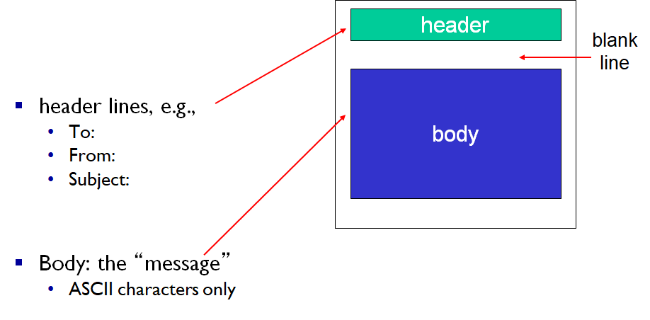

# Computer Networking - Email and DNS

컴퓨터 네트워크 - 이메일과 DNS
<!--more-->
# Computer-Netowork-Email-and-DNS

# E-mail

## 세 주요 컴포넌트

- User Agents
- 메일 서버
- SMTP (Simple Mail Transfer Protocol)

## User Agent

- 메일 리더
- 메일을 쓰고, 편집하고, 읽음
- Outlook, Thunderbird 등
- 들어오고 나가는 메세지들은 서버에 저장됨

## 메일 서버

- Mailbox
    - 유저에게 온 메세지들을 담음
- Message Queue
    - 보내질 메세지들을 일시적으로 담는 큐
- SMTP 프로토콜
    - 메일 서버간에 이메일 메세지들을 보낼 때 사용됨
    - **클라이언트**: 메세지를 전송하는 메일 서버
    - **서버**: 메세지를 받는 메일서버

## SMTP

- TCP
    - 신뢰성 있는 전송을 위해
    - 25번 포트
- Direct Transfer
    - 직접 TCP 연결을 통해 메일 서버들이 통신하며 메세지를 주고받음
- 단계
    - Handshaking
    - 메세지 전송
    - 통신 종료
- Command/Response Interaction
    - HTTP와 유사
    - commands: ASCII
    - response: 상태 코드 등
- 메세지는 반드시 7bit ASCII로 되어 있어야 함
- Persistent connection을 사용
- 메세지의 끝은 <EOL>.<EOL>로 구분
    - EOL=CRLF=New Line

## 메일이 보내지는 과정

1. Alice가 UA를 통해 메세지 작성
2. Alice의 UA는 메일 서버에게 메세지를 보냄
3. 해당 메세지는 메일 서버의 Message Queue에 들어감
4. Alice의 메일 서버가 SMTP를통해 TCP 연결 요청 → Bob의 메일 서버로
5. SMTP 클라이언트 (Alice의 메일 서버)는 TCP 연결을 통해 Bob의 메일 서버에 메세지 전송
6. Bob의 메일 서버는 Bob의 메일박스에 메세지 저장
7. Bob은 UA를 사용해 메세지 확인

## SMTP와 HTTP 비교

- HTTP: 데이터를 Pull
- SMTP: 데이터를 Push
- 양쪽 모두 ASCII 기반 command/response interaction과 status code를 사용
- HTTP는 각각의 오브젝트가 하나의 Response 메세지에 포함되어 전송
- SMTP는 각각의 오브젝트가 여러개의 메세지에 담겨 전송될 수 있음

## Mail Message Format

## Mail Access Protocols

> 메일 서버에서 UA를 통해 메세지를 가지고 올 때 사용

- POP
- IMAP
    - POP보다 더 많은 기능
- HTTP
    - Google, Hotmail 등

## POP3

- Download and Delete Mode
    - 메세지를 읽으면 서버에서는 삭제된다
- Download and Keep Mode
    - 메세지를 읽어도 메세지의 사본이 서버에 유지된다
- POP3 = Stateless
    - 지난 연결에 대한 상태 정보를 가지고 있지 않다

## IMAP

- 모든 메세지가 한곳 (서버) 에 저장된다
- 유저가 메세지들을 폴더를 통해 관리할 수 있다
- 상태 정보를 유지
    - 폴더 이름
    - 메세지 ID와 폴더 이름의 매핑 등

# 3. DNS (Domain Name System)

> IP 주소와 도메인 네임을 어떻게 연결하는가?

- 분산된 데이터베이스
    - 네임 서버로 이루어진 계층화된 시스템
- 애플리케이션 프로토콜
    - 호스트와 네임서버가 통신
    - 코어 인터넷 펑션이지만 애플리케이션 단에서 구현
        - 코어 단에서 구현하면 너무 복잡해지기 때문

## DNS Services

- Hostname을 IP 주소로 변환
- Host aliasing
    - Canonical (실제) Hostname과 더불어 별도의 alias names을 관리
    - 예) [w2.east-asia.ibmserver.com](http://w2.east-asia.ibmserver.com) → www.ibm.com
- 트래픽 분산
    - 한 HostName을 여러개의 IP 주소에다 배정할 수 있다.
        - DNS가 로드 밸런싱도 해주네
- 왜 중앙집중화 되어있지 않나
    - 어떤 재해로 인해 모든 지구상 호스트가 해당 DNS 서버에 접속불가라면?
        - 끔찍하지..
    - 해당 주변의 네트워크 트래픽 관리를 위해
    - DNS서버가 먼 해외에 있다면?
        - 인터넷 접속에 지연이 심해질 것
    - 유지보수를 위해
        - 단 하나의 DNS 서버만 존재한다면 서버를 끄기가 조심스러워 지겠지
    - 즉 확장성이 없다!

## DNS 계층 구조

## Root name servers

- DNS query를 받은 로컬 DNS 서버가 hostname을 알지 못할 때 질의받음
- 얘도 모를 경우 Authoritative name server에 질의함

## TLD (Top-Level Domain) servers

- 최상위 도메인 (TLD) 관련하여 책임짐

## Authoritative DNS server

- 기관이나 인터넷 서비스 운영자가 운영, 관리
- 자기들이 이름붙인 호스트들과 그 IP들을 매핑하는 정보를 관리

## Local DNS name server

- 계층에 그렇게 단단히 구성되어 있지는 않다
- 각각의 ISP는 하나 이상의 DNS를 가지고 있다
- 호스트에서 DNS query를 받으면
    - 먼저 캐시를 살펴봐서 정보가 있다면 그걸로 응답 (권위 없는 응답)
    - 만약 캐시에 없다면 프록시로 동작, 다른 DNS 서버에 query를 포워딩
    - 캐시 된 정보는 out of date 된 정보일 수도 있다

# 4. DNS Name Resolution 과정

## Iterated Query

> "나는 잘 모르겠으니 이 서버에다가 물어봐"

1. 호스트가 로컬 DNS 서버에 질의
    - "나 mail.naver.com에 접속하고 싶은데 IP 뭐야"
2. 로컬 DNS 서버에 해당 정보 캐시가 없으면 Root에 질의
3. Root에도 없으면 Root가 말함
    - "나는 잘 모르겠으니 TLD DNS server (com) 에다 물어봐"
    - 하고 해당 정보를 알려줌
4. 로컬 DNS 서버는 그 정보를 가지고 TLD DNS server에 질의
5. TLD DNS server에도 없으면 TLD 서버가 말함
    - "나는 잘 모르겠으니 Authoritative DNS server (naver.com) 에다 물어봐"
    - 하고 해당 정보를 알려줌
6. Authoritative DNS server는 실제 해당 매핑을 관리하는 주체이기 때문에 무조건 알고있음 (권위 있는 응답)
7. 로컬 DNS 서버는 최종 응답을 받았고 그 정보를 호스트에다가 전달해줌

## Recursive Query

> "로컬 DNS 서버도 다음 DNS 서버에 하청을 준다"

1. 호스트가 로컬 DNS 서버에 질의
2. 로컬 DNS에 해당 정보 캐시가 없으면 Root에 질의
3. Root에도 없으면 Root가 TLD DNS server에 질의
4. TLD DNS server에도 없으면 TLD DNS server가 Authoritative DNS server에 질의
5. 이렇게 Recursive하게 응답을 받고 받고 받아서
6. 로컬 DNS 서버가 호스트에게 최종응답 전달

## DNS 캐싱

- 네임 서버가 HostName-IP 매핑을 알게 되면 캐시함
    - 단 TTL이 있다
- 이 캐시 정보가 오래된 정보일 수 있음
    - 도메인 할당할때 많이 겪어봤지?
- 당장 업데이트 해달라고 요쳥할 수도 있음
    - RFC2136

## DNS 레코드

> RR = 네임 서버가 관리하는 DNS 데이터 엔트리

> **RR Format = (name, value, type, TTL)**

### Type A

- name : hostname
- value: IP address
- ex) **(www.naver.com, 152.142.67.41, A, 100)**

### Type NS

- name: domain
- value: 해당 도메인을 관리하고 있는 네임 서버를 지정
    - 웹호스팅이나 Cloudflare할 때 네임서버 지정했던거
- ex) **(naver.com, ns1.cloudflare.com, NS, 100)**

### Type CNAME

- name: 별명 정보
- value: 실제 (canonical) 도메인
- ex) **(www.ibm.com, w3.east.asia.ibm.com, CNAME, 100)**

### Type MX

- value: name에 연결될 메일 서버의 주소
- ex) **(ibm.com, mail.ibm.com, MX, 100)**

## DNS 프로토콜 메세지 구조

> Query와 Reply 메세지가 있으며, 둘은 같은 메세지 포맷을 공유한다.

### 메세지 헤더

- **Identification**
    - DNS query와 해당 query를 위한 reply는 같은 값의 Identification을 가진다.
- **Flags**
    - query 메세지다
    - reply 메세지다
    - Recursion 방식으로 해주세요
    - Recursion 방식이 가능하다
    - Reply가 Authoriative이다 (캐시된 정보가 아니다)
- Questions
    - Query 내용
- Answers
    - RR 형태로 답이 옴

## DNS 레코드 넣기

> 사설 네임서버를 쓸 만큼 큰 회사라고 가정했을 때

1. DNS 등록자에게 내 도메인과 네임서버 정보 등록
    - 도메인, Authoritative name server, IP address 제출
    - **(mydomain.com, ns1.mydomain.com, NS, 1600)**
    - **(ns1.mydomain.com, 222.111.212.111, A, 1600)**
2. 사설 네임서버 안에서 www.mydomain.com에 연결할 IP라던가
3. MX로 메일서버를 연결한다던가 하면 됨
