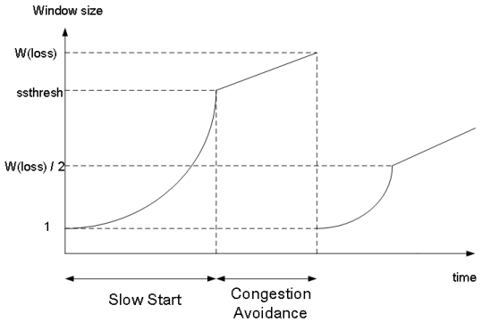

# Computer Networking - Final Quick Note

Computer Networking - Final Quick Note
<!--more-->
# Computer-Network-Final-Quick-Note

## Reliable Data Transfer (RDT)

- `udt_send()`와 `deliver_dat()`는 RDT에서 직접 호출
    - **ACTION** 이라고 지칭
- `rdt_send()`는 application layer에서, `rdt_rcv()`는 underline channel에서 호출
    - **EVENT** 라고 지칭

## RDT 1.0 : Reliable tranfer on reliable channel

- 하위  채널도 완벽한 Reliable
    - 비트 에러 없음
    - 패킷 로스 없음
- 그러나 실제로는 하위 채널은 Reliable 하지 않음

## RDT 2.0 : Channel with bit errors

- 하위 채널이 Reliable 하지 못함
    - 비트 에러가 있을 수 있음
- 비트 에러 복구 방법
    - Acks
    - NAKs
        - Receiver가 Sender에게 명시적으로 패킷에 에러가 있음을 알려줌
    - Sender는 NAKs를 받으면 패킷 재전송
- RDT 2.0에서의 새 매커니즘
    - 에러 디텍트
    - 피드백 (ACK, NAK)

## RDT 2.0 문제 : 만약 ACK, NAK가 Corrupted?

- Sender는 Receiver에게 무슨 일이 일어났는지 알 수 없음
- 무작정 재전송하긴 힘듬
    - ACK을 받아야 위쪽에서 오는 데이터를 대기할 수 있음
    - ACK가 와서 인식되지 않으면 같은 패킷만 계속 재전송
- Duplicate 막기
    - Sender는 각 패킷에 Seq Number 기입해둠
    - Receiver는 그 Seq Number를 보고 이미 받은 패킷이면 Discard 시킴

## Stop and Wait Protocol

- Sender는 한 패킷을 보내고 Receiver의 리스폰스를 기다림
- 아래 RDT들은 모두 Stop and Wait Protocol 사용 (ACK를 기다림)

## RDT 2.1 : Seq Number로 중복 방지

- `sndpkt = make_pkt(0, data, ckecksum)`, `sndpkt = make_pkt(1, data, ckecksum)`으로 sequence number까지 보내주는 모습
- `corrupt(rcvpkt)||isNAK(rcvpkt)` 으로 ACK 혹은 NAK corrupt 체크
    - **corrupt 되었다면 일반 NAK같이 치부함**
- Twice as many states (**만약 seq가 2개라면 4개의 상태가 필요하다는 뜻**)
    - State must remember whether expected packet should have seq number of 0 or 1

- **Receiver는 받은 패킷이 중복된 패킷인지 체크**해야 한다
    - 0번의 패킷을 기다리는데 1번이 오거나, 1번의 패킷을 기다리는데 0번이 오면 `extract` 하지 않고 바로 ACK 패킷을 만들어 보내는 모습.
        - 즉 Discard 해버린다
- **Receiver는 Sender가 ACK|NAK을 잘 전달받았는지 알지 못함**

## RDT 2.2 : NAK-FREE Protocol

- **ACK만 사용**
- 기다리고 있는 것과 **다른 Seq Number를 가진 ACK가 오면 NAK를 받은 것 처럼** 처리

## RDT 3.0 : ERROR, LOSS 모두 처리

- 밑의 채널이 불안정해 패킷 에러, 로스 둘 다 가능
- **구현**
    1. Sender는 ACK를 충분한 시간만큼 기다림
    2. 시간 안에 ACK가 오지 않으면 패킷 재전송
    3. 만약 패킷이 그냥 Delay 된 것이였다?
        - 재전송된 패킷은 중복 패킷이 되겠지만, Seq Number 덕분에 그냥 Discard됨
    - 카운트 다운 타이머 필요

- `start_timer`로 "resonable" 한 시간동안 기다림
    - timeout 되면 패킷을 재전송하고 타이머 재시작
- **corrupt 되거나 잘못된 seq number의 ACK이 오면 그냥 무시**
- 제대로된 ACK가 오면 타이머 멈추고 다음으로 넘어감

## RDT 3.0 동작

- 지금까지 혼동하고 있었는데 이걸보면 Sequence는 일련의 한정된 패킷에 넘버링 하는게 아니라, 버퍼 개념인 듯 하다.
- 즉 여기서는 버퍼가 두칸짜리고 이걸 계속 상위 레이어에서 데이터를 받아서 채우고 Receiver에 전달하는 것.
- (d)의 경우에는 ACK 전달이 Delay됨.

## RDT 3.0의 문제

- 제대로 작동은 하지만 작동이 엄청 느리다
- 사실상 못쓴다
- **RTT**
    - 패킷을 보내고 답을 받는데까지 시간
    - 2 X *PropDelay*
- 그러니까 실제 패킷을 전송하는데 할애한 시간인 `L/R` 에 전체 시간인 `RTT + L/R`을 나누면 **Utilization (효율)** 을 알 수 있다.. 이말이다.
    - 위의 예에서는 `1Gbps 링크`, `15 prop delay`, `8000bit 짜리 패킷`을 보내는 것을 가정
        - `RTT` = 2 * `prop delay` 이므로 (대충 그림상)
        - (8000/10^9) / (30 + 8000/10^9) → 0.00027
- 위에서 봤듯이 사실 RDT 전부 ACK를 기다리는 모습들. 즉 Stop and Wait 프로토콜을 사용하기에 느림
    - 그래서 파이프 라이닝이 나옴

## Pipelining Protocols

- Sender는 ACK를 받지 않더라도 계속 여러개의 패킷을 보낼 수 있음
- TCP 프로토콜에 사용됨

## Utilization (이용률) 상승

- 위의 예에서는 3개의 패킷을 동시에 보내 3배만큼 효율 증가
- Receive 측에서 ACK를 보내긴 함

## Go-Back-N

- 최대 N개까지는 ACK를 받지 않고 패킷을 보낼 수 있다
- Receiver는 `Cumulative ACK`만을 보냄
    - 누적 패킷
    - Gap이 있다면 Ack 패킷을 보내지 않음
        - 즉 만약 패킷1을 받았는데.. 패킷2가 전달이 되지 않은 경우?
        - 패킷3이 전달되어 Ack를 보낼 때 Ack1을 보낸다.
- 한개의 타이머만 유지
    - 타임아웃이 발생하면, Ack로 정상 전송 여부가 판별되지 않은 모든 패킷을 다시 보낸다

# 2. Go-Back-N (GBN)

> Sliding Window Protocol 이라고도 부름

## Sender

- `window` : 최대 N개의 패킷을 보낼 수 있는 범위
- **`send_base`** : 현재 Window에서 처음 보내는 패킷
- **`nextseqnum`** : (상위 레이어에서 패킷이 아직 안와서) 다음에 보낼 패킷
- 설명하자면..
    - **초록색**은 Ack를 받고 정상 전송이 컨펌된 패킷들
    - **노란색**은 보내긴 했으나 Ack가 도달 안된 패킷들
    - **파란색**은 현재 Window 내에서 전송 가능한 가용 패킷 용량
    - **하얀색**은 아직 Window 범위 내에 있지 않아 사용 불가능한 칸이다.
    1. **만약 상위 레이어에서 데이터가 내려오면**
        - **Window 칸 모두 파란색**이다
            - 해당 패킷들을 만들어 보내고
            - 그 수만큼 파란색 칸은 노란색이 되고
            - `nextseqnum`도 해당 수만큼 오른쪽으로 이동
            - 보내놓은 패킷이 없어서 타이머가 종료된 상태였는데, 처음 패킷을 보냈으므로 **타이머 시작**
        - **Window 내에 노란색도 있고 파란색도 있다**
            - 해당 패킷들을 만들어 보내고
            - 그 수만큼 파란색 칸은 노란색이 되고
            - nextseqnum도 해당 수만큼 오른쪽으로 이동
        - **Window 칸 모두 노란색이다**
            - `nextseqnum`이 현재 window를 이탈한 상태라는 것
            - 즉 가용한 패킷 용량을 다 사용했으므로 데이터 전송을 거부
    2. **만약 Ack가 도착하면**
        - 해당 Ack가 컨펌한 패킷들만큼 노란색 칸이 초록색 칸으로 채워지고
        - 또 그만큼 `send_base`가 오른쪽으로 이동
        - `window`는 바뀐 `send_base`에 맞춰 그만큼 재설정됨
        1. **그랬는데 만약 모든 칸이 초록색이라면**
            - 모든 보낸 패킷이 Ack에 의해 컨펌되었으므로 **타이머 종료**
        2. **아직 컨펌되지 않은 패킷이 있다면**
            - **타이머 재시작**
    3. **타임아웃이 발생하면**
        - **타이머 재시작**하고
        - **노란색 패킷들을 다시 보냄**

## Sender FSM

- 위에서 얘기한 내용을 FSM으로 표현한 것

## Receiver FSM

- `expectedseqnum` : 받아야 할 패킷의 시퀀스 넘버
- **패킷이 순서대로 왔을 경우**
    - **제대로 수신된 제일 마지막 패킷을 기준으로 ACK 하나를 보냄**
    - `expectedsuqnum` 하나만 기억하면 됨
- **패킷의 순서가 엉망인 경우**
    - 그냥 버려버리고
    - **순서대로 제대로 온 패킷의 마지막 시퀀스 넘버 ACK를 보낸다**

## 모식도

- Sender는 패킷 0,1,2,3 을 보낸다
- Receiver는 패킷2가 Loss 됬으므로 마지막으로 제대로 수신된 패킷1의 ACK를 계속 보낸다.
- Sender는 ACK1를 받아 0,1은 컨펌됨을 알고 send_base를 2로 이동
- 그리고 그 과정에서 Window에 포함되는 4,5가 비는데, 데이터가 오면 전송시킨다
- Receiver는 해당 패킷을 기대하는게 아니므로 계속해서 패킷1의 ACK를 보냄
- 그러다보면 타임아웃이 일어남
- Sender는 타이머를 재시작하고 Ack로 컨펌되지 않은 2,3,4,5 패킷을 보냄
- Receiver는 기대하고 있는 패킷이 왔으므로 수신 작업을 함

## Selective Repeat (SR)

### GBN과의 차이점

- **Receiver**
    - **개별적으로 패킷들에 ACK** 해줌
    - **순서대로 오지 않은 패킷도 버퍼함**
        - 즉 패킷 9를 받지못하고 패킷 10을 받아도
        - 버퍼에 패킷 10을 저장해뒀다가 패킷 9가 오면 한꺼번에 올려줌
- **Sender**
    - **각각의 패킷에 대해 타이머를 유지 관리**
    - **타임아웃이 오면 해당 패킷만 재전송**

### Sender / Receiver

### 모식도

- Sender가 패킷 0,1,2,3 보냄
- 패킷2에 로스가 일어남
- Receiver는 패킷 0,1,3 받고 각각 Ack 보냄. 패킷3은 버퍼에 들어감
- Sender는 0,1이 컨펌된것을 인지하고 Sender_base를 2로 옮김 (단 Ack3의 경우에는 Ack2가 아직 도달 안했으므로, 패킷3이 전송 잘 되었다는것만 기억.)
- 그 과정에서 포함되는 4,5 자리. 데이터가 오면 패킷 4,5로 전송
- Receiver는 패킷을 받고 버퍼에 저장. Ack 4, Ack 5도 전송함
- 패킷 4,5도 잘 전달되었다는 것을 기억.
- Sender는 패킷2 타이머가 타임아웃됨을 인지
- 따라서 패킷2를 재전송
- Receiver는 패킷2를 받고 버퍼에 있던 패킷들과 함께 상위 레이어로 전송, Ack2를 Sender에 전해줌

### 문제점

- 위같이 시퀀스 넘버를 짤 경우, Receiver 입장에서는 Sender의 사정을 알 수 없으므로
- 처음 패킷0,1,2에 대한 Ack들이 통째로 로스될 경우..
    - Sender는 재차 기존 패킷0,1,2를 재전송하고
    - Receiver는 그 재전송된 패킷이 새로운 칸의 0,1의 패킷으로 생각하고 버퍼에 넣어버린다.
- 그래서 **시퀀스 넘버 Range는 Window 사이즈보다 두 배 이상 커야 한다**.

## TCP 특성

- 메세지 크기 제한이 없음
- 플로우 컨트롤 : Receiver가 핸들 가능한 속도로 맞춰줌
- Pipelined
    - 혼잡 제어, 플로우 컨트롤로 인해 윈도우 사이즈 계속 변함

## TCP segment 구조

- FLAG들
    - U : Urgent. 빨리 보내야 하는 세그먼트. 잘 안씀
    - A : Ack
    - P : Push now. 잘 안씀
    - R : Reset. 비정상 종료
    - S : SYN. 연결을 처음 맺을 때 사용
    - F : FIN. 정상적 종료
- Receive WIndow : Receiver가 받고자 하는 바이트 수. Flow control 때 사용
- Checksum : 말 그대로 체크섬

## TCP Timeout

- RTT 보다 큰 시간 기다려야
- SampleRTT
    - 세그먼트를 실제로 보내보고 Ack가 올 때 까지 시간 측정
    - 평균값 추정
- 계산 예제 : Est0 = 100, Sam1 = 100, Sam2 = 50, Sam3 = 200, Alpha=0.1 일 때 Est1, Est2, Est3를 구하라
    - Est1 = 0.9*Est0 + 0.1*Sam1
    - Est2 = 0.9*Est1 + 0.1*Sam2
    - Est3 = 0.9*Est2 + 0.1*Sam3
- **Timeout_Interval = EstimatedRTT + 4*DevRTT**
    - **DevRTT = (1-b)*DevRTT + b*|SampleRTT - EstimatedRTT|**
    - SampleRTT와 EstimatedRTT 차이가 많이 나면 마진을 많이 두는 식
    - 최소 1초 이상은 나오게 되어 있는데, 컴퓨터 입장에서는 1초가 긴 시간이므로 다른 방법 사용 가능

## TCP RDT (Reliable Data Transfer)

### TCP Sender Events

- **TCP 소켓이 앱에서 데이터를 받을 때**
    - 세그먼트 넘버와 함께 세그먼트 생성
    - 타이머가 작동중이지 않으면 시작시킴
        - 가장 오래 Unacked 상태인 세그먼트라고 가정
- **타임아웃이 일어날 때**
    - 타임아웃이 일어난 세그먼트 재전송
    - 타이머 재시작
- **Ack를 받을 때**
    - 새로운 Ack일 경우
        - Ack 된 (컨펌된) 세그먼트 체크 (SendBase 우측으로 이동)
        - 아직 *Unacked*인 세그먼트가 있다면 타이머 시작

## TCP Ack 생성 절차

- 적합한 Seq Num 세그먼트가 도착
    - 다음 세그먼트를 50ms 가량 기다리고 도착하지 않으면 Ack 전송
- 다음 세그먼트 기다리는 와중 적합한 Seq Num 도착
    - 하나의 단일 누적 Ack를 보냄
- 적합한 Seq Num보다 큰 세그먼트 도착. Gap Detected.
    - Duplicated ACK를 보내 적합한 Seq Num 알려줌
- Gap을 완전히, 혹은 일부 메꿔줄 수 있는 세그먼트 도착
    - 더 낮은 Seq Num이 필요하다는 것을 Ack 통해 알려줌

## TCP Fast Retransmit

- Duplicate ACKs가 발생하면 패킷 로스로 판단, 즉각 재전송

## TCP Flow Control

- Receiver 측에서 Sender를 컨트롤하여 너무 빠른 속도로 데이터를 보내지 않게 조절
- Receiver가 헤더의 `Receive Window (rwnd)`를 사용해 Sender에게 가용한 버퍼의 크기 알려줌
- Sender는 `Unacked 패킷`의 양을 `rwnd` 값을 넘지 않게 조절해 오버플로우 방지

## HandShake

- 서로 양쪽의 시퀀스 넘버와 버퍼값을 알려주고 합의

## 2-way handshake

- 딜레이가 가변적
- 패킷 로스 등 재전송이 필요한 경우가 있을 수 있음
- 지금은 Handshake 중이기 때문에 Order가 보장되지 않음
- Can't "See" other side each other yet

## 3-way handshake

## TCP: Closing a connection

- 클라는 위에서 왜 TIMED_WAIT → CLOSED 까지 기다리고 있을까?
    - 만약 서버의 FIN에 대한 자신의 Ack Response가 유실되었을 경우, 서버가 `FINbit=1`을 재전송할 경우 다시 Ack를 보내줘야 하기에 충분한 시간동안 기다려 주는 것

## TCP Congestion Control

- 증가시킬때는 천천히, 감소시킬때는 빠르게
- Additive Increase, Multiplicative decrease
    - `congestion window (cwnd)`를 패킷 로스가 감지될 때 까지 `1MSS`만큼 매 `RTT`마다 늘림
    - 패킷 로스가 감지되면 `cwnd`를 반으로 줄임
- **TCP Sending Rate**

    

## TCP Slow Start

- 처음에는 `cwnd = 1 MMS`로 시작
- 이를 지수적으로 증가시킴
    - 각각의 RTT마다 `cwnd`를 두배씩 증가시킴
    - ACK를 받을 때 마다 `+1`을 해줌으로서 구현

## TCP의 손실 감지, 반응

- **타임아웃이 발생하면**
    - `cwnd = 1 MMS`로 초기화
    - `ssthresh`를 타임아웃이 발생했을 때 크기의 반으로 설정
    - 다음 `cwnd`를 지수적으로 (1..2..4..8) 증가시킴
    - `ssthresh`에 도달하면 선형적으로 (1..2..3..4) 증가시킴
- **3개의 중복 ACK가 발생** (**패킷로스 이벤트 발생**)
    - **TCP Tahoe**

        

        - 타임아웃 발생시와 동일하게 처리
    - **TCP RENO**

        

        - `cwnd`를 반으로 줄이고 선형적으로 증가시킴
        - 위 예제에서는 반으로 줄이고 + 3을 해줬는데 아무튼 구현법에 따라 다른듯

## TCP 쓰루풋

## TCP 공평성

- 연결 1,2가 같은 네트워크를 사용한다고 했을 때
- 처음에는 쓰루풋이 달라도 패킷로스 등을 거치며 Slow Start, CA 등으로 쓰루풋이 동일하게 수렴
- **Parallel TCP** (꼼수?)
    - 병렬적으로 연결을 맺어 속도 향상시킴
    - 웹 브라우저에서 자주 사용
- 단점
    - 멀티미디어 앱들은 속도에 지정 받을 수 있음
    - 따라서 UDP 많이 사용

## ECN (Explict Congestion Notification)

- 네트워크 라우터들이 혼잡 상황을 판단하고 Source, Dest에 알려줌
- IP헤더의 ToS 필드 이용
- **예**
    1. Source에서는 헤더에 ECN=00 으로 세팅되어 전송됨
    2. 만약 네트워크에 혼잡이 있다면 중간에 라우터에서 이를 ECN=11으로 바꿈
    3. Destination에서는 패킷을 받아보고 ECN이 설정되어 있다면 ECE=1 (ECN echo) 설정해 ACK를 보내줘 Source에게도 네트워크에 혼잡이 있다는 것을 알려줌

## Multimedia: Audio

- 아날로그 오디오 신호는 주기적인 속도로 샘플링 진행
- 각각의 샘플들은 Quantized 됨
- Quantized된 값들은 Bits로 표현됨
- **계산법**
    - 8000 samples/sec 이고 256 (2^8) quantized values
        - **8000 X 8 = 64000bps**
- 원본 손실이 일어남

## Multimedia: Video

- 비디오 : 일련의 이미지
    - 24 images/sec 등
- 인코딩 : 이미지간의 중복 이용해 비트를 줄임
    - Spatial
        - 중복된 색깔을 이용
    - Temporal
        - 전의 이미지와 다음 이미지간의 차이점만 보냄
- CBR : 고정된 비디오 인코딩 레이트
- VBR : 가변적인 인코딩 레이트
    - 인코딩이 변화하는 것에 따라 가변적

## Multimedia Networking

- Streaming: Stored audio, video
    - 다운로드와 동시에 실행 가능
    - 서버에 저장된 미디어
    - 유튜브
- Conversational Voice/Video over IP
    - Interactive
    - Delay Tolerance (딜레이 허용) 제한
    - Skype
- Streaming live audio, video
    - Live Sport Events

## Streaming stored video

## Streaming stored video : Challenge

- Keeping continuous
    - 플레이에 지연 걸리지 않게
    - But network status changing
    - Client-side buffer needed
- Video packet can be lost
- Client interact
    - Stop, Play, Rewind

## Streaming stored video : Client side buffering

- 버퍼 내용의 양은 가변적
- initial playout delay tradeoff
    - 초기 버퍼값을 높게 설정하면
        - 버퍼링이 많이 걸리지 않을 수 있다
        - 그러나 처음 영상을 재생할 때 까지의 시간이 많이 소요

## Streaming multimedia : UDP

- 보통 `send rate` = `encoding rate` = `constant rate`
- 전송 속도는 혼잡도에 상관없음
- TCP보다 `Playout delay` 상대적으로 적음
- 에러 복구가 필요하다면 에플리케이션 레벨에서 처리
- UDP는 방화벽에 자주 막히는 문제가 있음

## Streaming multimedia : HTTP (TCP)

- 혼잡 제어 때문에 전송속도 가변적
- Playout delay가 좀 더 큼
- 방화벽에 잘 안막히는 장점

## VOIP

- 통신 가능한 만큼의 딜레이 관리가 필요
- Session initialization
    - 전화하는 사람이 IP, 포트, 인코딩 알고리즘 전달 방법

## VOIP 특징

- 번갈아가면서 말함
- 64kbps during talking
    - 오직 말할때만 패킷 생성
    - **20ms chunks at 8Kbytes/sec (64kbps) → 160 bytes of data**
        - Talk Spurt에서 각 20ms마다 160바이트의 데이터가 생성
        - **여기에 UDP나 TCP 등의 헤더가 붙음**
        - 앱은 매 20ms마다 소켓을 통해 세그먼트를 보냄

## VOIP Playout delay : Fixed

- `q`라는 고정된 딜레이 값을 사용
- `q` 이상으로 딜레이가 발생한다면 해당 패킷은 필요없으므로 버림
- 너무 큰 값을 사용하면 딜레이 커짐, 적은 패킷 유실
- 작은 값을 사용하면 소통은 잘 되나 패킷 유실이 많이 일어날 수 있음

## VOIP Playout delay : Adaptive

- **목표**
    - Low playout delay
    - low late loss rate
- 네트워크 딜레이를 계속 추정 + 마진을 넣어 딜레이를 가변적으로 적용
    1. 각 Talk spurt 첫부분에 딜레이를 적용
    2. Slience 구간이 지난 이후
    3. 다음 Talk spurt이 시작 될 때 딜레이를 재계산하여 적용
- **패킷 딜레이 계산 방법**

    

- **평균 편차 계산**

- **Playout time**

    

## Receiver가 Talkspurt 시작점 판별하는 방법

- 패킷 유실이 없다면 타임 스탬프 확인
    - Talkspurt 내의 패킷들은 20ms 간격
    - 그 이상의 딜레이가 있었다는 것은 그 사이에 `침묵` 구간이 있었다는 것
        - Seq1 → (40ms) → Seq2
- 패킷 유실이 있었던 것 같다면
    - 타임스탬프 뿐만 아니라 시퀀스 넘버도 확인
    - Seq1 → (40ms) → Seq3

## VOIP : 패킷 로스 복구

- VOIP에서는 ACK/NAK 방식 사용 안함
    - 딜레이 때문
- **FEC (Foward Error Correction) 방식 이용**
    - 충분한 비트 미리 보내서 해당 데이터를 바탕으로 복구

## Simple FEC

- XOR 사용해 복구 비트 만듬
- 한개까지만 복구 가능

## PiggyBacking FEC

- 숟가락 얹는 방식
- 내 다음 청크에 낮은 음질의 백업 음성 탑재

## Interleaving 방식

- 20ms 단위로 송신하던 것을 5ms 단위로 쪼개어 뒤섞어 재구성
- 받을 때 다시 원래 순서로 맞추어 재생

## Skype

- 클라이언트끼리 서로 직접 연결해 통화
- 수퍼노드
    - 특별한 기능을 가진 스카이프 피어
    - 자신에게 접속해 있는 클라이언트 리스트 유지
- 오버레이 네트워크
    - 수퍼노드들의 네트워크
    - 유저 리스트 등 보관 및 공유

## Skype 동작

1. 수퍼노드 접속 (TCP)
2. 로그인 서버를 통해 로그인
3. 수퍼노드를 통해 전화할 유저 IP 가져옴
4. 얻은 IP 주소를 통해 전화

## Skype 문제

- NAT 문제
    - NAT 바깥에서 피어에게 연결 불가능
    - 수퍼 노트들 통해 중개하는 방법 사용

## RTP (Real Time Protocol)

- 실시간 데이터 전송을 위해 사용하는 프로토콜
- UDP 사용

## RTP 예시

- 64 Kbps (8 KBytes per second)의 PCM encoded voice를 RTP로 전송
    - 20ms 마다 160Bytes 오디오 청크
    - 여기에다가 RTP 헤더 + UDP 헤더 추가됨
    - RTP 패킷은 UDP 안에 캡슐레이션 되므로

## RTP 헤더

- Payload Type: 어떤 타입의 미디어인가 (보이스.. 미디어...)
    - Payload type 0: PCM mu-law, 64 kbps
    - Payload type 3: GSM, 13 kbps
    - Payload type 7: LPC, 2.4 kbps
    - Payload type 26: Motion JPEG
    - Payload type 31: H.261
    - Payload type 33: MPEG2 video
- Sequence number
    - RTP 패킷 별로 하나씩 증가
    - 패킷 로스가 감지되면 FEC를 통해 에러 복구 등 실행
- Timestamp
    - 실제 시간 아님
    - RTP 패킷에 있는 첫번째 바이트의 Sampling instant
    - Source가 Active할 때 App이 160개의 encoded samples를 생성한다면, 각 RTP 패킷의 timestamp는 160씩 늘어남
    - inactive 상태일 때는 Constant Rate로 늘어남
- SSRC field
    - Source의 유니크 ID

## RTCP

- RTP와 옵션적으로 사용
- RTCP 패킷은 Sender, Receiver의 Statistics를 포함
    - 얼마의 패킷을 보냈고, 얼마의 패킷이 로스됬고..
- Sender가 동작 제어하는데 도움

## RTCP : 패킷 타입

- Receiver report packets
    - 패킷 로스, 마지막으로 받은 시퀀스 넘버 등
- Sender report packets
    - 현재 시간, 보낸 패킷들, 보낸 바이트 등
- Source description packets
    - Sender의 메일, 이름 등..

## RTCP : 동기화

- Voice, Video 동기화 가능

## RTCP : Bandwidth scaling

- RTCP는 전체 대역폭의 5%만 차지하자
    - 너무 많이 리포트 보내면 대역폭 잡아먹으니까
- 예 : Sender가 2Mbps로 데이터를 보낸다면
    - 100Kbps만 RTCP가 쓴다는 것
    - 여기서도 75%는 Receiver가, 25%는 Sender가 나눠가짐
        - Receivers가 많다면 해당 75%를 균등하게 나눠 사용

## SIP : Session Init Protocol

- 모든 전화, 비디오 콜이 인터넷을 통해 이루어지도록
- 번호보다는 이름, 이메일로 신원 확인
- Collee가 어디서든, 어떤 장치를 쓰던 접근 가능하게

## SIP 서비스들

- Coller가 Collee에게 전화하고 싶다는 사실을 Collee에게 전달
- 미디어 타입, 인코딩 방식 협의
- 전화 종료
- mnemonic (의미있는) 식별자들을 IP로 변경
    - 이름, 이메일 등..
- 통화 관리
    - 새로운 미디어 스트림 추가
    - 인코딩 방식 변경
    - 전화 홀드, 전달, 추가 등

## SIP 예제

- 인코딩 협상
    - 만약 상대방이 요청한 인코딩을 자신의 시스템이 지원하지 않는다면 606 Not Acceptable
        - 상대방은 다른 인코딩 방식을 설정해 새 INVITE 메세지를 보낼 수 있음
- RTP(UDP) 뿐만 아니라 TCP도 사용 가능

## SIP Register

- 사용자가 SIP Client를 실행시키면 클라이언트는 SIP REGISTER에 메세지를 보내 등록

## SIP Proxy

- Local DNS Server와 유사한 역할
- Alice가 프록시 서버로 invite 메세지를 보내면
    - 해당 메세지는 상대방 Bob의 주소(이름)을 포함
    - 프록시 서버는 다른 프록시 서버 등을 통해 라우팅하여 Bob에게 메세지 전달
    - Response를 받으면 다시 그것을 Alice에게 전달
        - Response에는 Bob의 IP가 포함

## Multimedia support of network

- Best effort
    - 서비스 없음
- Differentiated Service (서비스 차등화)
    - Soft Guarantee available
    - Packet marking
    - Scheduling policing
    - 복잡성 중간, 가끔 사용
- Per-Connection QoS
    - Hard Guarantee available
    - Packet marking, Scheduling policing
    - Call admission
        - 보장해 줄 수 있다면 허용, 아니라면 통신 비허가
    - 복잡성 높아 실제로는 사용안함

## Best effort networks

- 좋은 라우터, 링크로 땜빵
- 비용 많이 듬
- 얼마만큼의 bandwidth가 충분한지 트래픽 추정 필요

## Class of Service

- 예를 들어 VOIP의 경우 실시간성 데이터이므로 HTTP보다 **우선순위** 높여줌
    - 여기서 **Packet marking**이 사용됨
- 그런데 VOIP의 우선순위를 높게 줘서 대역폭을 다먹어서 HTTP로 통신이 불가능해졌다면?
    - **QoS policing**을 주어 연결속도 제한
- 근데 QoS 걸어버리면 VOIP 패킷이 없을때도 HTTP는 제한된 속도로 통신할 수 밖에 없음
    - 효과적인 QoS policing 정책 없을까?

## Policing mechanims

- 평균 패킷 제한
    - (장기적으로) Unit time 당 얼마나 많은 패킷을 보낼 수 있는지 결정
- Peak Rate
    - 분당, 초당 얼마의 패킷을 보낼 수있는지 결정
- Burst size
    - 한번에 (연속적으로) 패킷을 보낼 때 얼마나 많이 보낼 수 있는지 결정

## Policing mechanisms: **Token bucket**

- **Token bucket** : 제일 많이 사용
- 방법론
    - 가상의 통이 있는데 여기에는 티켓이 1초당 10개 생성됨
    - 패킷이 지나갈 때 마다 티켓을 한장 소모하고 가야함
    - 만약 가상의 통이 비어있다면 (티켓이 없다면) 패킷은 티켓이 생길 때 까지 대기했다가 지나가야함
- **티켓(토큰)이 생성되는 시간을 통해 속도 조절**
    - 초당 A개의 토큰을 생성한다면 패킷도 초당 10개 지나갈 수 있음
- **통의 크기를 조절해 Burst Size 조절**
    - 통의 크기가 B라면, Burst Size도 B
        - 기다리는 시간 없이 연속적으로 보낼 수 있는 양
- 따라서 주어진 T 시간에 대해 보낼 수 있는 패킷의 양은
    - A * T + B

## Policing and QoS Guarantees

- Token bucket과 WFQ (Weighted fair queueing) 를 같이 쓰면 큐 Delay의 Guaranteed upper bound를 구할 수 있음
    - Dmax = b / WFQ
    - WFQ = ((W1) / (W1+..+Wn)) * R

## Differentiated Services

- 차등화된 서비스 제공
- **간단한 펑션은 네트워크 코어에 유지하고, 복잡한 펑션은 엣지 라우터나 호스트에 유지**
- **직접 클래스를 구현하진 않고, 클래스를 만들 수 있는 기능들을 정의**

## Diffserv Architecture

- 엣지 라우터와 코어 라우터로 나뉨
- **Edge Router**
    - Flow 별 트래픽 관리
    - **패킷 마킹**
        - in-profile
            - Flow가 선언한 만큼의 속도 안에서 쓰고있는 패킷들에 마킹됨
        - out-profile
            - Flow가 선언한 만큼의 속도 이상을 사용하고 있는 패킷들에 마킹됨
- **Core Router**
    - Class 별 트래픽 관리
    - 엣지 라우터에서 마킹한 것에 기반하여 버퍼링, 스케줄링
    - in-profile 패킷들에 우선순위를 먼저 줌

## Edge-router packet marking

- Profile = <협의된 전송 속도 R, 버킷 사이즈 B>
- Flow 마다 Profile을 베이스로 패킷을 마킹함
- 마킹 사용법
    - **Class-Based Marking**
        - 클래스 별로 마킹
    - **Intra-Class Marking**
        - 클래스 내에서도 in-profile인지 out-profile인지에 따라 마킹 가능

## Diffserv packet marking: Detail

- ToS를 이용해 마킹
- 6비트짜리 Differentiated Service Code Point (DSCP) 필드 이용

## Per-Connection QoS Guarantees

- **아예 연결별로 QoS를 지정**
- 예를 들어 1.5Mbps링크에 2개의 1Mbps 연결이 시도되고 있다면
    - 한개만 허용하고 다른 한개는 막아버림
    - **Call Admission**
