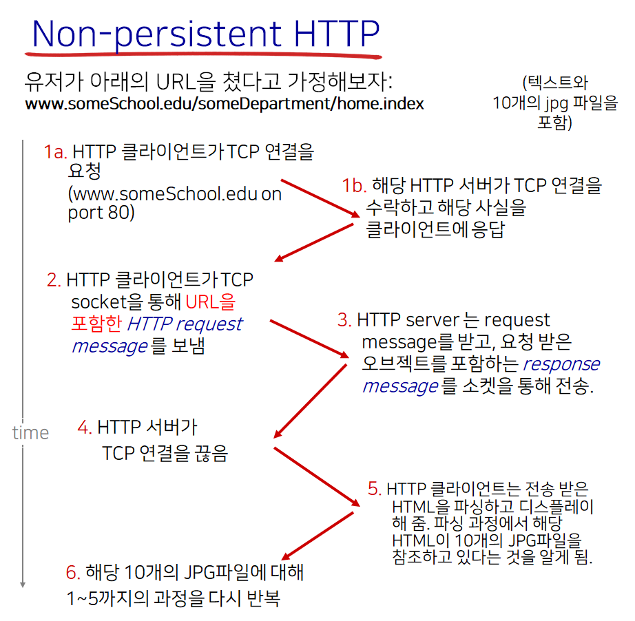

# Computer Networking - HTTP

컴퓨터 네트워크 - HTTP
<!--more-->
# Computer-Netowork-HTTP

# 1. Web and HTTP

- 웹 페이지는 오브젝트로 이루어져 있다
- 오브젝트
    - HTML 파일
    - JPEG
    - Audio 파일
    - 플래시 등
- 더 정확히 말하면 웹 페이지는 베이스 HTML 파일로 구성되며
    - 그리고 그 HTML 파일은 몇개의 참조된 오브젝트들을 포함한다.
- 각각의 오브젝트들은 URL을 통해 특정 가능하다
    - 예시) `www.somewebsite.com/somedirectory/someobject.gif`
    - URL은 **호스트 네임**과 **패스 네임**으로 이루어져 있다.

# 2. HTTP

## 개요

- **HTTP**: hypertext transfer protocol
- **웹의 애플리케이션 프로토콜**
- 기본적으로 Client/Server 모델
    - **Client**
        - 브라우저로 HTTP 프로토콜을 통해 reqeust하고 오브젝트들을 받아서 디스플레이 해줌
    - **Server**
        - 웹 서버는 HTTP 프로토콜을 통해 오브젝트를 response로 전송
- **TCP를 사용** (현재로서는)
    1. 클라이언트는 서버로 TCP 연결을 시작
    2. 서버는 TCP 연결을 수락
    3. 클라이언트는 HTTP request 메세지
    4. 서버는 HTTP response 메세지를 보냄
    5. TCP 연결 종료
- **HTTP**는 **Stateless** 하다
    - 서버는 과거의 클라이언트 request에 대한 정보를 저장하지 않는다
    - 다만 쿠키, 세션 등으로 따로 구현할 수는 있다
    - 왜?
        - 구현이 어렵다. 예를 들어서 클라이언트/서버가 크래시가 날 경우 복구 등에 대한 문제.

# 3. HTTP 연결 💥

> 시험에 나올 가능성이 높은 중요한 부분

## Non-Persistent HTTP

- 한 TCP 연결에서 한 개의 오브젝트만 보낼 수 있다
- 한 개의 오브젝트를 보내면 TCP 연결은 종료
- 여러 개의 오브젝트를 받고싶다면 여러 개의 TCP 연결이 필요

- **RTT (Round Trip Time)**
    - 작은 패킷이 클라이언트에서 서버로 갔다가 돌아오는 시간
    - 즉 Request 한 후 Response가 도착할 때 까지 걸리는 시간
    - 파일 (오브젝트) 전송 시간은 포함하지 않는다.
    - 즉 response 패킷의 처음 몇 바이트의 도달 시간 까지만 RTT로 침
- **Non-Persistent HTTP Response time = 2RTT + 파일 전송 시간**

## Non-Persistent HTTP 문제점

- 오브젝트 당 2 RTT를 소모
- TCP 연결마다 OS에 부하가 걸린다
- 브라우저는 TCP 연결을 병렬적으로 동시에 열어 시간을 줄이기도 한다
    - 예를 들어, 1HTML + 10JPG 예의 경우
        - HTML 파일을 전송받는데 2 RTT를 소모
        - HTML 파싱한 후 참조된 오브젝트들을 전송할 때 병렬적으로 TCP 연결을 해 한꺼번에 2 RTT를 소모
        - 총 4 RTT로 전송할 수 있다는 것

## Persistent HTTP

- 서버가 Response를 전송 후에도 TCP 연결을 유지
- 여러 개의 오브젝트를 한 번의 TCP 연결로 전송 가능
- 모든 참조 오브젝트에 대해 하나의 RTT로도 충분하다
    - 예를 들어 1HTML + 10JPG의 예의 경우
        - HTML 파일을 전송받는데 2 RTT를 소모
        - HTML 파싱한 후 참조된 오브젝트를 전송할 때 이미 연결된 TCP가 유지되고 있으므로 HTTP 전송에 해당하는 1 RTT 만 소모
        - 총 3 RTT로 전송 가능

# 4. HTTP request message

## 개요

- Request와 Response 두 개의 메세지 타입
- HTTP Request messsage
    - ASCII 로 구성
    - 사람이 읽을 수 있음

## Uploading Form Input

- POST 메소드
    - 폼 인풋에서 종종 쓰임
    - 인풋은 Entity body에 기입되어 전달
- Get 메소드
    - URL 메소드 라고도 함
    - 인풋은 URL 필드에 포함되어 전달된다

## Method Types

- HTTP/1.0
    - GET
    - POST
    - HEAD
        - 실제 데이터는 안보내고 HEAD만 보낼 때 사용
- HTTP/1.1
    - GET
    - POST
    - HEAD
    - PUT
        - URL 필드에 명시된 경로로 파일을 업로드 하고 싶을 때
    - DELETE
        - URL 필드에 명시된 경로의 파일을 지우고 싶을 때

# 5. HTTP response message

## Respose Status Codes

- **200 OK**
    - Request 성공. Response 메세지 뒤에 요청한 오브젝트가 있다.
- **301 Moved Permanently**
    - 요청한 오브젝트가 이동되었다. 새 위치를 메세지에 담아 보내주겠다.
- **400 Bad Request**
    - (서버가) 요청한 메세지를 이해할 수 없다.
- **404 Not found**
    - 요청한 문서를 서버에서 찾을 수 없다.
- **505 HTTP Version Not Supported**

# 5. User-Server State: Cookies

## 개요

상태 정보를 유지하기 위해 사용

과자 부스러기와 같이 작은 정보들을 담는다고 하여 Cookie라고 함

## 4개의 컴포넌트

쿠키를 사용하기 위해서는 다음의 네 가지 컴포넌트가 필요하다.

1. HTTP response message 에서의 쿠키 헤더 라인
2. HTTP request message 에서의 쿠키 헤더 라인
3. 쿠키 파일은 유저의 호스트에서 유지되고, 유저의 브라우저에 의해 관리된다
4. 웹 사이트의 백 엔드 데이터베이스

## 쿠키는 어디에서 사용될 수 있나?

- 인증
- 쇼핑 카트
- 사용자 맞춤 추천 정보
- 유저 활동 정보

> 쿠키는 프라이버시를 침해할 여지가 있다

# 2. 웹 캐시 (프록시 서버)

## 목적

클라이언트의 요청을 실제 오리진 서버의 관여 없이 만족시키는 것

1. 클라이언트는 프록시 서버에 HTTP Request를 보내 원하는 오브젝트를 요청
2. Proxy Server는 요청을 받은 오브젝트가 자신의 서버에 있는지 확인
    - 오브젝트가 없다면
        1. Origin 서버에 HTTP request 보내 해당 오브젝트 요청
        2. Origin 서버에서 받은 오브젝트를 Client에 Response로 다시 전달
    - 오브젝트가 있다면
        - Client에 전달

## 특징

- 프록시 서버는 클라이언트/서버 두개의 역할을 모두 하는 셈
- 클라이언트의 응답 시간을 줄여줄 수 있다
- 기관의 엑세스 링크에 대한 트래픽을 줄여줄 수 있다
- ISP에서 캐시 서버를 운영한다면, 영세 사업자는 트래픽 경감효과를 누릴 수 있다.

## Conditional GET

> 캐시된 최신의 오브젝트를 이미 가지고 있다면 서버에서 오브젝트를 보내지 말라는 것

- 오브젝트 전송 딜레이를 발생하지 않게 하여
- 링크 사용도를 낮출 수 있다

## 클라이언트

- 클라이언트 측에서 캐시된 버전의 오브젝트의 Date를 HTTP request에 명시

## 서버

- 만약 해당 캐시된 오브젝트의 Date가 최신의 것이라면 Response에 해당 오브젝트를 포함하지 않음

