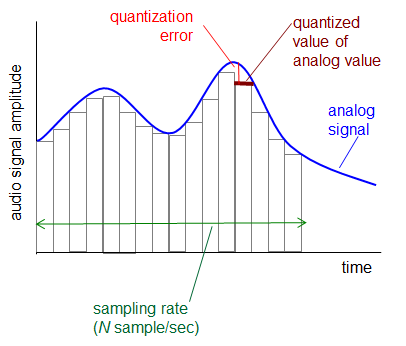

# Computer Networking - Network Multimedia

Computer Networking - Network Multimedia
<!--more-->
# Computer-Network-Multimedia

## Multimedia: Audio

- 아날로그 오디오 신호는 주기적인 속도로 샘플링 진행
    - Telephone: 8000 samples/sec
    - CD music: 44100 samples/sec
- 각각의 샘플들은 Quantized 된다

    

    - 즉 아날로그 → 디지털화
    - 각각 Quantized 된 값들은 Bits 로 표현됨
    - 계산법
        - 8000 samples/sec 이고 256 (2^8) quantized values
            - 8000 X 8 = 64000bps
    - 원본 손실이 일어날 수 밖에 없음

## Multimedia: Video

- 비디오: 일련의 이미지
    - 24 images/sec 등
- 디지털 이미지: 픽셀들의 집합
- 인코딩: 이미지간의 중복을 이용해 비트 (용량)을 줄임
    - spatial
        - 예를들어 N개의 같은 보라색 픽셀을 보내는 대신, (보라, N) 이렇게 색깔과 갯수만 보내는 형식
    - temporal
        - 전의 이미지와 다음 이미지간의 차이점만 보내는 방식
- CBR : 고정된 비디오 인코딩 레이트
- VBR
    - 가변적인 인코딩 레이트.
    - spatial, temporal이 변화하는 것에 따라 가변적.

## Multimedia Networking: 3 application types

- **Streaming**: Stored audio, video
    - 다운로드와 동시에 실행 가능
    - 서버에 저장된 미디어
    - 유튜브
- **Conversational voice/video over IP**
    - Interactive
    - Delay tolerance (딜레이 허용)이 제한됨
    - 스카이프
- Streaming live audio, video
    - 라이브 스포츠 이벤트

## Streaming stored video

## Streaming stored video: 도전점

- 한번 시작하면 버퍼링이 걸리지 않게 continuous 하게 해줘야 함
    - 그러나 네트워크 환경은 계속해서 변하기 마련임
    - 그래서 클라이언트 사이드에서 버퍼로 좀 쌓아뒀다가 플레이하는게 좋음
- 비디오 패킷이 유실될 수 있음
- 정지, 탐색, 리와인드 등 client interact

## Streaming stored video: Client side buffering

- 어느 정도 버퍼가 차면 플레이
- 버퍼의 찬 정도는 가변적임
- 버퍼를 채우는 속도에 따라서 x(t)
    - x < r : 버퍼를 채우는 속도가 play하는 속도보다 느림
        - 버퍼링이 걸림
    - x > r : 버퍼를 채우는 속도가 play하는 속도보다 빠름
        - 버퍼가 비지 않을 것이기 때문에 버퍼링 일어나지 않음
- initial playout delay tradeoff
    - 초기 버퍼값을 높게 설정하면 버퍼링이 많이 걸리지 않을 수 있겠다
    - 그러나 처음 영상을 재생할 때 까지의 시간이 많이 소요될 수 있다

## Streaming multimedia: UDP

- 보통 `send rate` = `encoding rate` = `constant rate`
- 전송 속도는 혼잡도에 상관없다
- TCP보다 상대적으로 적은 Playout delay
- 에러 복구가 필요하다면 애플리케이션 레벨에서 처리
- UDP는 방화벽에 자주 막히는 문제가 있다

## Streaming multimedia: HTTP (TCP)

- 혼잡 제어 때문에 전송속도가 가변적
    - 좀 더 큰 Playout delay
- 방화벽에 잘 안막히는 장점

