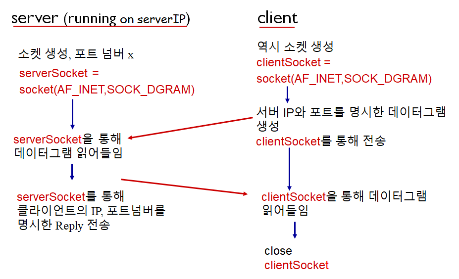

# Computer Networking - Socket Networking and Transport Layer

Computer Networking - Socket Networking and Transport Layer
<!--more-->
# Computer-Netowork-Socket-Networking-and-Transport-Layer

# 1. Socket Programming

## **Socket**

Door between applicationp process and end to end transport protocol

## Socket delivery flow

Make a messsage → Send it to sender socket → will be delivered automatically to the socket of the receiver → Receiver will get message thru its own socket

## So, you don't need to worry about much things

You only need to specify source address, destination address, and message which will be attached on socket.

Rest of parts will be done by transport infra.

## Two socket types

- **UDP**
    - Unreliable Datagram
- **TCP**
    - Reliable
    - Byte stream-oriented
        - Imagine there is some pipe between sender and receiver
        - Sender ←→ Receiver
        - And datagrams flow thru the pipeline, being oriented

## UDP: "No connection" between client ↔ server

- No Handshaking before sending data
- Sender (Can be both Server or Client) attaches IP destination address and port number to each packet
- Receiver extracts sender IP and port number from received packet
- Packet can be lost or received un-ordered status. (not guaranteed)

## How UDP interacting



## Actual Python Code (UDP)

```python
# UDP CLIENT
from socket import *
serverName = 'hostname'
serverPort = 12000
clientSocket = socket(AF_INET, SOCK_DGRAM)
message = raw_input('Input lowercase sentence:')
clientSocket.sendto(message.encode(), (serverName, serverPort))
modifiedMessage, serverAddress = clientSocket.recvfrom(2048) # receive from. will be blocked until it receives some datagram
print modifiedMessage.decode()
clientSocket.close()
```

```python
# UDP SERVER
from socket import *
serverPort = 12000
serverSocket = socket(AF_INET, SOCK_DGRAM)
serverSocket.bind(('', serverPort))
print ('The server is ready to receive')
while True:
    message, clientAddress = serverSocket.recvfrom(2048)
    modifiedMessage = message.decode().upper()
    serverSocket.sendto(modifiedMessage.encode(), clientAddress)
```

## TCP: "Creating TCP connection between client↔server"

- Client must contact server first
    - So, server process should be run first, with its socket to welcome client's contact
    - Client contacts server by creating TCP socket, specifying IP address, port number of server process (with connect function in python)
- Server creates saparated TCP socket for each clients
    - allows server to talk with multiple clients
    - source port numbers used to determine clients
- TCP provices reliable, in-order byte stream transfer ("pipe") between client ↔ server

## How TCP interacting


- 서버 소켓은 Close되지 않고 클라이언트 소켓을 위해 언제나 열려있을 것임

## Actual Python Code (TCP)

```python
# Client
from socket import *
serverName = 'servername'
serverPort = 12000
clientSocket = socket(AF_INET, SOCK_STREAM)
clientSocket.connect((serverName,serverPort))
sentence = raw_input('Input lowercase sentence:')
clientSocket.send(sentence.encode())
modifiedSentence = clientSocket.recv(1024)
print (‘From Server:’, modifiedSentence.decode())
clientSocket.close()
```

```python
# Server
from socket import *
serverPort = 12000
serverSocket = socket(AF_INET,SOCK_STREAM)
serverSocket.bind(('',serverPort))
serverSocket.listen(1) # begins to listen for incoming TCP requests
print 'The server is ready to receive'
while True:
     connectionSocket, addr = serverSocket.accept() # blocked waiting imcoming requests
     
     sentence = connectionSocket.recv(1024).decode()
     capitalizedSentence = sentence.upper()
     connectionSocket.send(capitalizedSentence.encode())
     connectionSocket.close()
```

# 2. Transport Layer

## Tranport services and protocols

- Manage **logical commucation** between app process running on different hosts
    - Those Two hosts may not physically connected
- Transport protocols run in end systems
    - Not in routers
    - Send side: breaks app messages into segments, and passes to network layer
    - Receiver side: Reassembles segments into messages, passes to app layer
- More than one transport layer can be available: UDP and TCP

## Transport vs Network Layer ★

### Network Layer

- **Logical communication** between **hosts**

### Transport Layer

- **Logical communication** between **processes** (programs)
- Relies on network layer servcies

## Internet Transport-Layer Protocols

> 딜레이, 전송 속도는 TCP, UDP 둘 다 보장 안됨

### TCP

- Congesion control
    - 네트워크가 혼잡할 때 Sender의 속도를 줄여 혼잡을 완화
- Flow control
    - Sender가 너무 빠르게 Stream을 보내지 않도록 속도를 조절
    - Receiver가 받는 속도가 느리면 패킷로스가 일어날 수 있기 때문
- Connection setup

### UDP

- No extensions

# 3. Multiplexing and Demultiplexing

> 여러개의 소켓에서 전송되고 받는 데이터를 Handle하기 위함


## Multiplexing

- **Handle data from** **multiple sockets**, add transport header

## Demultiplexing

- Use transport header info to **deliver received segments to correct socket**

## How Demultiplexing works

- Each datagram has source IP address and destination IP address
- Also datagram carries one transport-layer segment
    - which has source, destination port number
- So, host uses IP address & Port numbers to direct segment to appropriate socket

## Connectionless demultiplexing: "Used in UDP"

### !Recall

- 클라이언트 소켓이 만들어질때는 OS가 클라이언트 소켓에 포트 넘버를 자동 할당
- 서버 소켓을 만들 때는 Bind 함수로 포트번호 할당 가능
    - OS에서 포트 넘버 할당
    - Bind() 함수로 포트 넘버 할당
- Sendto() 함수를 사용하기 위해서는
    - IP 주소와 포트 넘버를 명시해줘야 한다

### SO.. When host receives UDP segment


- Checks destination port number in segment
    - 만약 각기 다른 Source IP, Port에서 온 데이터그램들이 같은 Destination Port를 가지고 있다면, 그냥 해당 Destination의 소켓으로 모두 전달한다.
    - 즉 UDP에서는 간단하게 말하면 포트 넘버만 보고 Demux를 한다고 볼 수 있다.
- And directs UDP segment to socket with that port number

## Connection-Oriented Demultiplexing: "Used in TCP"

### TCP socket identified by 4-tuple


> Receiver uses all four values to direct segment to proper socket

- Source IP
- Source Port #
- Destination IP
- Destination Port #

### Server host

- May support many simultaneous TCP sockets
- May have different sockets for each connecting client
    - Non-persistent HTTP will have different socket for each request
