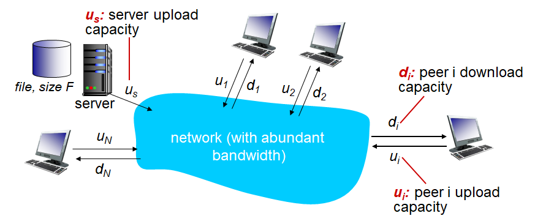

# Computer Networking - P2P and Dash

Computer Networking - P2P and Dash
<!--more-->
# Computer-Network-P2P-and-Dash

# 1. Pure P2P 아키텍쳐

- Always-On 서버 없음
- 임의의 엔드 시스템들이 서로 통신 (Peer)
- 피어들은 간헐적으로 연결되며 IP가 변경될 수 있음
- 예
    - Bittorrent
    - VoIP

## 클라이언트-서버 VS P2P

> Q. 사이즈가 `F`인 파일을 `N`개의 피어에게 전송할 때 얼마나 걸리나?

### 클라이언트-서버의 경우

- **서버의 입장에서**
    - 파일은 순차적을 보낸다.
    - 한 개 보낼 때

        $$F/u_s$$

    - 여러 카피 보낼 때

        $$N×F/u_s$$

- **클라이언트 입장에서**
    - dmin = 최소 클라이언트 다운 속도

    $$F/d_{min}$$

- 결과

    $$D_{cs} ≥ max(NF/u_s,F/d_{min})$$

### P2P의 경우

- **서버 역할 피어**
    - 일단 최소한 한 개의 파일은 업로드해야함

    $$F/u_s$$

- **클라이언트 역할 피어**

    $$F/d_{min}$$

- **최상의 경우**
    - 서버 역할 피어와 다른 모든 `i`개의 피어가 업로드 하고있을 경우

    $$NF/(u_s+ \sum u_i)$$

- **결과**

    $$D_{P2P} ≥ max\{F/u_s,F/d_{min},NF/(u_s + \sum u_i)\} $$

## 차이

> 클라이언트-서버 구조에서는 N이 커지면 전송시간 또한 선형적으로 커진다

> 그러나 P2P 구조에서는 N이 커져도 클아이언트-서버 구조처럼 드라마틱하게 전송시간이 늘어나지 않는다

# 2. 비트토렌트

- 파일은 256KB의 청크로 나뉘어짐
- **토렌트**: 파일을 공유하는 피어들의 그룹
- **트래커**: 토렌트 내부의 피어들의 참여도 등을 추적
- 토렌트에 처음 참여한 유저는 청크가 없다.
    - 다른 피어들에게서 청크를 받으며 점점 채워나간다
    - 트래커에게서 피어 리스트를 받은 후 일부 피어들과 통신함 (neighbor)
- 다운로드와 동시에 받은 청크를 업로드 가능
- 통신중인 피어들은 나가거나 새로 들어올 수 있다
- 파일을 다 받은 후에는 토렌트에 남거나 떠날 수 있다

## 비트토렌트 청크

- **요청**
    - 피어들은 각각 다른 파일들의 조각 (청크)을 가지고 있을 수 있다.
    - 그러므로 피어들은 주기적으로 다른 피어들이 가지고 있는 청크의 리스트를 요청해 받는다
    - 청크들을 요청할때는 최대한 레어한 청크부터 받는다.
- **전송**
    - **Tit-For-Tat**
        - 눈에는 눈 이에는 이
        - 나에게 파일을 보내야 나도 너에게 보낸다
    - 자신에게 가장 높은 속도로 청크를 보내고 있는 **4명의 피어**에게 청크를 전송한다
        - 나머지에게는 전송하지 않는다 (**Chocked**)
    - 해당 4명의 피어 리스트는 10초마다 한번씩 갱신된다
    - **Optimistically Unchoke**
        - 30초마다 추가로 랜덤하게 피어를 골라 청크를 전송한다
        - 해당 피어가 지금 4명의 피어 리스트에 있는 피어들보다 빠르다면
            - 그 피어가 새로운 **Top 4**가 될 것

# 3. 비디오 스트리밍과 CDN

## 비디오 스트리밍

- 비디오 트래픽이 인터넷 Bandwidth를 가장 많이 잡아먹음
- 서비스 업체들의 고민
    - 어떻게 수억명이 넘는 유저들을 다 수용하는가?
        - 하나의 서버로는 절대 수용 못한다 (네임서버 기억)
    - 유저마다 다른 환경
        - PC, 모바일
        - 각기 다른 인터넷 속도 등
- 솔루션
    - 분산된, 애플리케이션 레벨의 인프라 서비스 (DASH)

## 멀티미디어: 비디오

- 비디오란
    - 고정된 속도로 디스플레이되는 연속된 이미지
    - 예) 24프레임
- 이미지
    - 픽셀의 집합
    - 각 픽셀은 비트로 표현됨
- 코딩
    - 이미지 간의 중복성을 이용해 이미지 비트를 줄임
        - Spatial
            - 한 이미지 내에서 중복되는 픽셀을 이용
        - Temporal
            - 프레임 간에 차이점을 이용
    - CBR
    - VBR

## DASH (Dynamic Adaptive Streaming over HTTP)

> 유튜브에서 인터넷 속도에 따라 저화질, 중화질, 고화질 변경하는 것을 생각

### SERVER

- 파일을 여러개의 청크로 쪼갬
- 각각 청크들은 각기 다른 속도로 인코딩 됨
- Manifest file
    - 각각의 청크들의 URL을 제공

### CLIENT

- 주기적으로 서버-클라이언트 간 Bandwidth를 측정
- 그 속도를 기반으로 Manifest 파일을 보고 적절한 청크를 요청
    - 지금 Bandwidth 내에서 수용가능한 최대 레이트를 고름
    - 시간에 따라서 인터넷 속도가 달라질 수 있음
        - 그때그때 청크의 레이트 변경하며 요청할 수 있다
- **클라이언트가 주도 (Intelligence)**
    - 언제 청크를 요청할 것인가
        - 너무 빠르게 요청해 받으면 버퍼 오버플로우 발생
        - 너무 늦게 요청해 받으면 버퍼가 비어 버퍼링 발생
    - 어떤 레이트로
        - Bandwidth가 충분하다면 더 나은 화질 요청
    - 어디에 청크를 요청할 것인가
        - 클라이언트에서 물리적으로 더 가깝거나 더 빠른 회선의 서버에 요청 가능

## 수많은 요청 처리

> CDN을 이용, 영상의 COPY들을 나눠 분산 처리

- Enter Deep
    - 엑세스 네트워크에 많은 CDN 서버를 둠
    - 유저들에 더 가깝게
- Bring Home
    - 상대적으로 더 큰 몇개의 서버들을 엑세스 네트워크들 근처(POP)에 둠
- 네트워크 상황 등에 따라 각기 다른 CDN 노드를 선택해 사용 가능
- 고민
    - 어떤 CDN 노드로부터 컨텐츠를 받을 것인가?
    - 혼잡이 발생했을 때 Viewer는 어떻게 대처할 것인가?
    - 이를 Over The Top (OTT) 라고 함
    - 어떤 컨텐츠가 어떤 CDN에 위치할 것인가?

## DNS를 통한 CDN 컨텐츠 엑세스

1. 유저가 컨텐츠에 접속
    - http://video.netcinema.com/7FV50GAD
2. 유저는 로컬 DNS 서버에 해당 주소의 IP를 찾기 위해 DNS 질의
3. 질의 끝에 Netcinema의 Authoratative DNS 서버에서 CDN의 주소인 http://a1133.kingcdn.com 알려줌
4. 로컬 DNS는 KingCDN의 DNS 서버에 다시 질의하고, CDN의 DNS 서버는 실제 CDN 서버의 IP를 알려줌
5. 유저는 컨텐츠를 HTTP를 통해 스트리밍하며 받아봄

## 넷플릭스의 대략적 구조

