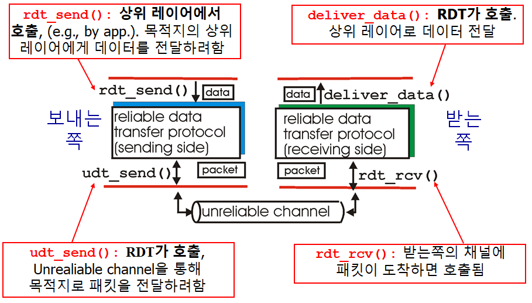

# Computer Networking - RDT and Pipelined Protocols

Computer Networking - RDT and Pipelined Protocols
<!--more-->
# Computer-Network-RDT-and-Pipelined-Protocols

# Reliable Data Transfer (RDT)

## What is RDT

- Transport layer provides reliable channel to application layer
- 그러나 Transport layer도 하위의 layer 기반이며, 이는 Unreliable channel이다.
    - 그럼 Transfer layer는 어떻게 Reliable channel을 구현하는가?

---

- `udt_send()`와 `deliver_dat()`는 RDT에서 직접 호출
    - **ACTION** 이라고 지칭
- `rdt_send()`는 application layer에서, `rdt_rcv()`는 underline channel에서 호출
    - **EVENT** 라고 지칭

## Let's try to develop RDT

- Assume we only need One-Way transfer
    - But control info will flow on both directions
- Use Finite State Machines (FSM) to specify sender, receiver
    - **FSM**
        - 상태를 중심으로 구현
        - 교재에서는 이렇게 표시

        

## RDT 1.0 : reliable tansfer 위의 reliable channel

- 하위 채널도 완벽하게 Reliable
    - 비트 에러 없음
    - 패킷 로스 없음
- FSM을 이용해 Sender, Receiver를 표현

    

    - Sender는 하위 채널에 데이터를 전송
    - Receiver는 하위 채널로부터 데이터를 수신
- 그러나 실제로는 하위 채널은 Reliable하지 못함

## RDT 2.0 : Channel with bit errors

- 하위 채널이 Reliable 하지 못함
    - 비트 에러가 있을 수 있음
- 그렇다면 어떻게 에러를 복구하는가
    - **ACks** (acknowledgements)
        - Receiver가 명시적으로 Sender에게 패킷을 잘 받았음을 알려줌
    - **NAKs** (negative acknowledgements)
        - Receiver가 Sender에게 명시적으로 패킷에 에러가 있음을 알려줌
    - Sender는 **NAKs**를 받으면 패킷을 재전송해줌
- RDT 2.0에서의 새 메커니즘
    - Error detection
    - Feedback (ACK, NAK)

## BUT WHAT IF ACK|NAK corrupted?

- Sender doesn't know what happened at receiver
    - ACK인지 NAK인지 판별 불가능
- Can't just retransmit: possible duplicate
    - ACK를 받아야 위쪽에서 새 데이터를 받고 패킷을 만드는데 ACK인지 판별이 불가능하니 계속 같은 패킷만 재전송 할수도 있다
- Duplicate 막기
    - Sender는 각 패킷에 Sequence number를 기입해둠
    - Receiver는 그 Sequence number를 보고 이미 받은 패킷이면 Discard 시킴

## Stop and Wait Protocol

- Sender sends one packet and waits for receiver's response

## RDT 2.1 : Sequence number로 중복 방지

- `sndpkt = make_pkt(0, data, ckecksum)`, `sndpkt = make_pkt(1, data, ckecksum)`으로 sequence number까지 보내주는 모습
- `corrupt(rcvpkt)||isNAK(rcvpkt)` 으로 ACK 혹은 NAK corrupt 체크
    - **corrupt 되었다면 일반 NAK같이 치부함**
- Twice as many states (**만약 seq가 2개라면 4개의 상태가 필요하다는 뜻**)
    - State must remember whether expected packet should have seq number of 0 or 1

- **Receiver는 받은 패킷이 중복된 패킷인지 체크**해야 한다
    - 0번의 패킷을 기다리는데 1번이 오거나, 1번의 패킷을 기다리는데 0번이 오면 `extract` 하지 않고 바로 ACK 패킷을 만들어 보내는 모습.
        - 즉 Discard 해버린다
- **Receiver는 Sender가 ACK|NAK을 잘 전달받았는지 알지 못함**

## RDT 2.2 : NAK-FREE Protocol

- ACK만 사용함
- 기다리고 있는것과 다른 Seq number의 정보를 가진 ACK가 오면 NAK를 받은것처럼 처리
    - Sender 측에서는 현재 패킷 `udt_send(sndpkt)` 즉 전 절차에서 만들어진 `make_pkt(0, data, checksum)` 을 다시 보냄
    - Receiver 측에서도 현재 패킷 `udt_send(sndpkt)` 즉 전 절차에서 만들어진 `make_pkt(ACK1, shksum)`을 그대로 보냄으로서 NAK 역할을 하게 함

## RDT 3.0 : ERROR, LOSS 모두 처리

- Underlying channel can also lose packets
    - Data, ACKs 둘 다 LOSS 가능
- Approatch
    1. Sender waits "resonable" amount of time for ACK
    2. **시간안에 안오면 패킷 재전송**
    3. 만약 패킷이 그냥 Delay 된거였다면 (not lost)
        - 재전송된 패킷은 중복 패킷이 되겠지만, Sequence number 덕분에 그냥 Discard 해줄 것
        - Receiver must specify seq number of packet being ACKed
    - 카운트 다운 타이머가 필요할 것

---

- `start_timer`로 "resonable" 한 시간동안 기다림
    - timeout 되면 패킷을 재전송하고 타이머 재시작
- **corrupt 되거나 잘못된 seq number의 ACK이 오면 그냥 무시**
- 제대로된 ACK가 오면 타이머 멈추고 다음으로 넘어감

## RDT 3.0 동작

- 지금까지 혼동하고 있었는데 이걸보면 Sequence는 일련의 한정된 패킷에 넘버링 하는게 아니라, 버퍼 개념인 듯 하다.
- 즉 여기서는 버퍼가 두칸짜리고 이걸 계속 상위 레이어에서 데이터를 받아서 채우고 Receiver에 전달하는 것.
- (d)의 경우에는 ACK 전달이 Delay되었는데도 중간에 Seq num이 다른 패킷과 ACK는 무시함으로써 정상 작동하는 모습을 보여준다.

## RDT 3.0 문제 : 퍼포먼스

- 제대로 작동은 하지만 작동이 엄청 느리다
- 사실상 못쓴다
- **RTT**
    - 패킷을 보내고 답을 받는데까지 시간
    - 2 X *PropDelay*
- 그러니까 실제 패킷을 전송하는데 할애한 시간인 `L/R` 에 전체 시간인 `RTT + L/R`을 나누면 효율을 알 수 있다.. 이말이다.
    - 구해보니 효율이 처참하다.

# Pinelined Protocols

- Sender는 Ack를 받지 않더라도 계속 여러개의 패킷을 보낼 수 있음
- TCP 프로토콜에 사용됨

## Increased Utilization

- 3개의 패킷을 동시에 보내므로 효율성이 증가하였다
- Receiver 측에서는 Ack를 보내긴 한다
- 다만 Sender 측에서는 패킷을 보낼 때 3개를 동시에 보내며, Ack를 받고 다음 패킷을 보낼때도 마찬가지다

## Go-Back-N

- 최대 N개까지 Ack를 받지않고 패킷을 보낼 수 있다
- Receiver는 `Cumulative Ack`만을 보낸다
    - 예를 들어 Ack10이라는 Ack를 보냈다면  0~10까지의 패킷을 정상적으로 수신했다는 것
    - **Gap 이 있으면 Ack 패킷을 보내지 않음**
        - 즉 만약 패킷1을 받았는데.. 패킷2가 전달이 되지 않은 경우?
        - 패킷3이 전달되어 Ack를 보낼 때 Ack1을 보낸다.
- 한개의 타이머만 유지
    - 타임아웃 발생하면, Ack로 정상 전송 여부가 판별되지 않은 모든 패킷을 다시 보낸다

## Selective Repeat (SR)

- 최대 N개까지 Ack를 받지않고 패킷을 보낼 수 있다
- Receiver는 각각의 패킷에 대해서 개별적인 Ack를 보낸다
    - 예를 들어 Ack10이라는 Ack를 보냈다면 10번째 패킷을 정상적으로 수신했다는 것
    - 그 이전의 패킷은 정상 수신여부 모름
- 각각의 패킷에 대해 타이머를 관리
    - 타임 아웃이 발생하면 해당 Ack를 받지 않은 패킷만 다시 전송
    - 오버헤드가 더 크다

Go-Back-N (GBN)

> Sliding Window Protocol 이라고도 부름

## Sender

- `window` : 최대 N개의 패킷을 보낼 수 있는 범위
- **`send_base`** : 현재 Window에서 처음 보내는 패킷
- **`nextseqnum`** : (상위 레이어에서 패킷이 아직 안와서) 다음에 보낼 패킷
- 설명하자면..
    - **초록색**은 Ack를 받고 정상 전송이 컨펌된 패킷들
    - **노란색**은 보내긴 했으나 Ack가 도달 안된 패킷들
    - **파란색**은 현재 Window 내에서 전송 가능한 가용 패킷 용량
    - **하얀색**은 아직 Window 범위 내에 있지 않아 사용 불가능한 칸이다.
    1. **만약 상위 레이어에서 데이터가 내려오면**
        - **Window 칸 모두 파란색**이다
            - 해당 패킷들을 만들어 보내고
            - 그 수만큼 파란색 칸은 노란색이 되고
            - `nextseqnum`도 해당 수만큼 오른쪽으로 이동
            - 보내놓은 패킷이 없어서 타이머가 종료된 상태였는데, 처음 패킷을 보냈으므로 **타이머 시작**
        - **Window 내에 노란색도 있고 파란색도 있다**
            - 해당 패킷들을 만들어 보내고
            - 그 수만큼 파란색 칸은 노란색이 되고
            - nextseqnum도 해당 수만큼 오른쪽으로 이동
        - **Window 칸 모두 노란색이다**
            - `nextseqnum`이 현재 window를 이탈한 상태라는 것
            - 즉 가용한 패킷 용량을 다 사용했으므로 데이터 전송을 거부
    2. **만약 Ack가 도착하면**
        - 해당 Ack가 컨펌한 패킷들만큼 노란색 칸이 초록색 칸으로 채워지고
        - 또 그만큼 `send_base`가 오른쪽으로 이동
        - `window`는 바뀐 `send_base`에 맞춰 그만큼 재설정됨
        1. **그랬는데 만약 모든 칸이 초록색이라면**
            - 모든 보낸 패킷이 Ack에 의해 컨펌되었으므로 **타이머 종료**
        2. **아직 컨펌되지 않은 패킷이 있다면**
            - **타이머 재시작**
    3. **타임아웃이 발생하면**
        - **타이머 재시작**하고
        - **노란색 패킷들을 다시 보냄**

## Sender FSM

- 위에서 얘기한 내용을 FSM으로 표현한 것

## Receiver FSM

- `expectedseqnum` : 받아야 할 패킷의 시퀀스 넘버
- **패킷이 순서대로 왔을 경우**
    - **제대로 수신된 제일 마지막 패킷을 기준으로 ACK 하나를 보냄**
    - `expectedsuqnum` 하나만 기억하면 됨
- **패킷의 순서가 엉망인 경우**
    - 그냥 버려버리고
    - **순서대로 제대로 온 패킷의 마지막 시퀀스 넘버 ACK를 보낸다**

## 모식도

- Sender는 패킷 0,1,2,3 을 보낸다
- Receiver는 패킷2가 Loss 됬으므로 마지막으로 제대로 수신된 패킷1의 ACK를 계속 보낸다.
- Sender는 ACK1를 받아 0,1은 컨펌됨을 알고 send_base를 2로 이동
- 그리고 그 과정에서 Window에 포함되는 4,5가 비는데, 데이터가 오면 전송시킨다
- Receiver는 해당 패킷을 기대하는게 아니므로 계속해서 패킷1의 ACK를 보냄
- 그러다보면 타임아웃이 일어남
- Sender는 타이머를 재시작하고 Ack로 컨펌되지 않은 2,3,4,5 패킷을 보냄
- Receiver는 기대하고 있는 패킷이 왔으므로 수신 작업을 함

# Selective Repeat (SR)

## Go-Back-N 과의 차이점

- Receiver
    - 개별적으로 패킷을 ACK 처리
    - 순서대로 오지 않은 패킷도 버퍼함
        - 즉 패킷9를 받지 못하고 패킷10을 받았을 때에도 버퍼에 패킷10을 저장해두었다가 패킷 9가 오면 한꺼번에 올려줌
- Sender
    - 각각의 패킷에 대해 타이머를 유지 관리
    - 타임아웃이 오면 해당 패킷만 재전송

## Sender / Receiver

## 모식도

- Sender가 패킷 0,1,2,3 보냄
- 패킷2에 로스가 일어남
- Receiver는 패킷 0,1,3 받고 각각 Ack 보냄. 패킷3은 버퍼에 들어감
- Sender는 0,1이 컨펌된것을 인지하고 Sender_base를 2로 옮김 (단 Ack3의 경우에는 Ack2가 아직 도달 안했으므로, 패킷3이 전송 잘 되었다는것만 기억.)
- 그 과정에서 포함되는 4,5 자리. 데이터가 오면 패킷 4,5로 전송
- Receiver는 패킷을 받고 버퍼에 저장. Ack 4, Ack 5도 전송함
- 패킷 4,5도 잘 전달되었다는 것을 기억.
- Sender는 패킷2 타이머가 타임아웃됨을 인지
- 따라서 패킷2를 재전송
- Receiver는 패킷2를 받고 버퍼에 있던 패킷들과 함께 상위 레이어로 전송, Ack2를 Sender에 전해줌

## 문제점

> 시퀀스 넘버를 잘 써야한다.

- 위같이 시퀀스 넘버를 짤 경우, Receiver 입장에서는 Sender의 사정을 알 수 없으므로
- 처음 패킷0,1,2에 대한 Ack들이 통째로 로스될 경우..
    - Sender는 재차 기존 패킷0,1,2를 재전송하고
    - Receiver는 그 재전송된 패킷이 새로운 칸의 0,1의 패킷으로 생각하고 버퍼에 넣어버린다.
- 그래서 시퀀스 넘버 Range는 Window 사이즈보다 두 배 이상 커야 한다.
