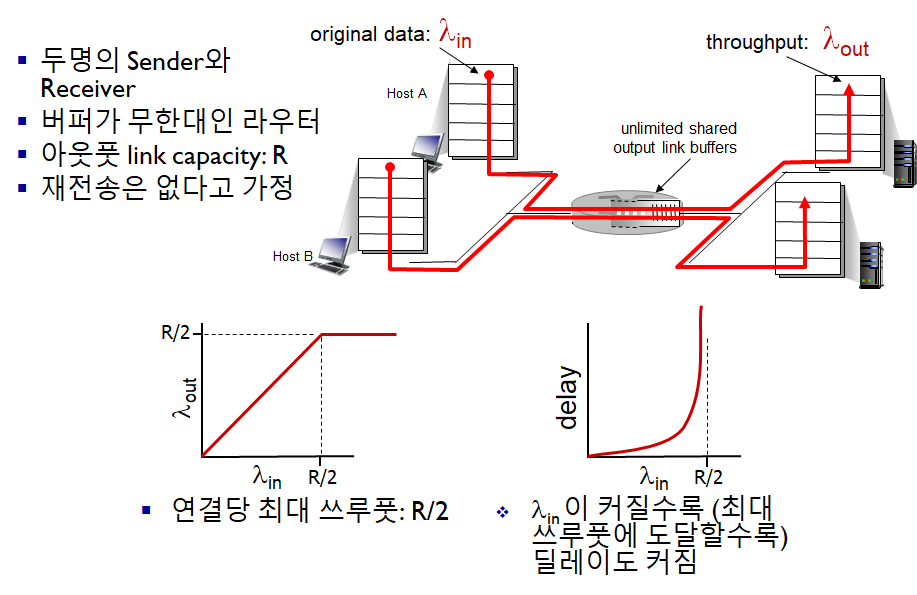

# Computer Networking - TCP Congestion Control

Computer Networking - TCP Congestion Control
<!--more-->
# Computer-Network-TCP-Congestion-Control

# Principles of congestion control

## 정의

- 너무 많은 Source들이 너무 많은 데이터를 너무 빨리 보내 네트워크가 감당이 안되는 상황
- Flow control과는 다르다
- 패킷 유실, 긴 딜레이가 발생할 수 있다

## 시나리오 1

## 시나리오 2

## 혼잡이 발생하면

- "Goodput"을 위해 재전송이 자주 필요할 수 있다
- 필요하지 않은 재전송도 일어날 수 있다
    - "Goodput"의 효율을 떨어뜨린다

## 시나리오 3

## 혼잡이 발생하면

- 만약 패킷이 드롭되면, 해당 모든 상위의 Transmission capacity들의 효율이 떨어지게 된다.TCP Congestion Control

> Additive Increase, Multiplicative Decrease

> 증가시킬때는 천천히, 감소시킬때는 빠르게

- Sender는 전송 속도 (윈도우 사이즈)를 계속 늘려 Bandwidth를 증가시키고, 패킷 로스가 일어나면 윈도우 사이즈를 줄인다
    - Additive increase
        - `cwnd` (congestion window)를 패킷 로스가 감지될 때 까지 `1MSS` 만큼 매 `RTT`마다 늘린다
    - Multiplicative decrease
        - 패킷 로스가 감지되면 `cwnd`를 반으로 줄인다

    

    - 최대한 Max bandwidth를 쓰겠다는 노력..

## 1. TCP Congestion Control: detail

- 기억하자!
    - TCP의 경우 Cumulative (누적) Ack를 쓰기 때문에 초록 노랑 섞이지 않음
- Sender 전송 속도 제한

- cwnd (congestion window) 는 네트워크 혼잡도에 따라 가변적
- **TCP Sending Rate**
    - 대충 RTT 당 cwnd 만큼 보냄

    

    - cwnd를 늘리거나 줄임으로서 혼잡도 회피

## 2. TCP Slow Start

- 처음에는 cwnd = 1 MSS (1460bytes 정도)로 시작 (작은 크기)
- 이를 지수적으로 증가시킴
    - 각각의 RTT마다 cwnd를 두배씩 증가시킴
    - 이는 ACK를 받을 때 마다 +1를 해줌으로서 가능

    

## 3. TCP: 패킷 로스 검출, 반응

- 타임아웃 발생
    - cwnd를 1 MSS로 줄임
    - 다음 다시 지수적으로 증가시킴 (threshold=8 까지) (1..2..4..8..)
    - threshold에 도달하면 선형적으로 증가시킴 (9..10..11..12) → congestion avoidence
- 3개의 중복 ACK가 발생
    - TCP Tahoe
        - 타임아웃 발생시와 같이 처리
    - TCP RENO
        - cwnd를 반으로 줄이고 선형적으로 증가시킴

## 4. Slow start → CA (congestion avoidence)

- 위를 보면 패킷로스 이벤트가 발생하자
    - ssthresh가 패킷로스가 일어난 값의 1/2로 재설정되었다
    - TCP Tahoe의 경우
        - cwnd가 1로 초기화 되고 지수적으로 증가
        - ssthresh에 도달하자 선형적으로 증가
    - TCP Reno의 경우
        - cwnd가 1/2로 재설정되어 바로 선형적으로 증가

## TCP 혼잡 컨트롤 요약

## TCP 쓰루풋

- Slow start 없다고 가정, 보낼 데이터가 항상 있다고 가정
- W (window size) 이상이면 패킷 로스가 일어난다고 가정
- 평균 쓰루풋 = 3/4 * W per RTT

## TCP Features: TCP over "Long, Fat Pipes"

- 예를들어 1500 byte segments, 100ms RTT에 10 Gbps 쓰루풋을 원할 때
- 윈도우 사이즈가 83,333이 되어야 가능
- 세그먼트가 로스된다면?

    

- 2의 10승 당 하나의 로스만 발생해야 한다고 함
- 이는 비현실적임

## TCP 공평성

- TCP는 공평성을 가지고 있다

- 연결 1,2가 같은 네트워크를 사용한다고 했을 때
    - 처음에는 쓰루풋이 달라도 패킷로스 등을 거치며 slow start, CA 등으로 쓰루풋이 equal bandwidth로 수렴된다

## 공평성의 장단점

- 멀티미디어 앱들의 경우 혼잡도 컨트롤 때문에 속도에 지장받는걸 원하지 않음
    - 따라서 UDP를 많이 사용
- Parallel TCP
    - 어플리케이션은 병렬적으로 연결을 맺어 속도를 향상시킬 수 있음 (꼼수같다..?)
    - 예를 들어 이미 9개의 TCP 커넥션이 있는데, 새 앱이 1개의 TCP만 연결한다면
        - R/10 만 배당받는 셈
    - 그런데 새 앱이 TCP를 9개 열어버리면
        - R/2를 할당받는 셈
    - 웹 브라우저에서 자주 사용

## Explict Congestion Notification (ECN)

> 네트워크가 도와주는 혼잡 컨트롤 (일부 구현)

- 라우터들이 혼잡 상황을 판단, Source와 Destination에 알려줌
- IP 헤더에 ToS 필드가 있는데 이것을 사용

- 위를 보면
    1. Source에서는 ECN=00 으로 세팅되어 전송됨
    2. 만약 네트워크에 혼잡이 있다면 중간에 라우터에서 이를 ECN=11으로 바꿈
    3. Destination에서는 패킷을 받아보고 ECN이 설정되어 있다면 ECE=1 (ECN echo) 설정해 ACK를 보내줘 Source에게도 네트워크에 혼잡이 있다는 것을 알려줌
