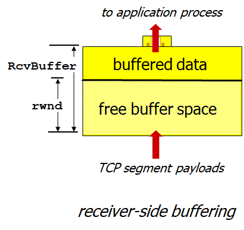

# Computer Networking - Flow Control and Handshake

Computer Networking - Flow Control and Handshake
<!--more-->
# Computer-Netowork-TCP-Flow-Control-and-Handshake

# 1. TCP Flow Control

- Reciver 측에서 버퍼에다가 데이터를 저장하는데 Sender가 너무 빠르게 보내면 데이터가 유실될 수 있음 (Overflow)
- 그러므로 Receiver 측에서 Sender를 컨트롤하여 너무 빠른 속도로 데이터를 보내지 않도록 조절

## 절차

- Receiver는 가용한 버퍼의 크기를 TCP header의 `rwnd` 값을 통해 Sender에게 알려줌 (광고)
    - RcvBuffer의 크기는 기본적으로 4096 Bytes 이지만 OS에서 보통 자동으로 할당해줌
- Sender는 `Unacked 패킷`의 양을 `rwnd` 값을 넘지 않도록 조절해 오버플로우 방지

# 2. Connection Management

- TCP는 Sender/Receiver가 Handshake하는 절차를 거침
- 도중에 서로 Connection Parameters (Variables)에 대해 동의함
    - 양쪽의 시퀀스 넘버와 버퍼값을 서로 알려주고 동의

## 2-way handshake

## 2-way handshake 문제점

- 딜레이가 가변적
- 패킷 로스 등 재전송이 필요한 경우가 있을 수 있음
- 지금은 Handshake 중이기 때문에 Order가 보장되지 않음
- Can't "See" other side each other yet

- 왼쪽의 경우
    - Delay 때문에 클라이언트가 다시 req_conn(x)를 보냈다
    - 그러나 재전송된 패킷이 서버에 도달하기 전에 TCP 연결이 맺어져버렸고
    - 데이터 송수신도 끝나 TCP 연결은 종료되었다
    - 이 재전송된 패킷은 그 이후에 서버에 도착했다
    - 서버는 이를 받아들여 TCP 연결을 또 열어버린다
    - 그러나 이는 클라이언트가 없는 반쪽짜리 연결이다 (쓸모없는)
- 오른쪽의 경우
    - TCP 전송이 끝난 후 재전송된 req_conn(x) 뿐만 아니라 재전송된 데이터까지 다 받아버렸다
    - 결국 서버 혼자 새 TCP 연결을 열고 데이터까지 받아버린 꼴이다

## TCP 3-way handshake

- 예를 들어 클라이언트는 `ACK(y)`를 보낼 때 HTTP Request를 같이 보낼 수 있다

## TCP: Closing a connection

- 클라이언트, 서버 둘 다 연결 끊을 수 있음
    - FIN 플래그에 1을 주면 됨
- Respond to received FIN with ACK
    - on receiving FIN, ACK can be combined with own FIN
    - 즉 위에서 서버가 클라의 `FINbit=1` 에 대한 `Ack`를 보낼 때 자신의 `FINbit=1`을 같이 보낼수도 있었다.
- simultaneous FIN exchanges can be handled
- 클라는 위에서 왜 TIMED_WAIT → CLOSED 까지 기다리고 있을까?
    - 만약 서버의 FIN에 대한 자신의 Ack Response가 유실되었을 경우, 서버가 `FINbit=1`을 재전송할 경우 다시 Ack를 보내줘야 하기에 충분한 시간동안 기다려 주는 것
