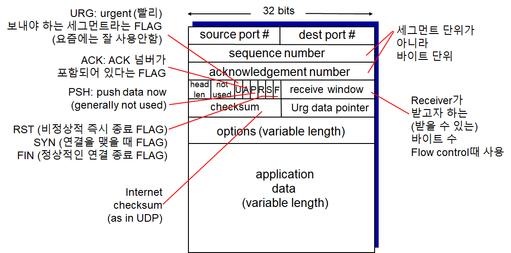

# Computer Networking - Network TCP

Computer Networking - Network TCP
<!--more-->
# Computer-Network-TCP

# 1. TCP

## Overview

- **Point 2 Point**
    - 하나의 Sender, 하나의 Receiver
- **Reliable, In-Order byte Stream**
    - 메세지 크기 제한이 없음
- **Pipelined**
    - TCP의 Congrestion Control과 Flow control에 의해 윈도우 사이즈 계속 변함
- **Full duplex data**
    - 양방향 통신
    - MSS: Maximum Segment Size
- **Connection-Oriented**
    - Hand-Shaking을 먼저 해야함
- **Flow Controlled**
    - Receiver가 핸들 가능한 정도로의 속도로 맞춰줌

## TCP segment 구조

- Option은 거의 사용하지 않아 TCP의 헤더 사이즈는 보통 20Bytes
    - 32bits = 4bytes

## TCP 시퀀스 넘버, ACKs

> GO back N 등에서는 패킷 단위로 번호를 매겼지만 여기서는 바이트 단위로 번호를 매김

### 시퀀스 넘버

- 해당 시퀀스의 첫번째 바이트의 Number

### ACK 넘버

- 상대방으로부터 기대하는 다음 시퀀스 넘버
- 즉 Seq1 다음에는 Seq5를 기대할 것이므로 Ack5
- Cumulative (누적되는) ACK
    - 즉 Ack8을 받았다면 1~7바이트 까지는 정상적으로 받았다라는 것
- Q. 만약 순서에 맞지않게 (Out of Order) 세그먼트들을 받았다면?
    - TCP 표준에는 정의되어 있지 않아 따로 개발자가 구현 필요

### 간단한 예시

- **'C'**라는 1Byte짜리 데이터를 주고받는 모습

## TCP Timeout

- Timer의 시간이 만료되면 패킷이 유실됬다고 판단, 재전송
- Q. 얼마나 기다릴 것인가?
    - RTT (패킷이 갔다가 돌아오는 시간) 보다 커야함
    - 그런데 RTT는 네트워크 상황에 따라 가변적임
    - 너무 짧으면
        - 타임아웃이 너무 빨리 걸림.
        - 의미없는 재전송을 하게 됨
    - 너무 길면
        - 세그먼트 로스에 대해 늦게 대처하게 됨
- Q. RTT를 예상할 순 없나?
    - **SampleRTT**
        - 세그먼트를 실제로 한번 보내보고 Ack가 올때까지의 시간을 측정해 평균값 추정

## TCP RTT

- Exponential weighted moving average
- EstimatedRTT
    - SampleRTT들의 평균값
- 대략 이전의 평균 RTT에다 새로운 SampleRTT를 평균하되 가중치를 두어 평균하는 방법
- 이전의 값들은 시간이 지날수록 점점 더 영향력이 줄어듬
- 위 그래프에서 실제 SampleRTT보다 EstimatedRTT가 더 부드러운 곡선을 그리는 것을 알 수 있다
- 계산 예제
    - Est0 = 100, Sam1 = 100, Sam2 = 50, Sam3 = 200, Alpha=0.1 일 때 Est1, Est2, Est3를 구하라
    - Est1 = 0.9*Est0 + 0.1*Sam1
    - Est2 = 0.9*Est1 + 0.1*Sam2
    - Est3 = 0.9*Est2 + 0.1*Sam3

## TCP Timeout

- 실제 Timeout Interval =  EstimateRTT + "추가 값 (Safety Margin)"
- |현재 측정값 - 평균 측정값의 절대값|
    - 즉 현재 측정값과 평균 측정값의 차이가 많이 나면 마진을 많이 두고
    - 아니라면 적게 두겠다는 뜻
- 최소 1초 이상은 나오게 되어있음
    - 컴퓨터 입장에서는 1초가 긴 시간이기 때문에 다른 패킷 로스 디텍트 방식이 있음

## TCP Reliable Data Transfer

- IP (인터넷 프로토콜)은 RDT를 제공하지 않음
- 따라서 TCP는 해당 Unreliable한 서비스 위에서 RDT 서비스를 제공하고 있음
    - 파이프라인 세그먼트
    - Cumulative Acks
    - Single Retransmission timer
        - 타이머를 하나만 씀
- Retransmission Triggered by
    - 타임아웃 발생
    - Duplicate Acks

## TCP sender events

- **TCP 소켓이 앱에서 데이터를 받을 때**
    - 세그먼트 넘버와 함께 세그먼트 생성
    - 타이머가 작동중이지 않으면 시작시킴
        - 가장 오래 Unacked 상태인 세그먼트라고 가정
- **타임아웃이 일어날 때**
    - 타임아웃이 일어난 세그먼트 재전송
    - 타이머 재시작
- **Ack를 받을 때**
    - 새로운 Ack일 경우
        - Ack 된 (컨펌된) 세그먼트 체크 (SendBase 우측으로 이동)
        - 아직 *Unacked*인 세그먼트가 있다면 타이머 시작

## TCP 재전송 시나리오

- **Premature timeout 설명**
    - Sender: 타임아웃되어 Seq 92를 다시 재전송
    - Receiver: 사실 정상적으로 받아 Ack120을 돌려줌
    - Sender: Sendbase 120으로 맞춤
    - Receiver: 이미 받은 세그먼트를 다시 받았으므로, 마지막으로 성공한 Ack120을 다시 전송해줌
        - 받을것으로 기대하는 넘버를 보낸다는 의미도 있음

- Cumulative ACK이기 때문에 ACK를 동시에 받았을 때 윗쪽 하나가 유실되더라도 Ack120 하나만으로 `0~119`까지 받았다는걸 알기에 정상작동

## TCP ACK 생성

## TCP Fast retransmit

- 타임아웃은 1초 이상으로 꽤 김
    - 패킷 로스에 대응해 재전송하기까지 딜레이가 길 수 있음
- 따라서 Duplicate ACKs가 발생하면 패킷 로스로 판단, 즉각 재전송 하겠다는 것
- 위의 예에서 Host B는 기대중이던 Seq number가 도착하지 않아 ACK100을 계속 재전송해줌
- Host A는 그것으로 보아 패킷 로스가 일어났다고 가정하고 Host B가 지정해주는 (또한 가장 오래된 Unacked Seq인) 100번 세그먼트를 빠르게 재전송
