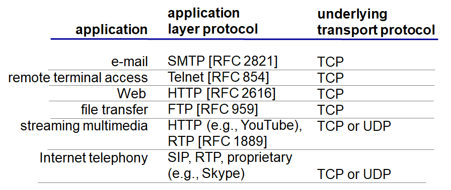

# Computer Networking - Transport Layer Protocols

Computer Networking - Transport Layer Protocols
<!--more-->
# Computer-Netowork-Transport-Layer-Protocols

## 1. TCP 서비스

### 신뢰성 있는 전송

### Flow control

- Sender가 메세지를 너무 빨리 보내지 않게 (Receiver가 데이터 처리가 느릴 경우 데이터 loss 없이 온전히 받을 수 있게) 전달하게 해줌
- Sender와 Receiver 1:1 관계

### Congestion control

- 네트워크의 관계
- 각 Sender가 네트워크의 혼잡을 방지하기 위해 Sending 속도를 줄여줌

### 타이밍, 최소한의 Throughput, 보안 관련 서비스는 제공해주지 않음

### Connection-oriented

- TCP는 우선 클라이언트 - 서버 상에 연결을 맺고 메세지를 주고받는다

## 2. UDP 서비스

### 신뢰성 있는 전송 보장해주지 않음

### 아무 서비스도 보장해주지 않는다

### 왜 쓰냐 그럼?

- 헤더 사이즈가 작고 빠르게 전송 가능
- 요즘 네트워크가 좋아져서 대부분 잘 가기 때문

# 12. TCP 프로토콜 보안 적용하기

## TCP & UDP

- 메세지를 암호화하지 않음

## SSL

- 별도의 라이브러리
- 암호화된 TCP 연결 제공
- 데이터 무결성
- 사용자 인증

## SSL은 애플리케이션 레이어

- 유저 애플리케이션 밑에 SSL, 그 밑에 TCP
