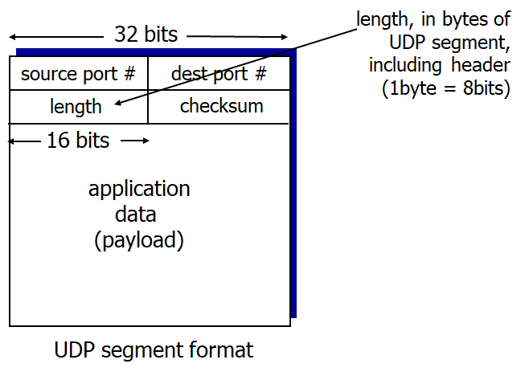

# Computer Networking - UDP

Computer Networking - UDP
<!--more-->
# Computer-Network-UDP

# 1. UDP

- "BARE BONES" Protocol
    - No extentions
    - Almost like IP + DATAGRAM
- "Best effort" service
    - UDP segments can be lost
    - Delivered as **out-of-order**
- No hand-shaking between UDP sender and receiver
- each UDP segment handled independently

## UDP usages

- Streaming multimedia app
    - Timing is important, so fast deliver is required
    - Some loss of packets is okay
- DNS
- SNMP
    - 간이 망 관리 프로토콜
    - 네트워크 관리 및 정보 수집을 위한 표준 프로토콜

## Reliable transfer over UDP

- implement yourself at application layer

## UDP segment header

- Header size : 8bytes

## Why is there a UDP?

- No connection establishment
    - No delay for hand-shake
- Simple: No connection state at sender, receiver
- Small header size
    - Header size of TCP is 20bytes
- No congestion control
    - Can be delivered as fast as desired

## UDP Shecksum

- 세그먼트들을 16비트 정수로 간주해서 모두 더해 체크섬을 만듬
- Sender와 Receiver가 각각 체크섬을 계산, 비교해 에러가 있는지 확인
- 체크섬은 헤더의 체크섬 Bit에 탑재되어 전송됨

### Goal

- To detect **Errors**

### Sender

- 헤더 필드를 포함한 모든 세그먼트 내용을 16비트 정수로 간주함
- 체크섬: 모든 세그먼트 내용들을 더한 결과
    - 1의 보수를 이용
- Sender는 Checksum 결과를 UDP Checksum Field에 넣음

### Receiver

- 전달된 세그먼트들의 체크섬을 다시 직접 계산
- 직접 계산한 체크섬이 전달받은 체크섬 값과 동일한지 확인
    - NO - error detected
    - YES - no error detected... maybe

### Example

- 두 세그먼트를 더한다
    - 남는 오버플로우된 비트가 있다면 결과값의 제일 하위 비트에 더한다.
- 모든 비트를 Flip한다
- 그럼 체크섬이 된다
