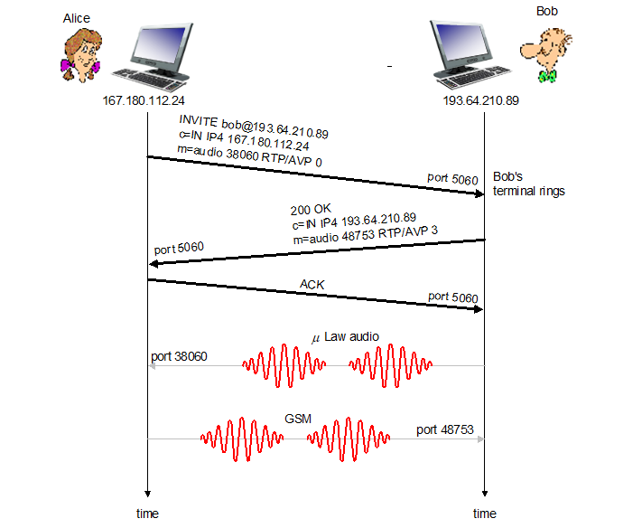

# Computer Networking - VOIP-SIP

Computer Networking - VOIP-SIP
<!--more-->
# Computer-Network-VOIP-SIP

## SIP : Session Init Protocol

- 모든 전화, 비디오 콜이 인터넷 통해서 이루어지도록
- 번호보다는 이름이나 이메일로 신원 확인
- 전화 받는 사람(Collee)가 어디서든, 어떤 장치를 쓰던 Reachable 하게

## SIP 서비스들

- Call 셋업 시 SIP가 제공하는 메커니즘들
    - Coller가 Collee에게 전화하고 싶다는 사실을 Collee에게 알려줌
    - 이로서 미디어 타입, 인코딩 방식 등 협의
    - 전화 종료
- mnemonic (의미있는) 식별자들을 IP 주소로 변경
    - 이메일, 이름 등
- 통화 관리
    - 새로운 미디어 스트림 추가 (음성 → 비디오 전화 등)
    - 인코딩 방식 변경
    - 다른 통화상태 추가
    - 전화 홀드, 전달 등

## Example

- 인코딩 협상
    - 만약 상대방이 요청한 인코딩을 자신의 시스템이 지원하지 않는다면 606 Not Acceptable
        - 상대방은 다른 인코딩 방식을 설정해 새 INVITE 메세지를 보낼 수 있음
- RTP(UDP) 뿐만 아니라 TCP도 사용 가능

## 이름 변환, User Location

- Collee의 IP 주소를 알아내야 하는데 IP는 계속 바뀜
    - USER는 돌아다니고
    - DHCP 프로토콜
    - 기기마다 다른 IP

## SIP registrar

- 사용자가 SIP Client를 실행시키면 클라이언트는 SIP REGISTER에 메세지를 보내 등록

## SIP Proxy

- Local DNS Server와 유사한 역할
- Alice가 프록시 서버로 invite 메세지를 보내면
    - 해당 메세지는 상대방 Bob의 주소(이름)을 포함
    - 프록시 서버는 다른 프록시 서버 등을 통해 라우팅하여 Bob에게 메세지 전달
    - Response를 받으면 다시 그것을 Alice에게 전달
        - Response에는 Bob의 IP가 포함

## SIP example

# Network and Multimedia

## Multimedia support of network

- Best Effort
    - None services available
- Differentiated service (서비스 차등화)
    - Soft Guarantee available
    - Packet Marking
        - 패킷에 중요도 마킹
    - Scheduling policing
    - 복잡성 중간. 조금 사용
- Per-connection QoS
    - Hard Guarantee available
    - Packet Marking
    - Scheduling policing
    - Call admission
        - 보장해줄 수 있다면 허용, 아니라면 통신 비허가
    - 복잡성이 높아 실제로는 사용 거의 안함

## Best effort networks

- 충분한 용량을 줘서 딜레이나 로스 없이 하겠다
- 좋은 라우터, 링크로 하겠다
- 비용이 많이 듬
- Challenges
    - 그럼 얼마만큼의 bandwith가 충분한 양인가?
    - 트래픽 추정도 필요함

## Class of Service

- 서비스에 클래스를 두어 차등화하겠다
- 클래스 별로 다른 서비스를 제공

## Class of Service : Sinario 1

- VOIP의 경우 실시간성 데이터이므로 우선순위가 높아지면 좋음
- VOIP인지 HTTP 클래스인지 식별하기 위해 **Packet Marking** 사용

## Class of Service : QoS garantees

- 그런데 VOIP에 우선순위를 높게 줬더니 링크 캐퍼시티를 전부 사용해버린다면?
    - HTTP 연결은 아예 못하게 되어버림
    - 그러므로 **QoS policing**를 주어 연결속도 제한

## Class of Service : QoS Problem

- 그런데 예를들어 VOIP에 1Mbps, HTTP에 0.5Mbps 식으로 고정적으로 할당해버리면
    - 만약 VOIP가 Idle 상태일때도 HTTP는 0.5Mbps만 사용 가능
    - 그러므로 링크 낭비
    - 따라서 최대한 효과적으로 사용할 수 있는 방법 궁리해야함

## Packet Scheduling

- 큐에 쌓인 패킷들 중에 어떤 패킷을 보낼 지 정하는 것 (지난학기때 배움)
- 방법들
    - FCFS (선입선출)
    - Simple Multi-Class Proirity
    - Round robin
    - Weighted fair queueing (WFQ)

## Policing mechanisms

- QoS 정책
- 평균 패킷 제한
    - (장기적으로) Unit time 당 얼마나 많은 패킷을 보낼 수 있는지 결정
- Peak Rate
    - 분당, 초당 얼마의 패킷을 보낼 수있는지 결정
- Burst size
    - 한번에 (연속적으로) 패킷을 보낼 때 얼마나 많이 보낼 수 있는지 결정

## Policing mechanisms: **Token bucket**

- **Token bucket** : 제일 많이 사용
- 방법론
    - 가상의 통이 있는데 여기에는 티켓이 1초당 10개 생성됨
    - 패킷이 지나갈 때 마다 티켓을 한장 소모하고 가야함
    - 만약 가상의 통이 비어있다면 (티켓이 없다면) 패킷은 티켓이 생길 때 까지 대기했다가 지나가야함
- **티켓(토큰)이 생성되는 시간을 통해 속도 조절**
    - 초당 A개의 토큰을 생성한다면 패킷도 초당 10개 지나갈 수 있음
- **통의 크기를 조절해 Burst Size 조절**
    - 통의 크기가 B라면, Burst Size도 B
        - 기다리는 시간 없이 연속적으로 보낼 수 있는 양
- 따라서 주어진 T 시간에 대해 보낼 수 있는 패킷의 양은
    - A * T + B

## Policing and QoS Guarantees

- Tocken bucket과 WFQ를 같이 쓰면 라우터 큐 딜레이의 Guaranteed upper bound를 구할 있다

- 즉 Dmax of Red = b / ((W1)/W1+..+Wn) * R)

## Differentiated Services

- 차등화된 서비스 제공
- 간단한 펑션은 네트워크 코어에 유지하고, 복잡한 펑션은 엣지 라우터나 호스트에 유지
- 직접 클래스를 구현하진 않고, 클래스를 만들 수 있는 기능들을 정의

## Diffserv Architecture

- **Edge Router**
    - Flow 별 트래픽 관리
    - 패킷 마킹
        - in-profile
            - Flow가 선언한 만큼의 속도 안에서 쓰고있는 패킷들에 마킹됨
        - out-profile
            - Flow가 선언한 만큼의 속도 이상을 사용하고 있는 패킷들에 마킹됨
- **Core Router**
    - Class 별 트래픽 관리
    - 엣지 라우터에서 마킹한 것에 기반하여 버퍼링, 스케줄링
    - in-profile 패킷들에 우선순위를 먼저 줌

## Edge-router packet marking

- Profile = 협의된 전송 속도 R, 버킷 사이즈 B
- Flow 마다 Profile을 베이스로 패킷을 마킹함
- 마킹 사용법
    - Class-Based Marking
        - 클래스 별로 마킹
    - Intra-Class Marking
        - 클래스 내에서도 in-profile인지 out-profile인지에 따라 마킹 가능

## Diffserv packet marking: Detail

- ToS를 이용해 마킹
- 6비트짜리 Differentiated Service Code Point (DSCP) 필드 이용

## Per-Connection QoS Guarantees

- 아예 연결별로 QoS를 지정
- 예를 들어 1.5Mbps링크에 2개의 1Mbps 연결이 시도되고 있다면
    - 한개만 허용하고 다른 한개는 막아버림
    - **Call Admission**
