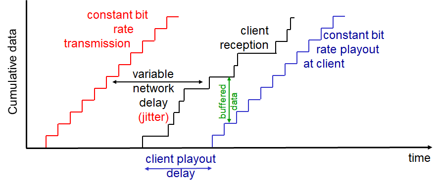

# Computer Networking - VOIP

Computer Networking - VOIP
<!--more-->
# Computer-Network-VOIP

## VOIP

- '통신 가능한' 만큼의 딜레이 관리가 필요
    - D < 150ms : Good
    - D > 400ms : bad
- **Session initialization**
    - 어떻게 전화하는 사람이 IP, 포트, 인코딩 알고리즘을 전달하는가?
- Value-Added Services
    - Call forwarding, screening, recording...
    - Emergency call

## VOIP 특징

- Speaker's audio
    - 번갈아가면서 말함
    - 한 사람이 말하면 한 사람은 침묵하면서 들음
    - 64 kbps during talking
        - **Multimedia: Audio** 참고
        - 오직 말할때만 패킷 생성
        - 20ms chunks at 8Kbytes/sec (64kbps) → 160 bytes of data
            - Talk spurt에서각 20ms 마다 160바이트의 데이터가 생성
            - 거기에 UDP나 TCP 등의 헤더가 붙음
            - 앱은 매 20ms마다 소켓에 세그먼트를 보내게 됨

## VOIP: Packet loss, delay

- 네트워크 혼잡 때문에 데이터그램 유실
- 소리가 듣는 사람한테 너무 늦게 도착
    - 보통 400ms 내에 도착해야함
- 어떤 인코딩을 쓰느냐, 어떤 Loss 보간법을 쓰느냐에 따라 1~10퍼센트 까지 유실 허용

## VOIP Buffer

- VOIP 역시 버퍼를 사용해 끊김을 방지한다
- 그렇다면 `Playout delay`의 양은 어느 정도가 좋을까?

## VOIP: Fixed playout delay

- `q`라는 고정된 딜레이 값을 사용
- `q` 이상으로 딜레이가 발생한다면 해당 패킷은 필요없으므로 버림
- 너무 큰 값을 사용하면 딜레이 커짐, 적은 패킷 유실
- 작은 값을 사용하면 소통은 잘 되나 패킷 유실이 많이 일어날 수 있음

## VOIP: Adaptive playout delay

- **목표**
    - Low playout delay
    - low late loss rate
- 네트워크 딜레이를 계속 추정 + 마진을 넣어 딜레이를 가변적으로 적용
    1. 각 Talk spurt 첫부분에 딜레이를 적용
    2. Slience 구간이 지난 이후
    3. 다음 Talk spurt이 시작 될 때 딜레이를 재계산하여 적용
- **패킷 딜레이 계산 방법**

    

    - TCP RTT 추정할 때 그 방식 그대로 씀

## Receiver가 Talkspurt 시작점 판별하는 방법

- **패킷 유실이 없다면, 타임스탬프 확인**
    - Talkspurt 내의 패킷들은 20ms 간격임
    - 그 이상 딜레이가 있었다는 것은 그 사이에 Silence 구간이 있었다는 것
        - Seq1 →(40ms)→ Seq2
- 패킷 유실이 있었던 것 같다면
    - 타임스탬프 뿐만 아니라 시퀀스 넘버도 확인
    - Seq1 →(40ms)→ Seq3

## VOIP: 패킷 로스 복구

- VOIP는 딜레이가 많이 없어야함
    - 기존의 ACK/NAK 방식은 딜레이가 많이 걸릴 수 밖에 없음
    - 그럼 어떻게 복구해야 할까?
        - **Foward Error Correction (FEC)**
            - 재전송을 하지 않고 충분한 비트를 미리 보내서 보낸 데이터를 바탕으로 복구

## Simple FEC

- N개의 청크 그룹마다 하나의 추가적인 청크를 만듬
    - 원본 청크들를 XOR하여 만듬
    - 결과적으로 N+1 개의 청크가 되어 Bandwith도 1/N 늘어나는 셈
- 예시) 1010이라는 청크가 있다고 하면 → 10100 으로 됨
    - 각각의 자리를 XOR하여 비트를 만듬

        

    - 만약 10X00 으로 하나의 청크가 로스되었다면?
        - 정상적으로 수신한 청크들을 다시 각각의 자리로 XOR하면 로스된 패킷을 알 수 있음
- 조건 : N+1에서 최대한 1개까지 패킷 로스됬을 때 복구 가능
- 또 N이 커질수록 패킷 유실 확률이 커지므로 적절한 값 정해야 함

## PiggyBacking FEC

- 숟가락 얻는 방식

- 보낼 때 다음 청크에 Original Stream에서 더 낮은 음질의 백업 음성을 추가로 송신
- 만약 한 청크가 유실되면 다음 청크의 예비 음성을 이용해 복구
- 한개의 예비 음성 뿐만 아니라 구현에 따라 두개 세개도 가능

## Interleaving 방식

- 뒤섞이는 방식

- 예를들어 20ms 단위 청크로 송신하던 것을 다시 5ms 단위로 쪼개어 뒤섞어 재구성
- 그 다음 받을 때 다시 원래 순서로 맞추어 재생하는 방법
- 이렇게 송신하면 만약 한 청크가 유실되더라도 뒤섞여있었기 때문에 중간중간 구멍이 작아 사람의 입장에서는 통신에는 아무 지장이 없다는 것
- 단점은 Playback 딜레이가 커진다는 것
    - 충분한 청크들을 모두 받아야 재구성 가능하기 때문

## Skype

- 사설 프로토콜

- P2P 컴포넌트들
    - 클라이언트
        - 서로간에 직접 연결하여 통화
    - 수퍼노드
        - 특별한 기능을 가진 스카이프 Peer
        - 자신에게 접속해있는 클라이언트 리스트 유지
    - 오버레이 네트워크
        - 수퍼노드들은 서로간에 네트워크를 형성
        - 서로 유저 리스트 등 보관 및 공유
    - 스카이프 로그인 서비스
- 동작 방법
    1. 수퍼노드에 접속 (TCP)
    2. 로그인 서버를 통해 로그인
    3. 수퍼노드를 통해 전화할 유저의 IP 주소 가져옴
    4. 얻은 IP 주소를 통해 전화
- **문제**
    - 전화할 두 사람이 NAT 뒤에 있다면?
        - Peer in NAT → Peer out of NAT : 연결 가능
        - Peer out of NAT → Peer in NAT : 연결 불가능
    - 그래서 수퍼 노드를 이용해 중개하는 방식을 씀
        - A Peer in NAT → 수퍼노드 A
        - B Peer in NAT → 수퍼노드 B
        - 수퍼노드 A ↔ 수퍼노드 B

# RTP

## Real Time Protocol

- 실시간 데이터를 전송하기 위해 사용하는 프로토콜
- Audio, Video 전송하는 패킷 구조를 정의
- RTP 패킷
    - Payload Type 정의
        - Video
        - Audio..
- RTP는 엔드 시스템에서 동작
- **UDP가 사용됨**
- 두 VOIP 어플리케이션이 RTP를 사용한다면 호환 가능할지도

## RTP example

- Sending 64 kbps PCM-encoded voice over RTP
    - Application collects encoded data in chunks
        - Every 20 msec = 160 bytes in a chunk
    - Audio chunk + RTP header from RTP packet in UDP segment
- RTP header indicates type of audio encoding in each packet
    - Sender can change encoding during conference
- RTP header contains seq_num, timestamps

## RTP and QoS

- RTP는 QoS 보장 되지 않음
- 중간의 라우터들은 RTP 인식하지 않음
    - Best-Effort 만 할거임

## RTP 헤더

- Payload Type: 어떤 타입의 미디어인가 (보이스.. 미디어...)
    - Payload type 0: PCM mu-law, 64 kbps
    - Payload type 3: GSM, 13 kbps
    - Payload type 7: LPC, 2.4 kbps
    - Payload type 26: Motion JPEG
    - Payload type 31: H.261
    - Payload type 33: MPEG2 video
- Sequence number
    - RTP 패킷 별로 하나씩 증가
    - 패킷 로스가 감지되면 FEC를 통해 에러 복구 등 실행
- Timestamp
    - 실제 시간이 아님 (Sampling instant)
        - RTP 패킷에 있는 첫번째 바이트의 Sampling instant
        - Audio의 경우, 타임 스탬프는 각 Sampling period마다 하나 씩 증가
            - 예) Each 125 usecs for 8 KHz sampling clock
        - if app generates chunks of 160 encoded samples, timestamp increases by 160 for each RTP packet when source is active
        - Timescamp clock continues to increase at constant rate when source is inactive
- SSRC field
    - Source의 Unique ID

## RTCP

- RTP와 옵션적으로 사용
- RTCP 패킷은 Sender, Receiver의 Statistics를 포함
    - 얼마의 패킷을 보냈고, 얼마의 패킷이 로스됬고 등등..
- Sender가 동작 제어 하는데 도움이 된다

## RTCP: 패킷 타입

- Receiver report packets
    - 패킷 로스, 마지막으로 받은 시퀀스 넘버 등
- Sender report packets
    - 현재 시간, 보낸 패킷들, 보낸 바이트 등
- Source description packets
    - Sender의 메일, 이름 등등..

## RTCP: 동기화

- Voice, Video 동기화 가능 (싱크)

## RTCP: Bandwidth scaling

- RTCP는 전체 대역폭의 5%만 차지하자
- 너무 많이 리포트 보내면 메인 미디어 대역폭을 너무 잡아먹으니
- Example: Sender가 2Mbps로 데이터를 보낸다면
    - 100Kbps만 RTCP가 쓰자
        - 여기서도 75%는 Receiver가, 25%만 Sender가 쓰자
            - 여기서도 Receiver가 많을 수 있기에 이 75Kbps를 균등하게 나눠 사용
