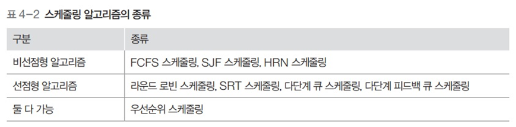

# 운영체제 - CPU 스케줄링 알고리즘

CPU 스케줄링 알고리즘
<!--more--># CPU 스케줄링 알고리즘

# 1. 스케줄링 알고리즘

## 평가 기준

- **CPU 사용률**
    - 전체 시스템의 동작 시간 중 실제 CPU가 사용된 시간을 측정
    - 가상 이상적인 수치는 100%
        - 그러나 여러 가지 이유로 90%도 미치지 못함
- **처리량 (.)**
    - 단위 시간 당 작업을 마친 프로세스의 수
    - 이 수치가 클수록 좋은 알고리즘

- **대기시간**
    - 프로세스가 생성된 후 디스패치되어 실행되기 전 까지 대기하는 시간
- **응답시간**
    - 첫 작업을 시작한 후 첫 번째 출력이 나오기까지 시간
- **실행 시간**
    - 프로세스 작업이 시작된 후 종료되기까지의 시간
- **반환 시간**
    - 대기 시간을 포함해 실행이 종료될 때 까지의 시간
- **평균 대기 시간**
    - 모든 프로세스의 대기 시간을 합한 뒤 프로세스의 수로 나눈 값

    

## FCFS 스케줄링

- First Come First Served (선착순)
- 한번 실행되면 그 프로세스가 끝나야 다음 프로세스 실행 가능
- 큐가 하나
    - 모든 프로세스는 우선순위 동일

## FCFS 스케줄링 성능

- **평균 대기 시간**

    

    $$(.+27+42)÷3=23$$

## FCFS 스케줄링 평가

- 처리 기간이 긴 프로세스가 CPU를 차지하면 다른 프로세스들은 계속 기다려야 실행 가능
- 현재 작업중인 프로세스가 입출력 작업을 요구할 경우 CPU가 작업하지 않고 쉬어버림
    - 작업 효율이 떨어짐

## SJF 스케줄링

- **준비 큐에 있는 프로세스 중**에서 실행 시간이 가장 짧은 작업부터 CPU 할당
- 최단 작업 우선 스케줄링이라고도 함

## SJF 스케줄링 성능

- **평균 대기 시간**

    

    $$(.+24+36)÷3=20$$

## SJF 스케줄링 평가

- 운영체제가 프로세스의 종료 시간 예측 어려움
- 작업시간이 길다는 이유만으로 계속 밀림
    - 아사 현상
    - 공평성이 떨어짐
    - 에이징(.)을 통해 완화 가능
        - 프로세스가 양보할 수 있는 상한선을 정함
        - 자신의 순서를 양보할 때 마다 나이를 한살씩 추가
        - 최대 몇살까지만 양보하도록 규정

## HRN 스케줄링

- SJF의 아사현상을 해결하기 위해 만들어진 비선점형 알고리즘
- 최소 응답률 우선 스케줄링이라고도 함
- 서비스를 받기 위해 기다린 시간 + CPU 사용 시간을 고려해 스케줄링
- 우선순위: **대기시간/CPU 사용 시간 + 1** (우선순위가 클수록 우선순위가 높다)

## HRN 스케줄링의 성능

- 반환시간
    - P1: 0~30 = 30
    - P2: 3~39 = 36
    - P3: 6~57 = 51
- 평가
    - 아사 현상을 완화
    - 대기 시간이 긴 프로세스의 우선순위를 높여 CPU 할당 확률을 높임
    - 우선순위 할당에 CPU 사용 시간이 개입하므로 완전히 공평하지는 않음

## 라운드 로빈 스케줄링

- 한 프로세스가 타임 슬라이스 동안 작업을 하다가 작업을 완료하지 못하면 준비 큐의 맨 뒤로 가서 자기 차례를  기다리는 방식
- 선점형 알고리즘
    - 중간에 종료되거나 자발적으로 종료되지 않아도 운영체제에 의해 CPU 사용권을 빼앗길 수 있음
    - 선점형 알고리즘 중 가장 단순하고 대표적인 방식
- 프로세스들이 작업을 완료할 때 까지 계속 순환

- 반환 시간
    - P1: 0~39 = 39
    - P2: 3~47 = 44
    - P3: 6~29 = 23

## 라운드 로빈 고려사항

- **타임 슬라이스의 크기와 문맥 교환**
    - 타임 슬라이스의 크기가 너무 작으면 문맥 교환에 따른 추가 시간이 너무 길어짐
    - 타임 슬라이스가 큰 경우 하나의 작업이 끝난 뒤 다음 작업이 시작되는 것 처럼 보여 FCFS 스케줄링과 다를게 없음
- 따라서 타임 슬라이스는 최대한 작게 설정하되 문맥 교환에 걸리는  시간을 고려해 적당하게 설정

## SRT 스케줄링과 성능

- 라운드 로빈 스케줄링 + **남아있는 작업 시간이 가장 적은 프로세스**를 선택

## SRT 스케줄링의 평가

- 실행 중인 프로세스와 큐에 있는 프로세스의 남은 시간을 주기적으로 계산해야함
    - 운영체제의 부담이 조금 커질 수 있음
- 운영체제가 프로세스의 종료 시간을 예측하기 어려움
- 아사 현상이 일어남

## 우선순위 스케줄링

- 프로세스의 중요도에 따른 우선순위를 반영한 스케줄링 알고리즘

## 우선순위 적용

- **우선순위는 비선점형 방식과 선점형 방식 모두 적용 가능**
    - SJF 스케줄링 : 작업 시간이 짧은 프로세스
    - HRN 스케줄링 : 작업 시간이 짧거나 대기 시간이 긴 프로세스
    - SRT 스케줄링 : 남은 시간이 짧은 프로세스
- **고정 우선순위 알고리즘**
    - 한번 우선순위를 부여받으면 종료될때까지 우선순위 고정
    - 단순하게 구현 가능
    - 변동적인 시스템의 상황 반영 불가능
        - 효율 떨어짐
- **변동 우선순위 알고리즘**
    - 일정 시간마다 우선순위 변동
        - 우선순위 계산, 반영 복잡
    - 효율적인 운영 가능

## 우선순위 스케줄링 평가

- 준비 큐에 있는 프로세스의 순서를 무시하고 우선순위가 높은 프로세스에 먼저 CPU 할당
    - 공평성 위배
    - 프로세스의 우선순위를 매번 재계산해야 하므로 시스템의 효율을 떨어뜨림
- 아사 현상을 일으킴
- 커널 프로세스가 우선

## 다단계 큐 스케줄링

- 우선순위에 따라 큐를 여러개 사용
- 우선순위는 고정형 우선순위
- 상단의 큐에 있는 작업이 모두 끝나야 하단에 있는 큐 작업이 시작

## 다단계 피드백 큐 스케줄링

- 프로세스가 CPU를 한번씩 할당받아 실행될 때 마다 우선순위가 낮아짐
    - 다단계 큐에서 우선순위가 낮은 프로세스의 실행이 연기되는 문제 완화
- 우선순위가 낮아진다고 해도 커널 프로세스가 일반 프로세스의 큐에 삽입되지는 않음
- 우선순위에  따라 타임 슬라이스의 크기가 다름
    - 아래 우선순위의 타임 슬라이스가 더 큼
    - 한번 CPU를 잡을 때 많이 작업하라고..
- 마지막 큐에 있는 프로세스는 무한대의 타임 슬라이스를 얻음
- 마지막 큐는 FCFS 스케줄링 방식을 사용
