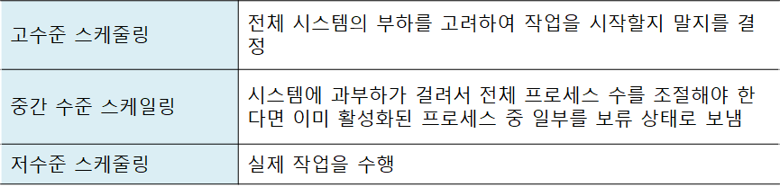

# 운영체제 - CPU 스케줄링

CPU 스케줄링
<!--more-->
# CPU 스케줄링

# 1. CPU 스케줄링

> 운영체제에서 식당 관리자의 역할을 담당

> 여러 프로세스들의 상황을 고려, CPU 및 자원 할당 결정

## 고수준 스케줄링

- 시스템 내의 전체 작업 (프로세스) 수를 조절하는 것
    - 예를 들어 최대 200개로 제한
- 어떤 작업을 시스템이 받아들일지 또는 거부할지를 결정
- 동시에 실행 가능한 프로세스의 총 개수가 정해짐
- 장기 스케줄링, 작업 스케줄링, 승인 스케줄링이라고도 함

## 저수준 스케줄링

- 어떤 프로세스에 CPU를 할당할지, 어떤 프로세스를 대기 상태로 보낼지 등을 결정
- 아주 짧은 시간에 일어나기 때문에 단기 스케줄링이라고도 함

## 중간수준 스케줄링

- 중지 & 활성화
    - 일부 프로세스를 일시정지 상태로 옮김으로서 나머지 프로세스가 원만하게 작동하도록 함
- 저수준 스케줄링이 원만하게 이루어지도록 완충

# 2. CPU 스케줄링의 목적

## 공평성

- 모든 프로세스가 자원을 공평하게 배정받아야 한다

## 효율성

- 시스템 자원이 노는 시간 없이 사용되도록 스케줄링
- 노는 자원을 사용하려는 프로세스에는 우선권 부여

## 안정성

- 우선순위 사용, 중요 프로세스가 먼저 사용하도록 배정
- 시스템 자원을 점유하거나 파괴하려는 프로세스로부터 자원 보호

## 확장성

- 프로세스가 증가해도 시스템이 안정적으로 작동하도록 함
- 시스템 자원이 늘어나면 혜택이 반영되게 함

## 반응 시간 보장

- 적절한 시간 안에 프로세스의 요구에 반응

## 무한 연기 방지

- 특정 프로세스의 작업이 무기한 연기되어서는 안 됨

# 3. 선점형 & 비선점형 스케줄링

## 선점형 스케줄링

- 운영체제가 필요하다고 판단되면 실행중인 프로세스의 작업을 중단하고 새로운 작업을 시작
- 하나의 프로세스가 CPU를 독점할 수 없음
    - 대화형 시스템이나 시분할 시스템에 적합
    - 대부분의 현대형 시스템에서 사용중
- 대부분의 저수준 스케줄러는 선점형 스케줄링 방식을 사용

## 비선점형 스케줄링

- 해당 프로세스가 CPU를 사용하면 종료되거나 자발적으로 대기 상태에 들어가기 전까지 계속해서 실행
- 스케줄러의 작업량이 작고 문맥 교환에 의한 낭비도 적음
- CPU 사용 기간이 긴 프로세스 때문에 CPU 사용 시간이 짧은 여러 프로세스가 기다리게 됨
    - 전체 시스템의 처리율 떨어짐
- 과거의 일괄 작업 시스템에서 사용하던 방식

# 4. 프로세스 우선순위

- 커널 프로세스의 우선순위가 일반 프로세스보다 높음
- 우선순위가 높은 프로세스가 CPU를 먼저, 오래 차지
- 시스템에 따라 높은 숫자가 높은 우선순위를 나타내기도, 낮은 숫자가 높은 우선순위를 나타내기도 함

# 5. CPU 집중 프로세스

- CPU 집중 프로세스
    - 수학 연산과 같이 **CPU버스트**가 많은 프로세스
    - CPU를 많이 사용하는 프로세스
- 입출력 집중 프로세스
    - 파일 저장 복사 등 **입출력 버스트**가 많은 프로세스

## 우선 배정

> (저수준) 스케줄링을 할 때 입출력 집중 프로세스의 우선순위를 CPU 집중 프로세스보다 높이면 시스템 효율 향상

# 6. 전면 프로세스 & 후면 프로세스

## 전면 프로세스

- GUI를 사용하는 운영체제에서 화면의 맨 앞에 놓인 프로세스
- (.에서도) 현재 입력 & 출력을 사용하는 프로세스
- 사용자와 상호작용이 가능하여 상호작용 프로세스라고도 함

## 후면 프로세스

- 사용자와 상호작용이 없는 프로세스
- 사용자의 입력 없이 작동하기 때문에 일괄 작업 프로세스라고도 함
- 전면 프로세스의 우선순위가 후면 프로세스보다 높음

## CPU 스케줄링 시 고려 사항

# 1. 큐

## 준비 상태의 다중 큐

- 프로세스가 준비 상태에 들어올 때
    - 자신의 우선순위에 해당하는 큐를 찾음
    - 해당 큐의 마지막에 삽입됨
- CPU 스케줄러는 우선순위가 가장 높은 큐의 맨 앞에 있는 프로세스 6 (. 6)에 CPU 할당

## 우선순위 배정 방식

- 고정 우선순위 방식
    - 운영체제가 우선순위를 부여하면 프로세스가 끝날 때 까지 바뀌지 않음
    - 구현하기 쉽다. 우선순위가 불변이기에
    - 그러나 시스템의 상황은 변하기 마련이기에 작업 효율이 떨어질 수 있다
- 변동 우선순위 방식
    - 작업 중간에 우선순위가 변경
    - 구현이 어려우나 시스템의 효율성을 높일 수 있다.

## 대기 상태의 다중 큐

- 여기서는 같은 입출력을 요구한 프로세스끼리 모아놓음

- 장치에서 인터럽트가 발생되면 해당 인터럽트를 기다리는 프로세르를 깨우고 준비상태로 들어감

## 다중 큐 비교

- 준비 큐
    - 한 번에 하나의 프로세스를 꺼내어 CPU를 할당
- 대기 큐
    - 여러 개의 프로세스 제어 블록을 동시에 꺼내어 준비 상태로 옮김
    - 대기 큐에서 동시에 끝나는 인터럽트를 처리하기 위해 인터럽트 벡터라는 자료 구조 사용

## 다중 큐 구조

