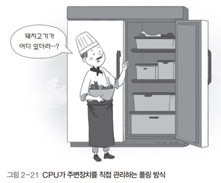

# 운영체제 - CPU

CPU
<!--more-->
# CPU

# 1. 인터럽트

## 폴링 방식

- CPU가 직접 입출력장치에서 데이터를 가져오거나 내보냄
- CPU가 입출력장치의 상태를 주기적으로 검사
    - 일정한 조건을 만족할 때 데이터를 처리
- CPU가 명령어 해석과 실행과 더불어 모든 입출력을 관리해야 하므로 작업 효율이 떨어짐

## 인터럽트 방식

- 입출력 관리자가 입출력을 대신 전담
- CPU의 작업과 저장장치의 I/O를 독립적으로 운영
    - 시스템의 효율을 높임
    - I/O를 수행하는 동안 CPU가 다른 작업을 할 수 있음

### 인터럽트

- 입출력 관리자가 CPU에 보내는 완료 신호

### 인터럽트 번호

- 많은 주변장치 중 어떤 것의 작업이 끝났는지를 CPU에 알려주기 위해 사용하는 번호
- 윈도우에서는 IRQ라고 부름

### 인터럽트 벡터

- 여러 개의 입출력 장치를 한꺼번에 처리하기 위해 여러개의 인터럽트를 하나의 배열로 만든 것

# 2. 인터럽트 방식의 동작 과정

1. CPU가 입출력 관리자에게 데이터 입출력 명령을 보냄
2. 입출력 관리자는 명령받은 데이터를 메모리에 가져다놓거나 메모리의 데이터를 저장장치로 옮김
3. 데이터 전송이 완료되면 입출력 관리자는 완료 신호를 CPU에 보냄

# 3. 직접 메모리 접근

- 입출력 관리자가 CPU의 허락 없이 메모리에 접근할 수 있는 권한
- 메모리는 CPU의 작업 공간
    - 데이터 전송을 지시받은 입출력 관리자는 직접 메모리 접근 권한이 있어야 작업 처리 가능

# 4. 메모리 매핑 입출력

- 메모리의 일정 공간을 입출력에 할당
- 보통 메모리(.)에 해당하는 어드레스 영역, I/O에 해당하는 어드레스 영역이 별개로 존재
- 그러므로 다른 명령어를 통해서 접근하게 됨
- 그런데 이 방식에서는 메모리의 일정 공간을 I/O를 위해 할당

# 5. 싸이클 훔치기

- CPU와 직접 메모리 접근이 동시에 메모리에 접근하면 **보통 CPU가** 메모리 사용 권한을 **양보**
- **CPU의 작업 속도보다 입출력장치의 속도가 느리기 때문**에 직접 메모리 접근에 양보하는 것
    - I/O 작업을 기다리고 있는 프로그램이 있을 수 있기 때문

# 6. 병렬 처리

## 개념

- 동시에 여러 개의 명령어를 처리해 작업의 능률을 올리는 방식

## 파이프라인 기법

- 하나의 코어에 여러 개의 스레드를 이용하는 방식

## 슈퍼스칼라 기법

- 듀얼코어 CPU를 이용해 2개의 작업을 동시에  처리

## 병렬 처리의 고려사항

- **상호 의존성이 없어야 병렬 처리가 가능**
    - 각 명령이 서로 독립적이고 앞의 결과가 뒤의 명령에 영향을 미치지 않아야 함
- **각 단계의 시간을 일정하게 맞춰야 병렬 처리가 원만하게 이루어짐**

    

    - 각 단계의 시간이 들쭉날쭉하면 다음 작업이 밀리게 되어 병렬 처리의 효과가 떨어질 수 있다.
- **전체 작업 시간을 몇 개로 나눌지 잘 따져봐야 한다**
    - 병렬 처리의 깊이 N (위 이미지의 높이)
    - 이론적으로는 N이 커질수록 동시에 작업할 수 있는 갯수가 증가
        - 그러나 작업을 너무 많이 나누면 오히려 작업을 이동하고 새로운 작업을 불러오는 딜레이가 많이 걸려 성능 하락
        - 따라서 적절하게 설정하는 것이 중요

# 7. CPU에서 명령어가 실행되는 과정

1. **명령어 패치 (.)**: 다음에 실행할 명령어를 메모리에서 불러와 레지스터에 저장
2. **명령어 해석 (.)**: 명령어 해석
3. **실행 (.)**: 해석한 결과를 토대로 명령어 실행
4. **쓰기 (.)**: 실행된 결과를 메모리에 저장

## 파이프라인 기법

## 슈퍼스칼라 기법

- 파이프라인을 처리할 수 있는 코어를 여러개 구성
- 복수의 명령어를 동시에 실행

## 슈퍼파이프라인 기법

- 파이프라인의 각 단계를 또 세분화
- 한 클록 내에 여러 명령어를 처리
- 다음 명령어가 빠른 시간 내에 처리될 수 있어 처리속도 향상

### 슈퍼파이프라인 슈퍼스칼라 기법

- 슈퍼파이프라인 기법을 여러 코어에서 실행

# 8. 무어의 법칙, 암달의 법칙

## 무어의 법칙

- CPU의 속도가 24개월마다 2배 빨라진다는 내용
- 초기의 CPU에만 적용되었다

## 암달의 법칙

- 컴퓨터 시스템의 일부를 개선할 때
- 예를들어 CPU의 속도를 2배 개선하더라도 전체 시스템의 성능이 2배 빨라지지 않는다는 것
