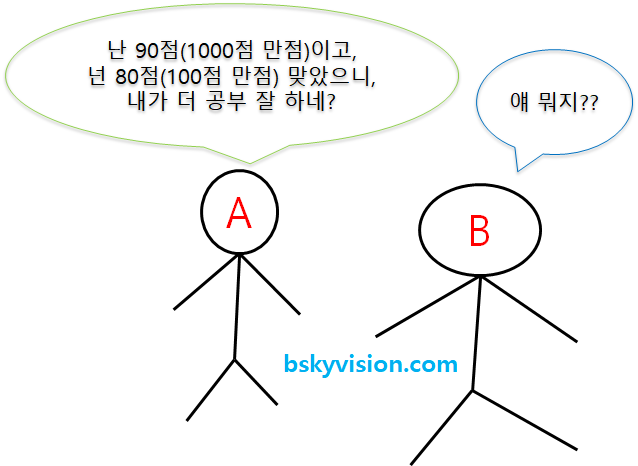

# Data Processing

<!--more-->
# Data Preprocessing

## 전처리 방법

- 데이터 정제
    - missing value 처리
    - noisy data
    - 데이터 불일치
- 데이터 통합
    - 메타데이터
    - 상관성 분석
    - 데이터 충돌 탐지
    - 의미적 이질성 해소
- 데이터 변환
    - smoothing
    - aggregation
    - generalization
    - normalization
    - attribute construction
- 데이터 축소
    - data cube aggregation
    - dimensionality reduction
    - numerosity reduction
    - sampling

## Normalization VS Standardization

- 둘 다 머신러닝 알고리즘을 훈련시키는데 있어서 사용되는 특성들이 모두 비슷한 영향력을 행사하도록 값을 변환

- 각 Feature들의 단위, 값의 범위가 모두 다름
    - 따라서 특성들의 단위를 무시할 수 있도록, 또 값의 범위 또한 다들 비슷하도록 맞춰주는 것이 정규화, 표준화의 역할.

## Normalization (정규화)

- Feature들의 범위를 [0, 1]로 옮김

## Standardization

- Feature들의 값들이 정규분포를 따른다고 가정하고 값들을 0의 평균, 1의 표준편차를 갖도록 변환
- 평균을 기준으로 얼마나 떨어져 있는지를 나타내는 값

## Label Encoding

- Scikit-learn은 숫자로 된 label만  취급
- 문자로 표현된 label을 숫자로 바꿈
