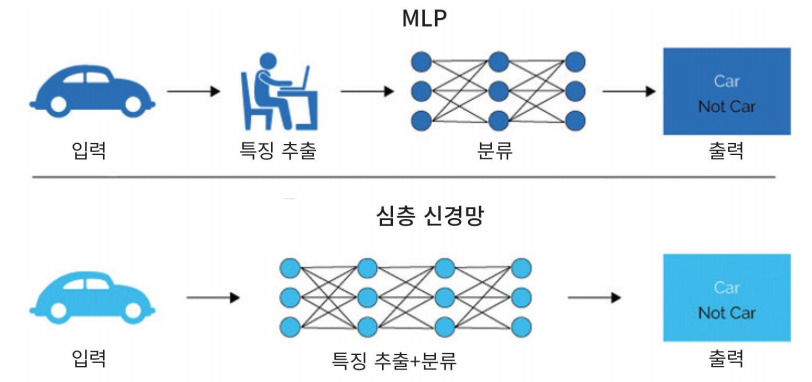

# Deep Neural Network

<!--more-->
# Deep Neural Network

## DNN

- MLP (다층 퍼셉트론)에서 은닉층의 갯수 증가시킴
    - 당시에는 기술적인 문제, 컴퓨터 성능 문제가 있었음
- Visual, 음성인식, 자연어 처리, 기계 번역 등에서 뛰어난 성능

## DNN으로 성능개선한 이유

- MLP의 문제점 개선
    - graadient vanishing 문제
    - 손실함수
    - overfitting
- Big Data
- GPU 성능 개선

## 은닉층의 역할

- MLP에서는 Feature 추출을 사람이 함
- 딥러닝은 Feature 추출까지 Hidden Layer에서 자동으로 함

## Vanishing Gradient 현상

- MLP에서 발생
- 역전파를 통해 구했던 오차의 기울기 등이 점점 사라짐
- **원인**
    - Sigmoid 활성화 함수가 원인
    - 은닉층이 많아지면 출력층에서 계산된 그래디언트가 역전파되다가 값이 점점 작아져 사라짐
- **대처**
    - 새로운 활성화 함수인 ReLU 사용

## ReLU

- 새로운 활성화 함수
- max(0, x)
    - 계산이 간단 → 빠름

## 손실함수 MSE (Mean Squared Error)

- 평균제곱오차
- 에측값에서 실제값을 뺀것에서 제곱한 뒤 평균을 냄

## Softmax 함수

- 출력값들을 모두 0~1 사이 값으로 정규화
- 출력의 총합은 항상 1

## 가중치 초기화

- 경사하강법으로 학습 → 학습시작 시점 가중치 설정 중요
- 입력의 계수와 출력의 계수가 적절히, 표준편차가 균등하게 하여 오류가 전파되는 부분을 안정화
- Xavier 초기화
    - 이전 은닉층의 노드 수에 맞추어 변화된 표준편차 이용

## Optimizer

- 학습 속도를 빠르고 안정적으로 하는 것

## Momentum

- 학습속도를 가속시킴
- 전역최소값을 찾는데 도움

## Optimizer의 종류

- 스텝 방향
- 스탭 사이즈 (속도)

## Regularization 규제화

- 모델이 복잡하여 생긴 과적합 해결

## Data Augmentation

- 데이터가 부족하여 생긴 과적합을 해결
    - 데이터를 변형시켜 (이미지의 경우 돌리거나 등..) 데이터 양을 늘림

## Drop Out

- 은닉층의 노드가 너무 많아 생긴 과적합을 해결
- 학습 시 전체 신경망 중 일부만 사용
- 예측할 때는 모든 노드를 사용
