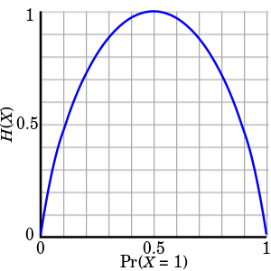

# Dicision Tree

<!--more-->
# Dicision Tree

## Information Theory

- 정보량을 수치화하고 그것의 연산을 가능하게 하는 것

### Quantity of Information 정보량

- 불확실성
- 확률이 낮은 사건일수록 정보량 (불확실성)은 높다
- 확률과 정보량은 반비례관계
- "오늘 하루 종일 맑다"
    - '내일은 맑다' 의 불확실성
    - '내일은 큰 비가 온다' 의 불확실성

### Information Entropy

> H(X)가 정보 엔트로피 값이고, 아래 축은 시행에서 어떤 사건이 일어날 확률입니다. 확률이 0.5일 때 엔트로피가 가장 높은 1임을 볼 수 있고, 확률이 한 쪽으로 편향될수록 엔트로피가 낮아지는 것을 볼 수 있습니다.

- 확률 변수의 정보량
- 얻은 정보가 의미있는 정보인지 (정보량)를 판단
- 가장 랜덤일 경우 엔트로피는 1 (최대)
- 아닐 경우 1 이하. 고정일 경우 0

## 상호정보량 Mutual Information

- 하나의 확률변수가 다른 확률변수에 대해 제공하는 정보의 양

# Decision Tree

- 분류, 회귀에서 사용
- 트리 형태로 의사결정 지식을 표현한 것

- 내부 노드 : 비교 속성
- 단말 노드 (ternimal node) : 기대값
- 간선 (edge) : 속성 값

## Decision Tree알고리즘

- 반복적인 노드 분할 과정
    - 분할 속성 (spliting attribute) 을 선택
    - 속성값에 따라 서브트리를 생성
    - 데이터를 속성값에 따라 분배

### 분할속성 결정 방법

### Information Gain (정보 이득)

- 어떤 분류를 통해 얼마나 information에 대한 이득이 생겼는지를 나타냄
- Entropy를 통해 계산
- 어떤 Feature를 선택함으로써 더 데이터를 잘 구분하는지

## 엔트로피 계산

### 속성별 정보이득

- IG(Pattern) = 0.246
- IG(Outline) = 0.151
- IG(Dot) = 0.048

### 분할속성 선택

- 정보이득이 큰것 선택
    - Pattern 선택

## Decision Tree 개선 척도

- 정보이득비 (빠르게 건너뜀)
- 지니지수 (빠르게 건너뜀)

## 분할속성 평가 척도 비교

## 결정트리 알고리즘

- ID3
    - 범주형 속성값을 갖는 데이터
- C4.5
    - 범주형 + 수치형 속성값
    - ID3을 개선
- CART
    - 수치형 속성값

## 앙상블 Ensemble Classifier

### 학습기 결합

- 선형 분류기와 같은 간단한 인식기로 학습을 수행
- 복수 개의 선형 분류기의 학습 결과를 결합해 좋은 성능의 인식기를 만듬

### 장점

- 나쁜 운을 피할 수 있다
- 성능향상
- 데이터 양, 질에 따른 어려움 극복
- 결정 경계가 너무 복잡한 경우 사용

### 결합

- 병렬적 결합
    - 한번에 일괄로 분류하여 최종 결과 생성
- 순차절 결합
    - 각 분류기의 결과를 순차적으로 조합

### 결합 방법의 분류

- **Filter에 의한 방법 (순차)**
    - 각 분류기 학습때마다 새로운 데이터를 생성
    - Boosting, Cascading
- **Resampling에 의한 방법 (병렬)**
    - 주어진 전체 데이터로부터 일부 집합을 추출하여 각 분류기를 학습
    - Bagging, MadaBoost
- **Rewrighting에 의한 방법**
    - 모든 분류기에 대해 동일한 학습 데이터 사용 → 각 데이터에 가중치를 부여해 학습에 대한 영향도 조절
    - AdaBoost

## 배깅 (Bagging, bootstrap aggregating)

- 부트스트랩을 통해 여러개의 학습데이터 집합을 만들고, 각 학습 데이터 집합별로 분류기를 만들어 이들이 투표나 가중치 투표를 하여 최종 판정

## 랜덤 포레스트 (Random Forest)

- 분류기로 결정트리를 사용하는 배깅 기법

## 부스팅 (Boosting)

- K개의 분류기를 순차적으로 만들어가는 앙상블 기법
- 분류 정확도에 따라 학습데이터에 가중치를 변경해가면서 분류

## AdaBoost

- 검색필요
