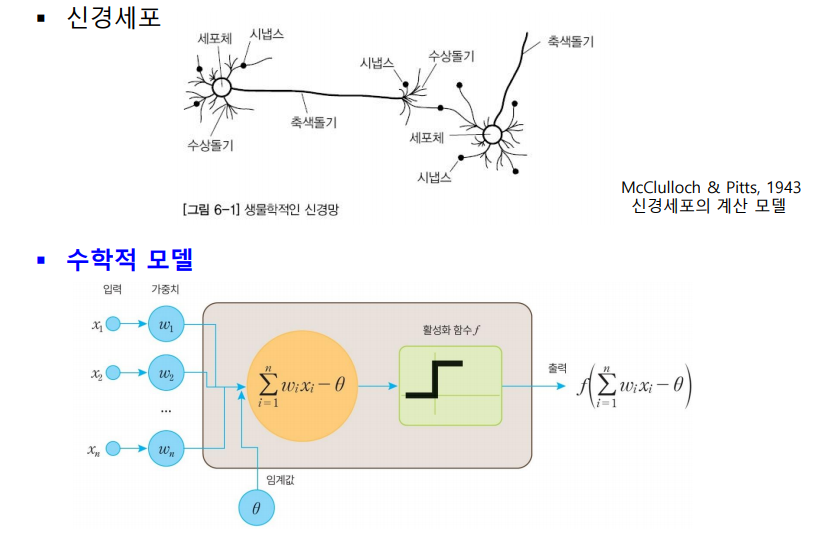

# Neural Network

<!--more-->
# Neural Network

## 신경망

- 인간의 뇌 신경망을 모사
- 최초 : 1949년 Hebb 학습 알고리즘
- 1958년 Perceptron
    - 단층은 선형분리만 가능
    - 이후 1986년 다층 퍼셉트론, 오류 역전파 학습 알고리즘 통해 실용적 문제 해결
- 2013년 Deep Learning

## 신경세포 계산 모델

- 각 입력에 가중치 곱함
- 이를 합한것이 일정 수치를 넘으면 (임계값) Activation → 다음 세포에게 넘김

## 퍼셉트론

- 가중치와 바이어스 값을 조절하여 결과를 도출
- 논리연산 AND 학습과정 연습해야할듯

## 퍼셉트론의 한계

- 선형 분리는 되는데 XOR은 안됨
    - 직선만 그어서 분리가 안된다

## 다층 퍼셉트론

- 대부분의 입력 패턴은 선형으로 분리 불가
- 여러개의 퍼셉트론을 여러층으로 연결해 복잡한 영역을 곡면으로 둘러싸는 결정 영역을 구함

## 다층 퍼셉트론

- 입력층과 출력층 사이에 은닉층을 가지고 있는 신경망

## 역전파 알고리즘

- 순방향으로 계산하여 출력을 계산한 후에 실제 출력과 우리가 원하는 출력 간의 오차를 계산
- 오차를 역방향으로 전파하며너 오차를 줄이는 방향으로 가중치를 변경
- 다양한 비선형 함수들을 활성화 함수로 사용

## 활성화 함수

- 미분이 가능하고 연속적인 함수

## 손실함수

- 오차를 계산하는 함수
- MSE
- RMSE
- Cross Entropy

## 경사하강법

- 손실을 최소로 만드는 최적화 문제
- 손실함수의 최소값을 찾기위한 1차 미분값을 계산하고 반대 방향으로 움직임
