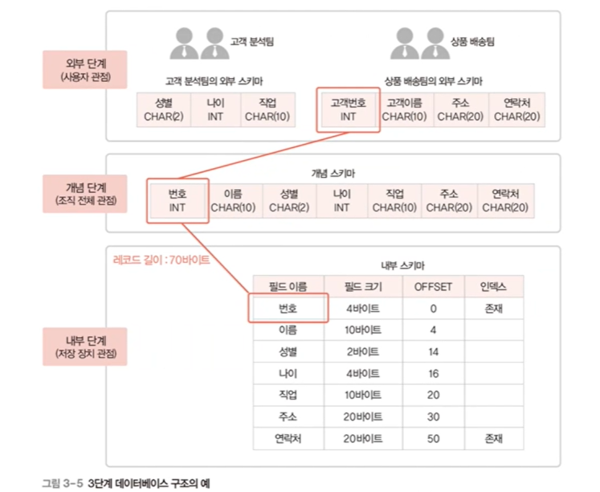

# ORACLE DB 이론 정리

ORACLE DB 이론 정리
<!--more-->

# 이론

# 1. 자료

## 자료와 정보

- **자료**
    - 현실세계의 값, 가공하지 않은 값
- **정보**
    - 자료를 가공하여 가치 있는 형태로 만든 것
    - 의사 결정에 의미 있는 값

## 표현 단위

> 위로 갈수록 컴퓨터, 아래로 갈수록 사람 중심의 개념

1. **비트**
    - 자료 표현 최소 단위
2. **바이트**
    - 문자 표현 최소 단위
3. **워드**
    - 명령 처리 기본 단위 (주소 표현의 최소 단위)
    - 4바이트
    - 문자가 모여 워드가 된다
4. **필드**
    - 자료 처리 (정보 표현)의 최소 단위
    - 예) 포털 사이트에서 이름 아이디 등 입력하는 거
    - 항목, 아이템이라고도 함
5. **레코드**
    - 필드의 모임
6. **파일**
    - 레코드의 모임
7. **데이터베이스**
    - 관련이 있는 파일의 집합

# 2. 데이터베이스 관리 시스템

## 파일 시스템

- 데이터를 파일로 관리하기 위해 파일을 생성, 관리하는 기능을 제공하는 소프트웨어
- 응용 프로그램마다 필요한 데이터를 별도의 파일로 관리
- 문제점
    - 같은 내용의 데이터가 중복 저장
    - 응용 프로그램이 파일에 종속적
        - 사용하는 파일의 구조가 변하면 응용 프로그램도 고쳐야 함
    - 동시 공유, 보안, 회복 기능 부족
    - 응용 프로그램 개발이 어려움
    - 데이터 무결성 유지가 어려움

## 데이터베이스 관리 시스템

- DBMS 라고도 함
- 데이터베이스 관리와 사용자의 데이터 처리 요구 수행
- 파일 시스템의 문제 해결
- 모든 응용 프로그램이 데이터베이스 시스템 공유 가능

## DBMS의 주요 기능

- 정의 기능
    - 데이터베이스 구조를 정의하거나 수정
- 조작 기능
    - 데이터를 삽입, 삭제, 수정, 검색
- 제어 기능
    - 데이터를 정확하고 안전하게 유지

## DMBS의 주요 구성 요소

- **질의 처리기 (Query Processor)**
    - 사용자의 데이터 처리 요구를 해석하여 처리
- **저장 데이터 관리자 (Stored Data Manager)**
    - 디스크에 저장된 데이터베이스와 데이터 사전을 관리하고 접근

# 3. DBMS 발전 과정

## 1세대

- 계층 DMBS
    - 트리 구조
    - 상위 레코드인 부모가 하위 레코드인 자식을 복수개 담음
    - 데이터 중복 문제가 존재
- 네트워크 DBMS
    - 데이터 중복 문제 해결
    - 노트와 간선을 이용한 그래프 구조
    - 복잡한 구조로 변경에 어려움 존재

## 2세대

- 관계 DBMS
    - 데이터베이스를 테이블 형태로 구현

## 3세대

- 객체지향 DBMS
    - 멀티미디어 데이터 원활한 처리
    - 관계형 DBMS의 비즈니스 데이터만 처리하는 것을 보완하기 위함
    - 객체를 이용해 데이터베이스 구성
- 객체관계 DBMS: 객체지향 DB + 관계형 DB

## 4세대

- NoSQL DBMS
    - 비정형 데이터를 처리하는데 적합
    - 안정성과 일관성 유지를 위해 복잡한 기능 포기
    - 데이터 구조를 미리 정해두지 않아 유연함
    - 확장성이 뛰어남
        - 여러 대의 서버에 분산해 저장 처리 가능
- NewSQL DBMS
    - 관계 DBMS + NoSQL

# 4. 데이터베이스 시스템

> 데이터베이스에 데이터를 저장하고, 이를 관리하여 조직에 필요한 정보를 생성해주는 시스템

## 구조

- 스키마
    - 데이터베이스에 저장되는 데이터 구조와 제약조건을 정의한 것
    - 필드의 이름과 자료형을 정의한 것
- 인스턴스
    - 스키마에 따라 데이터베이스에 실제로 저장된 값
    - 예) 고객번호:100 이름:홍길동 나이:25

## 3단계 데이터베이스 구조

> 외부 단계로 갈수록 추상화가 높아진다

> 쉽게 말해 집 주인은 인테리어만 보고, 설계자는 철골이나 기반 등 까지 생각한다는 것

- **외부 단계**
    - 개별 사용자 관점
    - 데이터베이스를 개별 사용자 관점에서 이해하고 표현하는 단계
    - 데이터베이스 하나에 외부 스키마가 여러개 존재할 수 있음
- **개념 단계**
    - 조직 전체의 관점
    - 데이터베이스 하나에 개념 스키마가 하나만 존재함
- **내부 단계**
    - 물리적인 저장 장치의 관점
    - 내부 스키마는 하나만 존재

## 3단계 데이터베이스 구조의 매핑(사상)

- 스키마 사이의 대응 관계
    - **외부-개념 매핑**
        - 응용 인터페이스 라고도 함
    - **개념-내부 매핑**
        - 저장 인터페이스 라고도 함
- **데이터 독립성**을 위해 매핑하여 정의
    - **데이터 독립성** : 하위 스키마를 바꾸더라도 상위 스키마가 영향을 받지 않는것
    - 논리적 데이터 독립성
        - 개념 스키마가 변경되어도 외부 스키마는 영향을 받지 않음
        - 외부-개념 스키마 사이의 매핑만 수정하면 됨
    - 물리적 데이터 독립성
        - 내부 스키마가 변경되어도 개념 스키마는 영향을 받지 않음
        - 개념-물리 스키마 사이의 매핑만 수정하면 됨
- 사용자가 원하는 데이터에 접근을 쉽게 하기 위해서도 있음

## 데이터 사전

- 시스템 카탈로그 라고도 함
- 메타 데이터를 유지
    - 스키마, 매핑 정보, 제약조건 등을 저장
- DBMS가 스스로 생성하고 유지
- 일반 사용자도 접근할 수 있으나 열람만 가능

## 데이터 디렉토리

- 데이터 사전에 있는 데이터에 실제로 접근하는데 필요한 위치정보를 저장하는 시스템 데이터베이스
- 일반 사용자의 접근 불가

## 사용자 데이터베이스

- 사용자가 실제로 이용하는 데이터가 저장되어 있는 일반 데이터베이스

# 5. 데이터베이스 사용자

> 데이터베이스를 이용하기 위해 접근하는 모든 사람

- 데이터베이스 관리자
    - 데이터베이스 시스템을 운영 및 관리
- 최종 사용자
    - 데이터베이스에 접근하여 데이터를 조작
- 응용 프로그래머
    - 응용 프로그램 개발 시 데이터베이스를 이용

# 6. 데이터 언어

- **데이터 정의어 (DDL; Data Definition Language)**
    - 스키마를 정의하거나 수정 또는 삭제하기 위해 사용
- **데이터 조작어 (DML; Data Manipulation Language)**
    - 데이터의 삽입, 삭제, 수정, 검색 등의 처리를 요구하기 위해 사용
    - 절차적 데이터 조작어
        - 사용자가 어떤 데이터를 원하고 (What) 그 데이터를 얻기 위해 어떻게 (How) 처리해야 하는지도 설명
    - 비절차적 데이터 조작어
        - 사용자가 어떤 데이터를 원하는지만 설명
- **데이터 제어어 (DCL; Data Control Language)**
    - 내부적으로 필요한 규칙이나 기법을 정의하기 위해 사용
    - 사용 목적
        - 무결성
        - 보안
        - 회복
        - 동시성 제어

# 7. 데이터 모델링

> 현실 세계에 존재하는 데이터를 조직이 선별한 데이터만을 선별해 데이터베이스로 옮기는 과정

> 데이터베이스 설계의 핵심 과정

## 2단계 데이터 모델링

- 개념적 데이터 모델링
    - 현실 세계의 중요 데이터를 추출해 개념 세계로 옮기는 작업
- 논리적 데이터 모델링
    - 개념 세계의 데이터를 데이터베이스에 저장하는 구조로 표현하는 작업

# 8. 데이터 모델

> 데이터 모델링의 결과물을 표현하는 도구

- 개념적 데이터 모델
    - 사람의 머리로 이해할 수 있도록 현실 세계를 개념적 모데링하여
    - 데이터베이스의 개념적 구조로 표현하는 도구
- 논리적 데이터 모델
    - 개념적 구조를 논리적 모델링하여
    - 데이터베이스의 논리적 구조로 표현하는 도구

## 개체 관계 모델 (E-R model)

> 개체와 개체 간의 관계를 이용해 현실 세계를 개념적 구조로 구현

- **개체**
    - 사람, 사물, 개념, 사건 등
    - 다른 개체와 구별되는 이름을 가짐
    - 각 개체만의 고유한 특성, 상태 등 속성을 하나 이상 가짐
    - 서점에 필요한 개체: 고객, 책
    - 학교에 필요한 개체: 학과, 과목

        

    - **개체 타입**
        - 개체를 고유의 이름과 속성들로 정의한 것
    - **개체 인스턴스**
        - 개체를 구성하고 있는 속성이 실제 값을 가짐으로서 실체화된 개체
    - **개체 집합**
        - 특정 개체 타입에 대한 개체 인스턴스들을 모아놓은 것
- **속성**
    - 개체나 관계가 가지고 있는 고유의 특성
    - 의미 있는 데이터의 가장 작은 논리적 단위
    - 분류 방법
        - 갯수
            - **단일 값 속성**
                - 고객아이디, 고객명 등
            - **다중 값 속성**
                - 복수 전공을 할 경우의 전공값 등
        - 의미의 분해 가능성
            - **단순 속성**
                - 의미를 더 이상 분해 불가능
                - 책 이름, ISBN 등
            - **복합 속성**
                - 의미를 분해할 수 있는 속성
                - 주소 : 국가, 도, 시, 동, 면, 리 등 세분화 가능
                - 생년월일 : 연, 월, 일 등 세분화 가능
        - **유도 속성**
            - 다른 속성에서 유도되어 결정되는 속성
            - 할인율에 따른 판매가격 등
        - **NULL 속성**
            - NULL 값이 허용되는 속성
        - **KEY 속성**
            - 각 개체 인스턴트를 식별하는 데 사용되는 속성
            - ID, 고객번호 등
- **관계**
    - 개체와 개체가 맺고 있는 의미있는 연관성
    - 즉 매핑을 의미
    - 관계의 유형
        - 관계에 참여하는 개체 타입의 수
            - 이항 관계
            - 삼항 관계
            - 순환 관계
                - 개체 타입 하나가 자기 자신과 맺는 관계
        - **매핑 카디널리티**
            - 개체들간에 매핑되는 원소 개수
            - 일대일 관계

                

            - 일대다 관계

                

            - 다대다 관계

                

    - **관계 참여 특성**
        - **전체 참여**
            - 모든 개체 인스턴스가 관계에 **반드시** 참여해야함
            - 모든 학생은 반드시 학과 수업을 들어야 한다
        - **부분 참여**
            - 개체 인스턴스 중 일부만 **선택적**으로 관계에 참여해도 됨
            - 고객 중 일부만 상품을 구매해도 된다
    - **관계 종속성**
        - 개체 A가 존재해야 객체 B가 존재할 수 있음
        - 개체 A가 삭제되면 객체 B도 삭제됨
        - 약한 개체
            - 다른 개체의 존재 여부에 의존적임
        - 강한 개체
            - 다른 개체의 존재 여부를 결정
        - 특징
            - 강한 개체와 약한 개체는 일반적으로 일대다의 관계를 가짐
            - 약한 개체는 강한 개체와의 관계에 필수적으로 참여
            - 약한 개체는 강한 개체의 키를 포함하여 키를 구성

## 개체-관계 모델 다이어그램

.png)

# 9. 논리적 데이터 모델

> E-R 다이어그램으로 표현된 개념적 구조를 데이터베이스에 저장할 형태로 표현한 논리적 구조

> 데이터베이스의 논리적 구조 = 데이터베이스 스키마

> 사용자가 생각하는 데이터베이스의 모습 또는 구조

## 관계 데이터 모델

- 2차원 테이블 형태
- 일반적으로 많이 사용

# 10. 데이터베이스 설계

## 정규화를 이용

나중에 다룸

## E-R 모델과 릴레이션 변환 규칙을 이용

- 5단계의 과정이 있음
- 도중에 오류가 생기면 이전 단계로 돌아갈 수도 있음

## 1. 요구사항 분석

- 사용자의 요구 사항을 수집, 분석해 DB 용도 결정
- DB를 실제 사용할 주요 사용자의 범위를 결정
- 면담, 설문조사, 업무관련 문서 분석 등으로 요구사항 수집
- 결과물: 요구사항 명세서

## 2. 개념적 설계

- 요구사항 명세서를 토대로 개념적 구조로 표현 →  개념적 모델링
- 일반적으로 E-R 모델 (위에서 배운 개체-관계 모델) 을 많이 사용

## **작업 과정**

### A. **개체 추출 :** 각 개체의 주요 속성과 키 속성 선별

- 개체 : 저장할 만한 가치가 있는 중요 데이터를 가진 사람이나 사물
    - 병원 운영에 필요한 사람: 환자, 의사 간호사 등
    - 병원 운영에 필요한 사물: 병실, 수술실, 의료 장비 등
- 개체 추출 방법 : 업무에 관련이 깊은 **명사**를 찾아 **개체, 속성**으로 분류
- 위의 예에서는
    - 한빛 마트는 프로젝트의 이름
    - 회원의 속성으로 회원아이디, 비밀번호, 이름, 나이, 직업, 등급, 적립금
    - 회원아이디는 키 속성으로 분류
    - 이렇게 할 수 있겠다
- 최종 추출 결과 (연습 많이 할 것)

### B. **개체 간의 관계 설정**

- 요구 사항 문장에서 의미 있는 동사를 찾자
- 위의 예시에서는
    - 회원 개체와 상품 개체의 관계 : 다대 다 관계
    - 주문 관계의 속성 : 주문번호, 배송지, 주문일자
    - 를 추출 가능
- **최종**

    

    

    

### C. **E-R 다이어그램을 총합해 표현**

