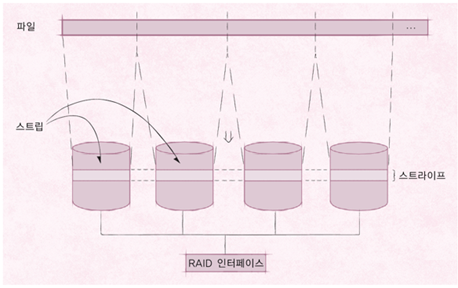

# 운영체제 - RAID

RAID
<!--more-->
# RAID

# RAID

## RAID (. Array of Independent Disks)

- 디스크 장애 발생 시 이를 복구하는 시스템
- 스트라이핑을 통한 입출력 속도 증가
- 하나의 원본 디스크와 같은 크기의 디스크에 같은 내용을 동시에 저장
    - 하나의 디스크가 고장나면 다른 디스크를 사용해 복구
- RAID 0,1,10 외에 RAID 2,3,4,5,6,50,60 등이 있음

## 스트라이핑

- 저장소를 스트립이라는 고정 크기 블록으로 나누어 데이터 저장
    - 연속된 파일 스트립은 대체로 구별된 디스크에 배치
    - 파일에 대한 요청이 한 번에 여러 디스크를 사용해 이루어짐
    - 디스크 요청의 평균 크기를 고려해 결정
- 스트라이프 (.) : 디스크 배열의 각 디스크에서 동일한 위치에 있는 스트랩의 집합

- RAID 시 예를 들어 4개의 디스크를 사용해 400Bytes를 저장한다면
    - 각 디스크에 100Bytes씩 한꺼번에 저장
    - 4배 속도 가능
- 스트립의 크기는 개발자, 시스템에 따라 가변적

## RAID 0

- 단순 스트라이핑
- 같은 규격의 디스크를 병렬로 연결
    - 여러 데이터를 여러 디스크에 동시에 저장하거나 가져옴
        - 이론적으로는 입출력 속도가 디스크의 갯수에 따라 증가
    - 복구 기능이 없음
        - 장애가 발생하면 데이터를 잃음
- 레이드를 사용하면 디스크 하나만 고장나도 전체 데이터 손실이 일어날 수 있음
    - 따라서 복구 기능없는 RAID 0은 잘 사용하지 않음

## RAID 1

- 하나의 데이터를 2개의 디스크에 나누어 저장
    - 장애 시 백업 디스크로 활용
- 데이터가 똑같이 여러 디스크에 복사됨
- 같은 크기의 디스크를 최소 2개 이상 필요
    - 짝수개의 디스크로 구성
- 저장하는 데이터와 같은 크기의 디스크가 하나 더 필요
    - 비용이 증가
    - 다만 가장 안전함

## RAID 2 (비트 수준 해밍 ECC 패러티)

- 오류 교정 코드 (.)를 따로 관리
    - ECC를 별도의 디스크에 따로 보관
    - 1101|101 등
    - 오류가 발생하면 이 코드를 이용해 디스크 복구
- ECC 저장을 위한 추가 디스크를 필요로 함
    - RAID 1 보다는 작은 저장공간을 요구
    - 오류 교정 코드를 계산하는 데 많은 시간을 소비해 잘 사용하지는 않음
- 각 디스크에 비트 단위로 저장
    - 보통 4비트를 교정하기 위한 코드는 3비트가 필요

## RAID 3

- 오류 검출 패러리 이용 방식
    - 오류 검출 패러티는 보통 1비트만을 사용
        - 1101|1 등
        - 짝수, 홀수 오류 검출 패러티 등...
        - RAID 2보다 작은 저장공간 요구
- 비트 혹은 바이트 수준에서 스프라이트 구성
    - 데이터가 모든 디스크에 나누어 저장
- 검출만 하면 어떻게 오류를 복구 하냐?
    - 디스크 컨트롤러를 통해 어느 디스크가 고장났는지 알 수 있음
    - 따라서 오류 검출만 하면 해당 디스크에 저장된 비트를 반전시켜 오류 복구 가능
- RAID 2 보다는 적지만 코드 계산을 위한 오버헤드가 있음

## RAID 4

- RAID 3과 유사하나 데이터를 블록 단위로 스트라이핑
    - RAID 3은 무조건 모든 디스크가 바빠야 하는데 그걸 해소하기 위함
    - 데이터가 저장되는 디스크와 패맅 비트가 저장되는 디스크만 동작

## RAID 5

- 블록수준 분산 패리티
- 패리티 비트를 하나의 디스크가 아니라 여러 디스크에 분산하여 보관함으로써 패리티 비트 디스크의 병목 현상을 완화
    - 즉 RAID 4의 경우 데이터를 쓰면 무조건 Parity 디스크도 사용해야하기 때문에 해당 디스크 하나에 병목현상이 몰림
- RAID 5의 경우 패리티 비트를 해당 데이터가 없는 디스크에 보관
- 한 디스크에 장애가 발생하면 다른 디스크에 있는 패리티 비트를 이용하여 데이터를 복구할 수 있음

## RAID 6

- RAID 5와 같은 방식이지만 패리티 비트가 2개여서 디스크 2개의 장애를 복구할 수 있음
- 패리티 비트를 2개씩 운영하기 때문에 RAID 5보다 계산량이 많고 4개의 디스크당 2개의 추가 디스크가 필요하다는 단점이 있음

## RAID 10

- 미러링 기능을 가진 RAID 1과 빠른 데이터 전송이 가능한 RAID 0을 결합한 형태
- 디스크를 RAID 0으로 먼저 묶으면 RAID 0+1이 되고, RAID 1로 먼저 묶으면 RAID 10이 됨
- RAID 0+1의 경우 장애가 발생했을 때 복구하기 위해 모든 디스크를 중단해야 하지만 RAID 10은 일부 디스크만 중단하여 복구할 수 있음

## RAID 50과 RAID 60

- RAID 50 : RAID 5로 묶은 두 쌍을 다시 RAID 0으로 묶어 사용
- RAID 60 : RAID 6으로 묶은 두 쌍을 다시 RAID 0으로 묶어 사용

