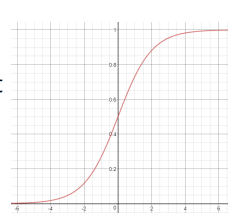

# Classification

<!--more-->
# Classification

## Naive Bayes Classification

Bayes의 법칙에 기반해 사후확률을 이용해 분류

### 장점

- 간단하고 빠르며 정확
- computation cost 작음 (빠름)
- 큰 데이터셋에 적합
- 연속형보다 이산형 데이터에서 성능 좋음
- Multiple class 예측을 위해서도 사용 가능

### 단점

- 사건 간에 독립성이 있어야 함

## Logistic Regression Classification

- 이진분류기

- 분류함수로 `Sigmoid` 함수 사용
- 비용함수로 평균제곱오차 사용하지 않음

    

    - 위와같이 울퉁불퉁해서 글로벌 미니멈을 못찾음
    - 따라서 새로운 비용함수인 `크로스 엔트로피` 를 비용함수로 사용

## Multinomal Regression Classification

- 종속변수가 범주형이면서 3개 이상의 범주를 가질때 적용
    - 예) 대학교로 진학할 때 어떤 전공이 인기있는지
    - 사람들이 어떤 혈액형을 가지고 있는지
    - 모두 통계적인 분류
- 분류함수로 `Softmax` 함수 사용

## K-nearest neighbor (KNN)

- 새로운 데이터를 입력받으면 가장 가까이 있는 것이 무엇이냐를 중심으로 새로운 데이터의 종류를 정해줌
- 주변의 K개의 갯수를 보고 판단 → KNN이라고 부름
    - K → 주변의 데이터 갯수

### 특징

- 학습단계에서는 실질적인 학습이 일어나지 않고 데이터만 저장
    - 학습데이터가 크면 메모리 문제
    - 게으른 학습 (Lazy learning)
- 새로운 데이터가 주어지면 저장된 데이터 이용해 학습
    - 시간이 많이 걸림
- 데이터간의 거리 계산
    - 수치데이터인 경우
        - 유클리디언 거리
    - 범주형 데이터가 포함된 경우
        - 직접 개발
- 효율적인 근접 이웃 탐색
    - 데이터의 갯수 많아지면 계산시간 증가 문제
    - 색인 자료구조 사용
        - R-트리, K-D 트리 등

### 최근접 K개로부터 결과를 추정하는 방법

- 분류
    - 출력이 범주형 값
    - **다수결 투표**: 개수가 많은 범주 선택
- 회귀분석
    - 출력이 수치형 값
    - 평균: 최근접 K개의 평균값
    - **가중합 (Weighted Sum)**: 거리에 반비례하는 가중치 사용

## Support Vector Machine (SVM)

- 이진분류기
- `**초평면**`: 분류하는 선
- 분류 오차를 줄이면서 동시에 **margin**을 최대로 하는 **`Decision Boundary`**를 찾음
- **margin**: 결정 경계과 가장 가까이에 있는 학습 데이터까지의 거리
- **`서포트**벡터`: Decision Boundary로부터 가장 가까이에 있는 학습 데이터들

### 제약조건 최적화

- 라그랑주 함수 사용

### 선형 분리불가 문제의 SVM

- **슬랙변수**

### 선형 SVM

- 선형인 초평면으로 공간 분할
- 슬랙변수를 도입하더라도 한계

### 데이터의 고차원 사상

- 데이터를 고차원의 사상하면 선형 분리 가능
- XOR 문제

## 고차원 변환의 문제점

- 차원의 저주 (`Curse of Dimensionality`) 문제 발생
    - 학습 데이터가 차원의 수보다 적어져 성능이 저하되는 형상
- 테스트 데이터에 대한 일반화 (Generalization) 능력 저하 가능
    - Margin  최대화를 통해 일반화 능력 유지
- 계산 비용 증가
    - Kerenl Trick 사용으로 해결

## Kernel Trick

- 고차원으로 변환하여 계산하지 않고, 원래 데이터에서 계산
- 커널 함수 이용
    - 다항식 커널 (Polynomial Kernel)
    - RBF 커널
    - 쌍곡 탄젠트 커널 (Hyperbolic Tangent)

## 비선형 SVM에 의한 결정 경계 및 서포트 벡터

# Multiclass Classification

- 2개 이상의 Classes를 분류

### 직접 분류

- Random Forest
- Naive Bayes

### 2진 분류 이용

- SVM
- Linear
- Logistic Regression
