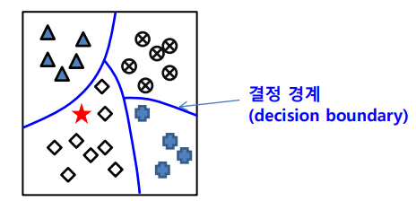

# Supervised Learning

<!--more-->
# Supervised Learning

[Classification](./classification)

[Regression](./regression)

---

# 1. 분류 (Classification)

- 데이터들을 정해진 몇 개의 부류로 대응시키는 문제
- 분류 문제의 학습
    - 학습 데이터를 잘 분류할 수 있는 함수를 찾는 것
    - 함수의 형태는 수학적 함수일 수 있고, 규칙일 수도 있음
- 분류기 (Classifier)
    - 학습된 함수를 이용해 데이터를 분류하는 프로그램

## 분류기 학습 알고리즘

- Naive Bayes
- Logistic Regression
- K-nearest neighbor (KNN)
- Dicision Tree
- Random Forest
- Support Vector Machine (SVM)
- 다층 퍼셉트론 신경망
- Deep Learning
- 앙상블: Bagging, AdaBoost
- 확률 그래프 모델

## 이상적인 분류기

- 학습에 사용되지 않은 데이터에 대해 분류를 잘 함
- 일반화 능력이 좋은 것

## 데이터의 구분

- Training Data
    - Classifier를 학습하는데 사용하는 데이터셋
    - 많을수록 유리
- Test Data
    - 학습된 모델의 성능을 평가하기 위해 사용되는 데이터셋
    - 학습에 사용되지 않은 데이터여야 함
- Validation Data
    - 학습 과정에서 학습을 중단할 시점을 결정하기 위해 사용하는 데이터셋

## Overfitting, Underfitting

- **과적합**
    - 학습 데이터를 지나치게 잘 학습
    - 데이터는 오류와 잡음을 포함할 개연성이 큼 → 학습되지 않은 데이터에 대해 좋지 않은 성능을 보일 수 있다
- **부적합**
    - 학습 데이터를 충분히 학습하지 않음

## Overfitting 회피방법

- 학습을 진행할 수록 오류 개선 경향
- 지나치게 학습되면 과적합 발생
- 학습 과정에서 별도의 Validation Data에 대한 성능 평가
    - 검증 데이터에 대한 오류가 감소하다가 증가하는 시점에 학습 중단

## 기계 학습에서의 Bias vs Variance 관계

- Bias: 편향 → 인풋에 대한 라벨 예측 정확도
- Variance: 분산 → 아웃풋의 다양함
- 예측값들과 정답이 대체로 멀리 떨어져 있으면 결과의 Bias가 높다
- 예측값들이 자기들끼리 대체로 멀리 흩어져 있으면 결과의 Variance가 높다

## 이진 분류기의 성능 평가

- 두개의 부류만을 갖는 데이터에 대한 분류기

- 0의 경우
    - 실제 값은 3개, 예측은 2개만 분류.
    - precision (예측 정확도)
        - 예측된 2개 값 중 맞은 것 2개. 따라서 2/2 → 100%
    - recall (재현률)
        - 실제 값 3개 중 2개가 예측됨. 따라서 2/3 → 0.67
- 1의 경우
    - 실제 값은 1개, 예측은 3개만 분류
    - precision (예측 정확도)
        - 1/3
    - recall (재현률)
        - 1/1

- 재현률이 높으면 정확도가 떨어짐
- 정확도가 높으면 재현률이 떨어짐
