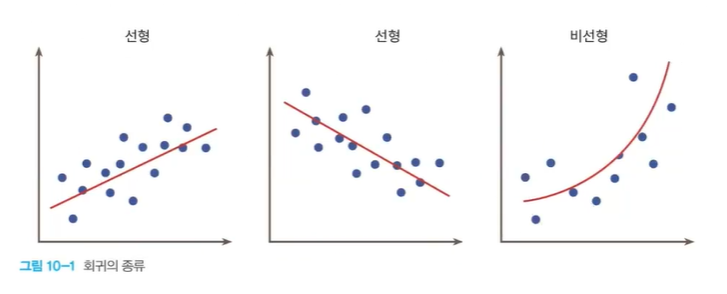

# Regression (회귀)

<!--more-->
# Regression

# Regression (회귀)

- 회귀는 여러개의 독립변수와 한개의 종속변수 간 상관관계를 모델링하는 기법
- Y=W1∗X1+W2∗X2+W3∗X3+⋯+Wn∗Xn
    - Y = 결정 값, 종속변수 (아파트 가격)
    - X1..Xn = Feature. 독립변수 (방 개수, 방 크기 등)
- W1...Wn = 회귀 계수. 독립변수의 값에 영향을 미침.

# Linear Regression

- 선형회귀의 예
    - 부모의 키와 자녀의 키 관계 조사
    - 면적에 따른 주택의 가격
    - CPU 속도와 프로그램 실행 시간 예측
- 선형 회귀 모델
    - 입력 데이터를 가장 잘 설명하는 함수 f(x) = mx+b에서 기울기와 절편값을 찾는 문제이다
        - 오차의 합이 가장 낮은 함수를 찾음
    - 기울기 → 가중치
    - 절편 → 바이어스

## 손실함수 (Loss Function) = 비용함수 (Cost Function)

- 실제값과 예측값의 차이를 수치화해주는 함수
- 오차가 클수록 손실 함수의 값이 크고, 오차가 작을수록 손실 함수의 값이 작아짐
- 손실 함수의 값을 최소화하는 W(weight), b(bias)를 찾는 것이 학습 목표

## 손실함수 최소화 방법

- **경사하강법 (Gradient descent method)**

## **Gradient descent method** 경사하강법

- 점진적으로 반복적인 계산을 통해 W 파라미터의 값을 업데이트하면서 오류값이 최소가 되는 W를 구함
    - 최초 오류값이 100이었다면, 두번째 오류값은 90, 세번째는 80과 같이 지속해서 오류를 감소시키는 방법으로 W를 업데이트
    - 오류값이 더이상 작아지지 않으면 그 오류값을 최소비용으로 판단하고 W값을 최적 파라미터로 변환

## Multi-Variable linear regression

## Polynomial Regression

