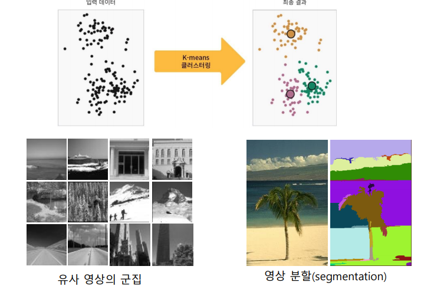

# Clustering (군집화)

<!--more-->
# Clustering (군집화)

## 군집화

- 유사성에 따라 데이터를 분할하는 것
- 데이터를 유사한 것들끼리 모으는 것
- 군집간의 유사도는 크게, 군집 내의 유사도는 작게

## 계층적 군집화 (hierarchical clustering)

- 군집화의 결과 계층적인 군집구조를 가짐
- agglomerative (병합형) : 각 데이터가 하나의 군집을 구성하는 상태에서 시작하여 가까이 있는 군집들을 병합하며 계층적인 군집 형성
- divisive (분리형) : 모든 데이터를 포함한 군집에서 점차 분리하며 계층적 구조 형성

## 분할 군집화 (partitioning clustering)

- 계층적 구조를 만들지 않고 전체 데이터를 유사한것 끼리 나눠 묶음
- 예) k-means 알고리즘

## k-means 알고리즘

- **과정**
    1. 군집의 중심 위치 무작위로 선정
    2. 군집 중심을 기준으로 군집 재구성
    3. 군집별 평균 위치 결정
    4. 군집 평균 위치로 군집 중심 조정
    5. 수렴할 떄 까지 2-4 과정 반복
- **특징**
    - 군집의 갯수 k는 미리 정해둠
    - 초기 중심값 위치에 민감
    - 군집화가 잘 되었다면 각 군집의 샘플이 가까운 거리에서 조밀하게 묶인다
        - 얼마나 뭉쳐있는지 정도인 응집도는 inertia 값으로 확인
        - 자신이 속한 군집까지의 거리를 의미하므로 낮을수록 좋음
- **k를 결정하는 방법**

    

    - Elbow method : k를 1부터 증가시키면서 수행하며 응집도 관찰
    - 각 값에 따라 SSE (sum of squared errors) 값을 수행

## Features (조건)

- **Curse of Dimentionality**
- 학습 스키마 (Feature) 가 1개 있을때보다 2개 있을 때 좋고 이런거는 맞는데
- 너무 많이 넣으면 급격하게 또 내려감
- **이유**
    - noise features 증가
    - 학습이랑 인식 속도 저하
- **솔루션**
    - 데이터셋 양 늘리기
    - 중요한 feature만 사용하기 (줄이기)
    - `차원 줄이기`
        - Principal Component Analysis (PCA)
        - Kernel PCA
        - Linear discriminant analysis (LDA)
        - t-SNE: Data Visualization
