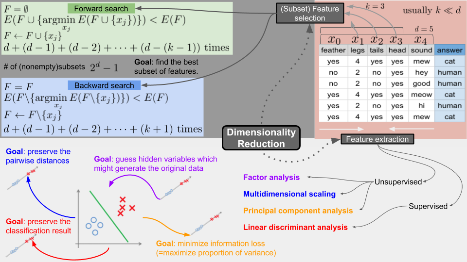

# Dimensionality Reduction (차원축소)

<!--more-->

# Dimensionality Reduction (차원축소)

- 목적에 따라 데이터의 양을 줄이는 방법
    - 데이터의 양이 줄어들면 시간복잡도 및 공간복잡도가 줄어듬
    - 아주 많은 차원의 데이터로 학습시키면 overfitting 되기 쉬움
    - 모델의 간단화
        - 사람이 이해하기 쉽고 내놓은 결과 또한 2차원, 3차원으로 나타내기 쉬움
- `dimention = feature`
    - 데이터의 한 Column

## Feature Selection

- `Forward Search`
    1. F를 비어있는 공집합으로 둠
    2. 에러 E를 구하는데, 원래 데이터셋의 Feature 하나하나 F에 넣어가면서 가장 성능이 좋은 (에러가 낮은) Feature를 구해 영구적으로 등록
    3. 목표로 하는 feature 갯수 K개가 될 때 까지 반복
- `Backward Search`
    1. 위와 반대로 F가 데이터 전체
    2. 하나하나 Feature를 퇴출시켜 가면서 최적의 Feature만 냄김
    3. 목표로 하는 feature 갯수 K가 될 때 까지 반복

## Feature Extraction

- 위에서는 데이터 열을 선별하는 방법이지만, 이것은 여러 무더기의 데이터 열을 압축함

### Principal Component Analysis (PCA)

- 데이터 손실을 최소화하는 방향으로 차원 축소 진행
