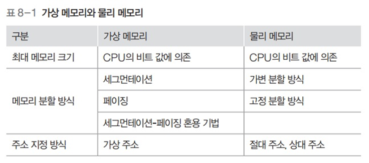

# 운영체제 - 가상 메모리

가상 메모리
<!--more-->
# 가상 메모리

# 1. 가상 메모리 시스템

## 필요한 이유

- 프로그래머가 시스템의 메모리 크기를 일일히 고려해 프로그래밍하기 쉽지 않음
- 물리 메모리의 크기와 상관없이 프로세스에 커다란 메모리 공간을 제공해줌
- 가상 메모리를 사용하면 프로세스는 운영체제가 어디에 있는지 물리 메모리의 크기가 어느 정도인지 신경쓰지 않고 메모리를 마음대로 사용 가능

## 가상 메모리의 구성

- 프로세스가 바라보는 메모리 영역
    - 실제 물리 메모리가 어느 크기이던 간에 공간 할당 가능
    - 게다가 그 공간은 연속적임
- 메모리 관리자가 바라보는 메모리 영역
    - 실제 물리 메모리는 가상 메모리보다 작을 수 있음
    - 물리 메모리의 부족한 부분은  스왑 영역으로 보충
    - 가상 메모리에서 메모리 관리자가 사용할 수 있는 메모리의 전체 크기는 물리 메모리 + 스왑 영역
- 가상 메모리 주소와 물리 메모리 주소는 다르다
    - 따라서 **동적 주소 변환**을 통해 가상 주소 → 실제 메모리 물리 주소로 변환 필요
    - 동적 주소 변환을 거치면 프로세스가 아무 제약 없이 사용자 데이터를 물리 메모리에 배치할 수 있음

## 가상 메모리 분할 방식

- 가변 분할 방식을 이용한 세그먼테이션
    - 외부 단편화 등의 문제가 있음
- 고정 분할 방식을 이용한 페이징 기법
    - 기본적으로 페이징 기법을 사용하나 페이지 테이블 관리가 필요
- 가상 메모리 시스템에서는 두 기법의 단점을 보완한 세그먼테이션-페이징 혼용 기법 주로 사용

## 메모리 매핑 테이블

- 가상 메모리 시스템에서 메모리 관리자는 가상 주소와 물리 주소를 1대1 매핑 테이블로 관리

## 페이징 기법

- 고정 분할 방식을 이용한 가상 메모리 관리 기법
- 물리 주소 공간을 같은 크기로 나누어 사용
- 가상 주소는 항상 0번지부터 시작
- 페이지와 프레임
    - 가상 주소와 물리 주소는 같은 크기로 나눠짐
    - **가상주소**의 각 분할된 영역을 **페이지**라고 부름
    - **물리주소**의 각 분할된 영역을 **프레임**이라고 부름
    - 페이지와 프레임의 크기는 같기 때문에 페이지는 어떤 프레임에도 배치 가능
    - 어떤 페이지가 어떤 프레임에 있는지에 대한 매핑 정보는 페이지 테이블에 담겨 있음
    - 페이지 테이블에 `invalid`는 해당 페이지가 스왑 영역에 있다는 의미

## 페이징 기법의 주소 변환

1. 가상 주소 18번지가 어느 페이지에 있는지 찾음
    - 18번지는 페이지 1의 8번째 위치 (. = <1, 8>)
2. 페이지 테이블의 페이지 1로 가서 해당 페이지가 프레임3에 있다는 것을 확인
3. 프로세스가 저장하려는 값을 프레임 3의 8번 위치에 저장
    - 즉, VA = <1,8> → PA = <3, 8>

## VA = <P, D> 구하는 공식

- 한 페이지의 크기가 10B인 가상 메모리 시스템에서 가상 주소 32번지
    - P=3 (./10의 몫)
    - D=2 (./10의 나머지)
- 한 페이지의 크기가 512B인 시스템에서 가상 주소 2049번지
    - P=4 (./512의 몫)
    - D=1 (./512의 나머지)
    - **다른방법 (실제 사용하는 방법)**
        - 가상주소 2049 라고 가정했을 때, 2비트로 표현하면 1000 0000 0001
        - 한 페이지의 크기가 512라면, 2^9이므로 9bit. 즉, Offset의 비트 수는 9bit.
        - Offset의 비트수는 9bit로 되어있다. 즉 0 0000 0001 이 D가 된다
        - P는 자동적으로 100이 된다
        - 다시 10진수로 표현하면 P = 100 → 4, D = 1 → 1

## 16비트 CPU에서 한 페이지의 크기가 2^10(.)B일 때

- 주소공간은 16비트로 표시
- 위와같이 한 페이지의 크기가 2^10이므로, 10bit가 Offset으로 쓰이게 됨
- 한 프로세스가 사용할 수 있는 가상 메모리의 크기는 2^16(.,536)B
- 사용자는 0~65,535번지까지 가상 주소 공간 사용 가능
- 가상 주소로 사용할 수 있는 16bit 중 6bit는 페이지 번호로, 10bit는 Offset

- 전체 페이지의 수는 2^6, 즉 64개이고 페이지 0번~63번까지 존재
- 물리 주소도 가상 주소와 같이 2^10B로 나뉨, 프레임은 0부터 31까지만 있다고 가정
- 페이지 테이블은 엔트리가 0~63으로 총 64개. 보통 가상 주소의 페이지 수를 따름.

## 프로세스가 980번지에 저장된 데이터를 요청할 때

### 나누기 이용

- 가상 주소 980번지의 페이지 P, 거리 D를 구함
    - P=0 (./1024의 몫)
    - D=980 (./1024의 나머지)
    - VA=<0, 980>
- 페이지 테이블로 가서 페이지 0이 프레임 2에 저장되어 있다는 것을 확인
- 물리 메모리의 프레임 2 시작 지점으로부터 980번지 떨어진 곳에 접근하여 데이터를 가져옴
    - 2048+980 = 3028번지

### 2진수 이용

- 이진수를 사용하는 것이 더 직관적
- 가상주소 980번지: 0000 0011 1101 0100
    - <P,D> = <000000, 1111010100>
- 2번 프레임: 00010
    - <F,D> = <00010, 1111010100>
    - 3028번지

## 다수의 프로세스가 있는 페이징 시스템

- 프로세스마다 페이지 테이블이 존재
    - 프로세스의 수가 많아지면 페이지 테이블의 크기가 커짐
    - 이에 따라 프로세스가 실제로 사용할 수 있는 메모리 영역이 줄어듬
- 페이지 테이블 크기를 적절히 유지하는 것이 핵심

## 물리 메모리 내 페이지 테이블의 구조

- **각 페이지 테이블의 시작 주소는 페이지 테이블 기준 레지스터에 보관**
- 물리 메모리의 크기가 작을 때는 페이지 테이블의 일부도 스왑 영역으로 옮겨짐

## 페이지 테이블 매핑 방식

### 직접 매핑

- 페이지 테이블 전체가 물리 메모리에 올라옴
- 별다른 부가작업 없이 주소 변환이 가능
- **페이지 테이블의 시작 주소는 페이지 테이블 기준 레지스터가 가지고 있음**
- VA=<P,D> → PA=<F, D>

### 연관 매핑

- 테이블의 일부는 고속 TLB에 저장, 나머지는 물리메모리에 위치
    - TLB : 변환 참조 버퍼
    - 맵에 유지하는 페이지 테이블 엔트리들은 가장 최근 참조한 페이지들
    - 쓴거는 다시 쓸 가능성이 높다는 추측에 근거 (지역성)
- 메모리에 접근하기 위해 먼저 TLB에 접근
    - TLB 히트 : 원하는 페이지 번호가 있음. 곧바로 물리 주소로 변환
    - TLB 미스 : 원하는 페이지 번호가 없음. 물리 메모리에 저장된 직접매핑테이블을 이용해 프레임 번호로 변환
- TLB 미스가 빈번하게 일어날 경우 시스템의 성능 떨어짐

### 다수준 페이지 테이블 (계층적 페이징)

- **table 단편화 : 소수의 페이지 테이블 엔트리만 사용**
- **디렉토리 매핑이라고도 부름**
- 페이지 테이블을 같은 크기의 여러 묶음으로 나누고 각 묶음의 시작 주소를 가진 디렉터리 테이블을 하나 더 생성해 관리
- **전체 페이지 테이블은 스왑 영역에** 있으며 **일부 테이블만 묶음 단위로 메모리로 옮김**
- 해당 묶음이 현재 메모리에 있는지 스왑 영역에 있는지를 표시하는 디렉터리 메모리를 생성
- **디렉터리 테이블**을 살펴보면 **원하는 테이블 묶음이 어디있는지 파악 가능**
    - 전체를 찾아보지 않아도 해당 페이지가 프레임에 있는지 알 수 있다
- 계층을 만들어 구현
    - 각 수준은 하위 수준 테이블을 가리키는 포인터를 저장
    - 최하위 수준은 페이지-페이지 프레임 매핑을 담고 있는 테이블로 구성
- 페이지 테이블이 일정 크기의 묶음으로 나뉨
    - 따라서 VA=<P, D>가 아닌 Va=<P1, P2, D>
        - P1 : 디렉터리 테이블에서 위치 정보
        - P2 : 묶음 내에서의 위치 정보
    - 페이지 테이블을 10개씩 한 묶음으로 나눈 경우
        - 0~9번 테이블 : 0번 디렉토리
        - 10~19번 테이블: 1번 디렉토리
        - 가상 주소 32번지 : <0, 3, 2>
        - 가상 주소 127번지 : <1, 2, 7>
- 디렉터리 페이지 테이블의 시작 주소는 페이지 테이블 기준 레지스터가 가지고 있음
- 프로세스가 특정 주소를 요구하면 VA=<P1, P2, D>로 변환
    - P1을 이용해 디렉터리 테이블에서 주소를 찾음
- 원하는 테이블이 물리 메모리에 있으면 묶음 테이블의 시작 주소가 명시되어 있음

### 역매핑

- 페이지의 번호를 기준으로 하던 다른 방식과 달리, 물리 메모리의 프레임 번호를 기준으로 테이블을 구성
- 테이블은 <프레임 번호, 프로세스 아이디, 페이지 번호>로 구성
- 프로세스 수와 상관없이 **테이블이 하나만 존재하므로 테이블의 크기가 매우 작음**
- 프로세스가 가상 메모리에 접근할 때 **프로세스 아이디와 페이지 번호를 모두 찾아야 하는 단점**이 있음

## 세그먼테이션 기법

## 세그먼테이션 테이블

- 세그먼트의 크기를 나타내는 limit와 물리 메모리상의 시작 주소를 나타내는 address가 있음
- 각 세그먼트가 자신에게 주어진 메모리 영역을 넘어가면 안됨
    - 세그먼트의 크기 정보에는 크기를 뜻하는 size 대신 limit를 사용
- 세그먼테이션 기법에서도 스왑 영역 사용

## 프로세스 A의 32번지에 접근할 때 주소 변환 과정

1. 가상 주소 VA = <0, 32>
2. 세그먼테이션 테이블에서 세그먼트 0의 시작 주소를 알아냄 (.)
3. 거기에 거리 32를 더하여 물리 주소 (.) 번지를 구함
    - 이 때 메모리 관리자는 거리가 세그먼트의 크기보다 큰지 점검
    - 만약 크다면 메모리 오류를 출력하고 해당 프로세스 강제종료
4. 물리 주소 (.) 번지에 접근해 원하는 데이터를 읽거나 씀

## 메모리 접근 권한

- 메모리의 특정 번지에 저장된 데이터를 사용할 수 있는 권한
- 읽기, 쓰기, 실행, 추가 권한이 있음

## 프로세스의 영역별 메모리 접근 권한

- 코드 영역: 자기 자신을 수정하는 프로그램은 없기 때문에 읽기, 실행
- 데이터 영역: 데이트는 읽기전용 데이터, 읽기/쓰기 모두 가능한 데이터로 나뉜다
    - 변수 / 상수

## 페이징 기법에서 메모리 접근 권한까지 고려한 페이지 테이블 예

- 페이지마다 접근 권한이 다르기 떄문에 페이지 테이블의 모든 행에는 메모리 접근과 관련된 권한 비트를 추가
- 메모리 관리자는 주소 변환이 이루어질 때 마다 페이지 테이블의 권한 비트를 이용해 유용한 접근인지 체크
- 페이지 테이블에 권한 비트가 추가되면 테이블의 크기가 커지게 됨

## 세그먼테이션-페이징 혼용 기법

- 세그먼트 테이블을 두어 세그먼트 별로 권한 비트를 나눠서 설정해줌
    - 테이블 크기를 줄여주는 효과

## 세그먼테이션-페이징 혼용 기법에서 동적 주소 변환 과정

1. 사용자가 가상 주소 VA = <S, P, D> 요청
    - <세그먼트 번호, 페이지 번호, Distance>
2. 세그먼테이션의 테이블의 해당 세그먼트 번호로 가서 자신의 영역을 벗어나는지, 권한이 없는 페이지에 접근하는지 등 확인
3. 페이지 테이블에서 해당 페이지가 어느 프레임에 저장되었는지 확인 (없다면 스왑 영역에서 가져옴)
4. 물리 메모리에 있는 프레임에서 D만큼 떨어진 곳에 접근해 데이터에 접근
