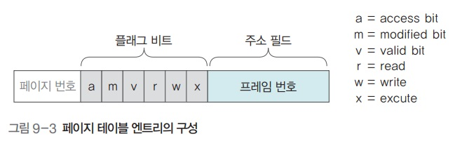

# 운영체제 - 가상메모리 관리

가상메모리 관리
<!--more-->
# 가상메모리 관리

# 프로세스의 일부만 메모리로 가져오는 이유

- 메모리를 효율적으로 관리하기 위해서
    - 메모리가 꽉 차면 관리가 어려움
- 응답 속도를 향상시키기 위해서
    - 용량이 큰 프로세스를 전부 메모리로 가져오려면 응답이 늦어질 수 있음
- 포토샵을 쓴다면 메인 프로그램만 올리고 필터는 사용자가 필요할 때 마다 메모리로 가져오는 것이 효율적이라는 것

## 요구 페이징

- 사용자가 요구할 때 해당 페이지를 메모리로 가져오는 것
- 페이지를 미리 가져오는 방식은 가져온 페이지를 쓰지 않을 경우 메모리를 낭비하게 됨
- 따라서 요구 페이징이 메모리의 절약, 효율적 관리, 응답 속도 향상 등의 장점을 가짐

## 요구 페이징과 스왑 영역

- 페이지가 스왑 영역에 있는 경우
    - 요구 페이징으로 인해 처음부터 물리 메모리에 올라가지 못함
    - 메모리가 꽉 차서 스왑 영역으로 옮긴 경우

## 페이지 테이블 엔트리 (.의 구성)

- 페이지 번호
- 프레임 번호
- 플래그 비트
    - 접근 비트 : 페이지가 메모리에 올라온 후 사용한 적이 있는가
    - 변경 비트 : 페이지가 메모리에 올라온 후 데이터의 변경이 있었는가
    - 유효 비트 : 페이지가 실제 메모리에 있는가
    - 읽기, 쓰기, 실행 권한 비트

## 유효 비트

- 페이지가 물리 메모리에 있는지, 스왑 영역에 있는지 표시
    - 유효 비트가 0일 때 : 페이지가 메모리에 있다
    - 유효 비트가 1일 때 : 페이지가 스왑 영역에 있다

## 페이지 부재

- 프로세스가 페이지를 요청했을 때, 메모리에 그 페이지가 없는 상황
- 페이지 부재가 발생하면 스왑 영역에서 해당 페이지를 물리 메모리로 옮겨야 함

## 페이지 부재 처리 과정

1. 프로세스가 페이지 3을 요청하면 페이지 테이블의 유효 비트가 1이기 때문에 페이지 부재 발생
2. 메모리 관리자는 스왑 영역의 0번에 있는 페이지를 메모리의 비어 있는 프레임인 5로 가져옴 (스왑 인)
3. 프레임 5로 접근하여 해당 데이터를 프로세스에 넘김

## 페이지 교체

- 페이지 부재가 발생하면 스왑 영역의 페이지를 메모리로 올리고 페이지 테이블을 갱신
- 빈 프레임이 없을때는 메모리에 있는 프레임 중 하나를 스왑으로 보내야함

## 페이지 교체 알고리즘

- 어떤 페이지를 스왑 영역으로 보낼 것인지 결정

## 대상 페이지

- 페이지 교체 알고리즘에 의해 스왑 영역으로 보낼 페이지

## 메모리가 꽉 찬 상태에서 페이지 부재가 발생했을 때 조치

1. 페이지의 유효 비트가 1이라 페이지 부재 발생
2. 메모리가 꽉 차서 페이지 하나를 스왑으로 보내야 함
    - 대상 페이지의 유효비트가 0에서 1로, 주소 필드 값이 메모리 주소에서 스왑 영역의 주소로 바뀜
3. 스왑 영역에 있던 페이지는 메모리(프레임)으로 올라감 (스왑 인)
    - 해당 페이지의 유효비트는 1에서 0으로, 주소 필드 값이 스왑 주소에서 프레임 번호로 바뀜

## 세그먼테이션 오류와 페이지 부재

- **세그먼테이션 오류**
    - 사용자의 프로세스가 주어진 메모리 공간을 벗어나거나, 접근 권한이 없는 곳에 접근할 때 발생
    - 해당 프로세스를 강제 종료하여 해결
- **페이지 부재**
    - 해당 페이지가 물리 메모리에 없을 때 발생하는 오류
    - 메모리 관리자는 스왑 영역에서 해당 페이지를 불러 물리 메모리로 옮긴 후 작업을 진행

## 지역성

- 기억장치에 접근하는 패턴이 특정 영역에 집중되는 성질
    - 즉 계속 특정 부분 데이터만 계속 사용된다는 거
- 페이지 교체 알고리즘이 '대상 페이지'를 지정할 때 지역성을 바탕으로 함

## 지역성의 종류

- **공간의 지역성**
    - 현재 위치에서 가까운 데이터에 접근할 확률이 먼 거리에 있는 데이터에 접근할 확률보다 높음
- **시간의 지역성**
    - 현재를 기준으로 가장 가까운 시간에 접근한 데이터가 오래된 데이터보다 사용될 확률이 높음
- **순차적 지역성**
    - 여러 작업이 순서대로 진행되는 경향이 있음
