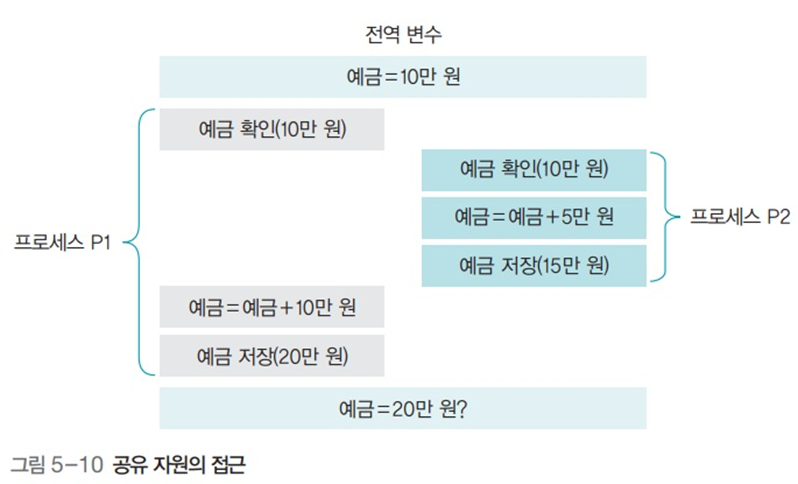

# 운영체제 - 공유자원과 임계구역

공유자원과 임계구역
<!--more-->
# 공유자원과 임계구역

# 1. 공유 자원

- 여러 프로세스가 공동으로 이용하는 변수, 메모리, 파일
- 공동으로 이용되기에 누가 언제 데이터를 읽거나 쓰느냐에 따라 결과가 달라질 수 있음

## 경쟁 조건

- 2개 이상의 프로세스가 공유 자원을 병행적으로 읽거나 쓰는 상황
- 공유 자원 접근 순서에 따라 실행 결과가 달라짐




# 2. 임계 구역

- 위의 예에서 `balance`(예금) 부분.
- 즉 공유 자원 접근 순서에 따라 달라지는 프로그램 영역
- 어떤 프로세스가 임계구역에 들어가면 다른 프로세스는 임계구역 밖에서 기다려야하며, 그 프로세스가 나와야 들어갈 수 있음

## 생산자-소비자 문제


- `sum=3` 일 때 동시 접근이 가능하게 되면
    - producer의 `sum+1`, customer의 `sum-1`이 실행 순서에 따라 랜덤으로 출력되어버림
- 하드웨어 자원의 경우에도 문제가 일어날 수 있음

## 해결 조건

### 상호 배제

- 한 프로세스가 임계구역에 들어가면 다른 프로세스는 임계구역 접근X

### 한정 대기

- 어떤 프로세스도 무한 대기하지 않아야 함

### 진행의 융통성

- 한 프로세스가 다른 프로세스의 진행을 방해해서는 안됨

## 임계구역 해결 코드: 공유 변수로 잠금을 직접 구현


- `lock=true`인 경우 무한 루프 돌면서 대기
- `lock=false`인 경우 lock을 걸고 임계 구역에서 작업하다가 lock을 해제하고 나옴

### 문제점


- `lock=false`일 때, `lock=true`로 걸고 임계 구역에 진입해야 하는데 그 직전에 타임아웃이 걸린다면?
    - 다른 프로세스도 임계 구역에 진입하게 되고, 해당 타임아웃으로 대기하고 있던 프로세스도 대기가 끝나 실행될 때 또 임계구역에 진입해버린다
    - 동시에 임계구역에 진입해버릴 수 있다는 것

## 임계 구역 해결 코드: 상호 배제 조건을 충족하는 코드


- 상호 배제 조건은 만족하지만, 여기서는 타임아웃 타이밍에 따라 상호 무한루프에 빠질 수 있는 위험이 있다.

## 임계 구역 해결 코드: 상호 배제와 한정 대기 조건을 만족


- 상호 배제와 한정 대기 조건을 만족
- 그러나 만약 P1이 자주 실행되어야 하는 상황이라면?
    - P1은 P2가 실행되어 락을 바꿔줄 때 까지 반드시 대기해야 한다 (반드시 번갈아가며 실행되야하므로)
    - 그러므로 진행의 융통성을 충족하지 않음

## 임계 구역 문제 해결: 하드웨어의 지원

> `while(.==true);` 문과 `lock=true` 문을 한꺼번에 실행 → `testandset(&lock)==true`

> 검사-지정 코드를 이용하면 명령어 실행 중간에 타임아웃이 걸려 임계구역을 보호하지 못하는 문제가 발생하지 않음


- 이 명령어는 원자성 (쪼개질 수 없음) 을 가져 중간에 인터럽트 될 수 없다.

## 임계 구역 문제 해결: 피터슨 알고리즘


 

- 임계구역 해결의 세 가지 조건 모두 만족
- 2개의 프로세스만 사용 가능하다는 한계

## 임계 구역 문제 해결: 데커 알고리즘


- 임계구역 해결의 세 가지 조건 모두 만족
- 2개의 프로세스만 사용 가능하다는 한계

## 임계 구역 문제 해결: 세마포어

> 프로세스가 작업을 마치면 다음 프로세스에 임계구역을 사용하라는 동기화 신호를 보냄


- Semaphore(.) : 전역변수 RS를 n으로 초기화. n은 현재 사용 가능한 자원의 수
- P() : 잠금을 수행하는 코드
    - RS>0이면 (사용 가능한 자원이 있으면) : RS를 1만큼 감소시키고 임계구역 진입
    - RS≤0이면 : 0보다 커질 때 까지 block()
- V() : 잠금 해제와 동기화를 같이 수행
    - RS 값을 1 증가시킴
    - 세마포어에서 기다리는 다른 프로세스에게 wake_up() 신호를 보내 임계구역에 진입해도 좋다는 신호 보냄
- 뮤텍스랑 같음
- 간편하게 구현 가능
- 이거도 현재는 잘 안쓰이긴 함

### BINARY 세마포어 사용 예

- 초기값이 1
- 상호 배제를 위해 사용 (하나 들어가면 아무도 못들어감)


### COUNTING 세마포어 예

- 초기값이 1 이상
- 한개 이상의 자원이 있을 때 사용
    - 여러개의 프로세스가 임계구역에 접근 가능


### 세마포어의 잘못된 사용 예 (실수)


1. 실수하여 세마포어를 쓰지 않고 공유자원에 접근하는 경우
    - 그냥 바로 접근이 가능해 임계구역 보호 불가능
2. 실수하여 `P()`를 두번 써버림
    - `wake_up()`신호가 발생되지 않아 세마포어에서 대기하고 있는 프로세스들 무한 대기
3. `V()`와 `P()`를 반대로 사용
    - 역시 상호 배제가 적용되지 않은 상태로 되버리므로 임계구역 보호 불가능

## 임계구역 해결 방법: 모니터

> 공유자원을 내부적으로 숨기고 공유 자원에 접근하기 위한 인터페이스만 제공

> 자원을 보호하고 프로세스 간에 동기화를 시킴

### 작동 원리


- 임계구역으로 들어가려는 프로세스는 직접 `P()` 혹은 `V()`를 사용하지 않음
- 대신 모니터에게 작업을 **요청**
- 모니터는 요청받은 작업을 모니터 큐에 저장하고 순서대로 처리, 결과만 프로세스에 알려줌

### 모니터

- 모니터는 데이터와 프로시저 (메소드, 함수)를 포함하는 객체
    - 모니터 안에서만 접근 가능
- 모니터 경계에서는 상호 배제를 엄격히 지켜야 함
    - 한번에 한 스레드만 모니터 진입 가능
    - 모니터는 상호 배제 보장
- 모니터가 사용되고 있을 때 들어가려는 스레드는 대기해야 함
- 모니터 안의 데이터는 모니터 내의 프로시저를 통해서만 접근 가능
- 상호배제, 동기화 두가지 모두 구현
    - **동기화**
        - 예를 들어 생산자와 소비자의 예에서 소비자가 아직 미처 소비하지도 않았는데 계속해서 데이터를 공급하는 경우
        - 한정된 큐에서 계속해서 공급하면 오버플로우 발생
        - 그러므로 생산자는 소비자가 버퍼를 비웠을 때 공급하고, 소비자는 생산자가 버퍼를 채웠을 때 소비해야 하며 이를 동기적으로 실행하는 것이 동기화.
    - 동기화를 구현하기 위해 **조건 변수** 구현
        - **조건 변수**

            ```c
            wait(.)
            signal(.)
            ```

            어떤 조건 변수에 대해서 동작을 수행할 때 까지 대기하고 있다가 해당 동작이 완료되면 기다리고 있는 프로세스에게 시그널을 보내면 깨어나 모니터를 얻음

### 모니터 코드


- 제공하는 인터페이스만 간단히 사용하면 끝

### 모니터 내부 코드


### 자바 모니터

- 멀티 스레드를 사용하는 자바 응용 프로그램에서 상호 배제와 동기화를 제공
- `Synchronized` 키워드
    - 자바 객체에 상호 배제 기능 부여
- `Wait()` 메소드
    - 객체에 대한 잠금을 해제하고 상태 변수를 기다림
- 스레드는 `notify()` 혹은 `notifyAll()` 메소드를 호출해 신호 보냄
