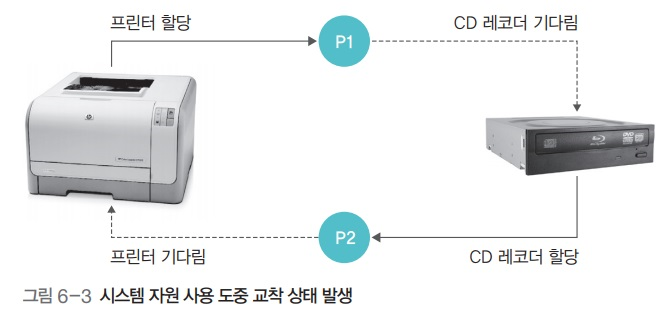

# 운영체제 - 교착상태

교착상태
<!--more-->
# 교착상태

# 1. 교착 상태

- 2개 이상의 프로세스가 다른 프로세스의 작업이 끝나기만을 기다리며 작업을 더 이상 진행하지 못하는 상태

## 아사상태와의 차이점

- **아사상태** : 운영체제가 잘못된 정책을 사용해 특정 프로세스의 작업이 지연되는 문제
- **교착상태** : 프로세스나 스레드가 결코 일어날 수 없는 특정 이벤트를 기다리는 것

## 발생 : 공유할 수 없는 자원을 사용할 때

- 위의 예에서는 P1, P2 둘 다 프린터, CD 레코더를 써야하는 상황
- 그러나 두 개 프로세스가 하나씩을 계속 점유하고 있기 때문에 무한 대기에 빠지게 됨

## 발생 : 공유 변수

- `lock1, lock2`가 모두 `True`가 되어 버릴 경우 두 프로세스 모두 한루프에 빠지게 됨

## 발생 : 응용 프로그램

데이터베이스같은 응용 프로그램에서도 교착상태 발생

## 자원 할당 그래프

- 프로세스가 어떤 자원을 사용중이고 어떤 자원을 기다리고 있는지를 방향성이 있는 그래프로 그린 것
- 프로세스는 원, 자원은 사각형으로 표현

## 다중 자원

- 여러 프로세스가 자원을 동시에 사용
- 수용할 수 있는 프로세스 수를 사각형 안에 작은 동그라미로 표현

## 식사하는 철학자 문제

- 두 개의 포크를 사용해 칠면조를 먹어야 하는 상황
- 왼쪽에 있는 포크를 잡은 뒤 오른쪽에 있는 포크를 잡아야만 식사 가능
    - 모두 동시에 식사를 시작한다고 가정한다면 다들 왼쪽에 있는 포크를 이미 집었으므로 가용 자원 없음
    - 따라서 식사를 마칠 수 없으므로 교착상태에 빠지게 됨

### 조건

1. 철학자들은 서로 포크를 공유할 수 없음
    - → 자원을 공유하지 못하면 교착 상태가 발생
2. 각 철학자는 다른 철학자의 포크를 빼앗을 수 없음
    - → 자원을 빼앗을 수 없으면 자원을 놓을 때 까지 기다려야 하므로 교착상태 발생
3. 각 철학자는 왼쪽 포크를 잡은 채 오른쪽 포크를 기다림
    - → 자원 하나를 잡은 상태에서 다른 자원을 기다리면 교착 상태 발생
4. 자원 할당 그래프가 원형
    - → 자원을 요구하는 방향이 원을 이루면 양보를 하지 않기에 교착상태 발생
    - 즉 원을 이루면 선후관계가 불분명하여 문제가 계속 맴돈다는 의미

    

    - (사각형이라면 이런 문제는 없었을 것)
    - (제일 왼쪽 철학자는 어차피 포크 2개를 가질 수 없어 식사가 불가능하다)

# 2. 교착상태 필요 조건

> 다음 4가지 조건이 모두 발생해야만 교착상태 발생

> 한가지라도 만족하지 않으면 교착상태 발생하지 않음

## **자원의 특징 조건**

- **상호 배제**

한 프로세스가 사용하는 자원은 다른 프로세스와 공유할 수 없는 자원이여야 함

- **비선점**

한 프로세스가 사용중인 자원은 다른 프로세스가 빼앗을 수 없는 비선점 자원이여야 함

## **프로세스의 행위 조건**

- **점유와 대기**

프로세스가 어떤 자원을 할당받은 상태에서 다른 자원을 기다리는 상태여야 함

- **원형 대기**

점유와 대기를 하는 프로세스 간의 관계가 원을 이루어야 함

# 3. 교착상태 해결 방법

## 교착 상태 예방

> 교착상태 필요조건 4가지가 발생하지 않도록 예방

> 시스템에 제약을 가장 많이 둠

> 교착상태 조건 4가지에 대해 각각의 방식이 존재

### A. **상호 배제 예방**

- 시스템 내에 상호 배타적인, 즉 독점적으로 사용 가능한 모든 자원을 없애버리는 방법
- 현실적으로는 모든 자원을 공유하도록 것은 불가능

### B. **비선점 예방**

- 모든 자원을 빼앗을 수 있도록 만드는 방법
- 그러나 아사 현상을 일으키고
- 뺏을 수 없는 자원이 있을수 밖에 없기에 불가능

### C. **점유와 대기 예방**

- 자원을 점유한 상태에서 다른 자원을 기다리지 못하게 함
- **전부 할당하거나 아예 할당하지 않는** 방법
- **장점**
    - 자원 사용 방식을 변화시켜 교착 상태를 처리한다는 점에서 의미가 있음
- **단점**
    - 그러나 프로세스가 자신이 사용하는 모든 자원을 자세히 알기는 어려움
    - 자원의 활용성이 떨어짐
    - 많은 자원을 사용하는 프로세스가 적은 자원을 사용하는 프로세스보다 불리
        - 아사 현상
    - 결국 일괄 작업 방식으로 동작

### D. **원형 대기 예방**

- 모든 자원에 숫자를 부여하고 숫자가 큰 방향으로만 자원 할당
    - 마우스를 할당받은 상태에서 프린터를 할당받을 수는 있지만 프린터를 할당받은 상태에서는 마우스나 하드디스크를 할당받을 수 없음
- 위의 예에서 P2는 R2를 할당받았지만 R1을 할당받을 수 없기에 강제종료됨
    - 따라서 P1은 R2를 할당받고 정상적으로 실행 가능
- **단점**
    - 작업 진행에 유연성이 떨어짐
        - 사용자는 P2 → P1 순서로 실행하고 싶을수도 있다
    - 자원의 번호를 어떻게 부여할 것인가?

### E. 결론

- 상호배제와 비선점은 예방이 사실상 불가능
- 점유와 대기, 원형 대기는 프로세스 작업 방식을 제한하고 자원을 낭비

## 교착 상태 회피

- 교착상태가 발생하지 않도록 자원 할당량을 조절하여 교착 상태를 회피
- 프로세스에 자원을 할당할 때 어느 수준 이상의 자원을 나누어주면 교착상태가 발생하는지 파악, 해당 수준 이하로만 자원을 나누어주는 방법
- 교착상태가 발생하는 범위에 있으면 프로세스를 대기시킴
- 상태 예방보다는 제약이 적음

### A. 안정 상태와 불안정 상태

- **안정 상태**
    - 각 프로세스의 기대 자원과 비교해, 가용 자원이 크거나 같은 경우가 **한 번 이상**인 경우
    - 즉, 각 프로세스의 기대 자원이 `5,7,8,10` 이고 가용 자원이 `5`일 경우에도 시스템은 안정 상태
- 할당된 자원이 적으면  안정 상태가 크고 할당된 자원이 많으면 불안정 상태가 크다
- 교착 상태는 불안정 상태의 일부분
    - 불안정 상태가 커질수록 교착상태 발생 가능성 높아짐
- 교착 상태 회피는 안정 상태를 유지할 수 있는 범위 내에서 자원을 할당해 교착 상태 회피

### B. 은행원 알고리즘

- 은행이 대출을 해주는 방식.
- 즉, 대츨 가능한 금액 범위 내이면 허용하지 그렇지 않으면 거부하는 것
- 위의 예는 라면 10개, 스파게티 20개가 있을 때
    - 손님을 가용한 범위인 10 까지만 받겠다는 것
    - (모든 손님이 라면을 원할 수 있으므로)
- **변수 용어**
    - 전체 자원
    - 가용 자원 (= 전체자원 - 프로세스들에 할당된 자원들)
    - 최대 자원 : 각 프로세스가 선언한 최대 사용 가능한 자원 수
    - 할당 자원 : 실제 각 프로세스에 할당된 자원 수
    - 기대 자원 (= 최대 자원 - 할당 자원)
- **자원 할당 기준**
    - 각 프로세스의 기대 자원 ≤ 가용 자원

### C. 교착 상태 회피의 문제점

- 프로세스가 자신이 사용할 모든 자원을 미리 선언해야함
- 시스템의 전체 자원 수가 고정적이여야 함
- 자원이 낭비됨

## 교착 상태 검출과 회복

- 시스템에 제약을 아예 두지 않음
- 자원 할당 그래프를 모니터링하며 교착 상태가 발생하는지 살펴보다가 교착 상태가 발생하면 교착 상태 회복 단계 진행

### A. 타임아웃 이용해 검출

- 특정 시간 동안 작업이 진행되지 않은 프로세스를 교착 상태가 발생한것으로 간주
- 교착 상태가 자주 발생하지 않을것이라 가정하고 사용
- 타임아웃되면 프로세스가 종료됨
- **데이터베이스에서 타임아웃의 문제**
    - 일부 데이터의 일관성이 깨질 수 잇음
    - 따라서 체크포인트와 롤백 사용, 작업을 하다 문제가 발생하면 과거의 체크포인트로 돌아감

### B. 자원 할당 그래프를 이용해 검출

- 자원 할당 그래프에 사이클이 있으면 교착 상태
- 시간이 오래 걸림. 시스템 내의 전체 프로세스와 자원의 싸이클을 검출해야 하므로.

### C. 교착 상태 회복

- 교착 상태가 검출된 후 교착 상태를 푸는 후속 작업을 하는 것
- 교착 상태 회복 단계에서는 교착 상태를 유발한 프로세스를 강제로 종료함
- **방법**
    1. 교착 상태를 일으킨 모든 프로세스를 동시 종료
    2. 교착 상태를 일으킨 프로세스 중 하나를 골라 순서대로 종료
        - 우선순위가 낮은 프로세스를 먼저 종료
        - 우선순위가 같은 경우 시간이 짧은 프로세스를 먼저 종료
        - 두 위의 조건이 같으면 자원을 많이 사용하는 프로세스를 먼저 종료

# 4. 다중 지원과 사이클

> 다중 자원이 포함된 자원 할당 그래프에서는 대기 그래프와 그래프 감소 방법을 이용해 사이클을 찾음

## 대기 그래프

- 자원 할당 그래프에서 프로세스와 프로세스 간에 기다리는 관계만 나타낸 그래프

## 그래프 감소

- 대기 그래프에서 작업이 끝날 가능성이 있는 그래프의 화살표와 관련 프로세스의 화살표를 연속적으로 지워나가는 작업

### 교착 상태가 발생하지 않는 경우

### 교착 상태가 발생한 경우

