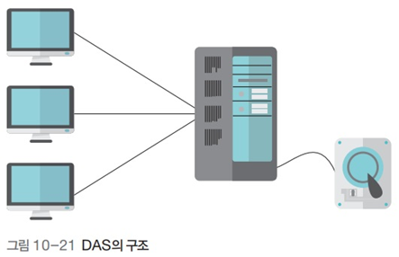

# 운영체제 - 네트워크 저장장치

네트워크 저장장치
<!--more-->
# 네트워크 저장장치

## DAS (. Attached Storage)

- **서버와 같은 컴퓨터에 직접 연결된 저장장치**를 사용하는 방식
- HAS (. Attached Storage) 라고도 부름
- 윈도우의 파일 공유(여러 컴퓨터 중 하나를 파일 공유 서버로 지정하고 나머지 컴퓨터에서 서버로 지정된 컴퓨터에 접근하여 파일을 이용하는 방식으로 운영)
- **단점**
    - 서버 컴퓨터 운영체제 지원하는 파일 시스템만을 사용
    - 데이터의 관리나 백업을 사용자가 직접 해야 함

## NAS (. Attached Storage)

- 기존의 저장장치를 LAN이나 WAN에 붙여서 사용하는 방식
- NAS 전용 운영체제를 가진 독립적인 장치로 새로운 하드디스크를 추가하거나 뺄 수 있음
- 저장장치를 네트워크상에 두고 여러 클라이언트가 네트워크를 통해 접근하게 함으로써 공유 데이터의 관리 및 데이터의 중복 회피가 가능

## SAN (. Area Network)

- 데이터 서버, 백업 서버, RAID 등의 장치를 네트워크로 묶고 데이터 접근을 위한 서버를 두는 형태
- 시스템이 제공하는 인터페이스를 통해 데이터에 접근
- 저장장치에 필요한 장치들을 네트워크로 묶어 하나의 시스템을 구성하기 때문에 **다양한 서비스를 제공**
- 데이터의 공유, 백업, 보안 등이 서버를 통해 자동으로 이루어짐
- 데이터 서버나 백업 서버를 같이 구축하여 NAS보다 구축 비용이 많이 듦
