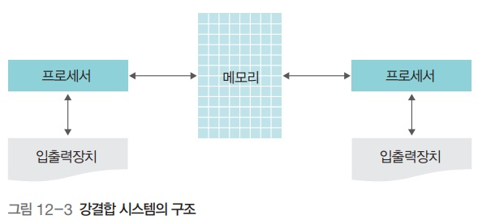

# 운영체제 - 네트워크와 인터넷

네트워크와 인터넷
<!--more-->
# 네트워크와 인터넷

## 네트워크 구성 방식 : 강결합 시스템

- **강결합 시스템**
    - 네트워크로 연결된 모든 컴퓨터의 프로세서가 하나의 메모리를 공유하는 방식
    - 모든 컴퓨터는 메모리를 공유하면서 같은 운영체제 사용
    - 약결합 시스템에 비해 속도가 빠름
    - 프로세서들이 하나의 공유 메모리를 사용하여 통신하기 때문에 공유 메모리를 서로 사용하려고 경쟁하며, 이러한 경쟁을 결합 교환 방법으로 해결

## 네트워크 구성 방식 : 약결합 시스템

- **약결합 시스템**
    - 둘 이상의 독립된 시스템을 연결한 것
    - 자신만의 운영체제, 메모리, 프로세서, 입출력장치를 가지고 독립적으로 운영되다가 필요할 때 통신선을 이용하여 메시지 전달이나 원격 프로시저 호출(.)로 통신
    - 컴퓨터들이 서로 독립적으로 작동하기 때문에 하나의 시스템에 장애가 발생해도다른 시스템에 영향을 미치지 않음

## LAN 토폴리지의 종류

- 스타형 : 중간에 네트워크를 관장하는 시스템을 두고 방사형으로 기기를 연결
- 링형 : 모든 기기를 원형으로 연결
- 버스형 : 중앙의 버스에 독립적으로 기기를 붙여 네트워크를 구성

## 분산 시스템

- 네트워크상에 분산되어 있는 컴퓨터가 작업을 처리하고 그 내용이나 결과를 서로 교환

## 분산 시스템의 장점

- 네트워크로 연결된 기기가 여러 자원을 공유할 수 있음
- 작업 분배(. balancing)를 통해 여러 기기가 작업을 나누어 처리할 수 있음
- 데이터나 처리를 분산함으로써 연산 속도를 향상할 수 있음
- 장애가 발생해도 시스템을 복구할 수 있음

## 분산 시스템에 사용되는 운영체제

- **네트워크 운영체제**
    - 각 컴퓨터가 독자적인 운영체제를 가진 채 사용자 프로그램을 통해 분산 시스템이 구현된 것
    - 낮은 수준의 분산 시스템 운영체제
    - 기기마다 운영체제가 다름
    - 지역적으로 널리 분산된 대규모 네트워크에서 사용하기 때문에 사용자가 기기 및 운영체제의 종류와 사용법을 알고 있어야 함
- **분산 운영체제**
    - 시스템 내에 하나의 운영체제가 존재하고, 전체 네트워크를 통틀어서 단일 운영체제로 운영
    - 전체 시스템을 일관성 있게 설계할 수 있음

## CGI

- 동적인 데이터를 HTML에 삽입하기 위해 프로세스에 질문을 하고 그 결과값을 HTML 형태로 웹 데몬에 전달하는 프로세스가 필요해서 개발

## P2P 시스템

- **비구조적 P2P 시스템** : 전체 노드에 대한 정보는 서버가 가지고 있고, 실제 데이터 전송은 일대일로 연결된 말단 노드를 통해 이루어지는 구조
- **구조적 P2P 시스템** : 각 노드가 전체 네트워크 정보가 아닌 부분적인 네트워크 정보를 유지. 파일 보유 정보를 여러 노드가 공유함으로써, 시스템의 한 노드가 사라지더라도 데이터 공유가 지속적으로 이루어짐

## 클라우딩 컴퓨팅 특징

- 위치에 무관한 자원 공동 사용
- 어디서나 연결 가능
- 온 디맨드 셀프 서비스
- 신속한 탄력성
- 사용한 만큼 지불
- 장점
    - 비용 절감
    - 시간 절감
    - 사용 편의
    - 확장성
    - 재해 예방

## LaaS, PaaS, Saas

- **IaaS (. As A Service)**
    - 물리적 서버(., Memory, O/S), 스토리지, 네트워크를 가상화하여 유연하게 제공하는 인프라 서비스
- **PaaS (. As A Service)**
    - 기업이 웹 어플리케이션 등의 어플리케이션을 개발하고 실행하기 위한 환경을 서비스 형태로 제공
- **SaaS (. As A Sevice)**
    - 기업 또는 일반 소비자가 다양한 어플리케이션(.)을 인터넷 및 웹브라우저를 통해 서비스로 제공

## 클라우딩 컴퓨팅 확산 근거

- 빅 데이터 시장 활성화
- 모바일 시장 활성화
- 클라우드 스트리밍
- 녹색 성장
    - 고효율, 저탄소 Green IT를 위한 기업 투자 증가
