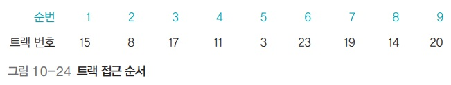

# 운영체제 - 디스크 스케줄링

디스크 스케줄링
<!--more-->
# 디스크 스케줄링

## 디스크 스케줄링

- 트랙의 이동을 최소화하여 탐색 시간을 줄이는 것이 목적

## 아래 예시들에서 공통으로 이용할 트랙 접근 순서

## FCFS 디스크 스케줄링 (. Come First Served)

- 요청이 들어온 순서대로 서비스
- 헤드가 이동한 총거리 : 7+9+6+8+20+4+5+6=65

## SSTF 디스크 스케줄링 (. Seek Time First)

- 현재 헤드가 있는 위치에서 가장 가까운 트랙부터 서비스
- 다음에 서비스할 두 트랙의 거리가 같다면 먼저 요청받은 트랙을 서비스
- 헤드가 이동한 총거리 : 1+3+3+1+3+12+3+5=31
- 효율성은 좋지만 아사 현상을 일으킬 수 있어 사용하지 않음
    - 계속 요청이 들어오는 경우 먼 곳에 있는 곳의 트랙은 아예 접근 못할수도

## 블록 SSTF 디스크 스케줄링

- 큐에 있는 트랙 요청을 일정한 블록 형태로 묶음
- 모든 트랙은 블록 안에서만 움직임
- 헤드가 이동한 총거리 : **2+9+3+8+20+3+1+5=51**
- 에이징을 사용하여 공평성을 보장하지만 FCFS에 비해 성능 향상은 제한적

## SCAN 디스크 스케줄링

- 헤드가 움직이기 시작하면 맨 마지막 트랙에 도착할 때까지 뒤돌아가지 않고 계속 앞으로만 전진하면서 요청받은 트랙을 서비스
- 헤드가 이동한 총거리 : 1+3+3+5+3+17+2+1+3=38
- 동일한 트랙이나 실린더 요청이 연속적으로 발생하면 헤드가 더 이상 나아가지 못하고 제자리에 머물게 되어 - 바깥쪽 트랙이 아사 현상을 겪는 문제가 발생
    - 예를들어 11번을 처리하고 왼쪽으로 나아가는데, 만약 큐에 자꾸 10번 요청이 계속 들어오면 10번만 처리해줘야하는 문제
- 엘리베이터를 생각하면 쉬움

## C-SCAN 디스크 스케줄링 (. SCAN)

- SCAN 디스크 스케줄링을 변형한 것 - 헤드가 한쪽 방향으로 움직일 때는 요청받은 트랙을 서비스하고 반대 - 방향으로 돌아올 때는 서비스하지 않고 이동만 함
- 헤드가 이동한 총거리 : 1+3+3+5+3+24+1+3+1+2=46
- 동일한 트랙(실린더) 요청이 연속적으로 발생하면 바깥쪽 트랙이 아사 현상을 겪음

## LOOK 디스크 스케줄링

- 더 이상 서비스할 트랙이 없으면 헤드가 끝까지 가지 않고 중간에서 방향을 바꿈
- 헤드가 이동한 총거리 : 1+3+3+5+17+2+1+3=35
- SCAN은 끝까지 가는데 이건 처리할게 그 방향에 없다면 U턴

## C-LOOK 디스크 스케줄링

- C-SCAN 디스크 스케줄링의 LOOK 버전
- 한쪽 방향으로만 서비스하는 C-SCAN 디스크 스케줄링과 유사한데, 차이점은 더 이상 서비스할 트랙이 없으면 - 헤드가 중간에서 방향을 바꿀 수 있다는 것
- 헤드가 이동한 총거리 : 1+3+3+5+20+3+1+2=38

## SLTF 디스크 스케줄링 (. Latency Time First)

- 디스크의 회전을 줄이기 위한 스케줄링
- 큐에 들어온 요청을 디스크의 회전 방향에 맞춰 재정렬한 후 서비스

