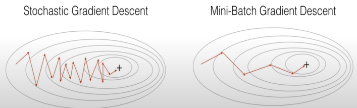

# 딥러닝 인터뷰

<!--more-->
# 딥러닝 인터뷰

## Diff between AI, ML and Deep Learning

- AI: technique which enables machines to mimic human behaviour.
- ML: using statical methods to enable machines to improve with experience
- Deep learning: Subset of ML, using multi layer neural network

## Do you think deep learning is better than machine learning? if so, why?

- 머신 러닝은 데이터가 많아질수록 느려짐, 딥러닝은 그렇지 않음
- 머신 러닝은 feature를 직접 지정해줘야 함. 딥러닝은 알아서 학습

## What is Perceptron? And how does it work?

## What is the role of weights and bias?

## What is the activation function?

## Steps of perceptron

- Init the weights and threshold
- Provide the input and calculate the output
- Update the weights
- Repeat Steps 2 and 3

## What is cost/loss function

- A cost function is a measure of the accuracy of the neural network with respoect to a given training sample and expected output
- it provides the perfomance of a neural network.
    - in deep learning, the goal is to minimize the cost function.
    - use gradient descent

## Gradient descent

- optimization algorithm used to minimize some function by iteratively moving in the direction of steepest descent.

## Mini-batch gradient

- more efficient compared to stochastic gradient descent
- generalization by finding the flat minima
- mini-batches allows help to approximate the gradient of the entire training set which helps us to avoid local minima

## What are the steps for using a gradient descent algorithm

- init random weight and bias
- pass an input thru the network and get values from the output layer
- calculate the error between the actual value and the predicted value
- go to each neuron which contributes to the error and then change  its respective values to reduce the error
- reiterate until you find the best weights of the network

## What are the shortcomings of a single layer perceptron?

- Single layer perceptron only can classify linearly saparable data points.
- Complex problems requiring lots of parameters cannot be solved.

## What is Multi Layer Perceptron?

- MLP is a deep artificial neural network composed by multiple perceptron
- Input Layer + Hidden Layer + Output Layer
    - 입력값을 받음 + 실제 계산 레이어 + 결정/추론 아웃풋

## What are the different parts of a multi layer perceptron?

- Input Nodes
    - 입력값을 Hidden Nodes에 패스
- Hidden Nodes
    - 실제 계산 수행
    - Transfer information from input to output
- Output Nodes
    - 값 출력 및 추론 담당

## What is Data Normalization and Why do we need it?

- Rescale values to fit in a specific range
    - To assure better convergence during backpropagation
- 신경망의 학습을 빠르게 하기 위해
    - 각각 Unnormalized, Normalized 데이터들의 비용 함수

    

    - Normalized의 경우 어디서 시작하던 쉽게 최적값에 도달 가능

## Backpropagation

- Calculate the error and propagate it back to the earlier layers.

## Hyper Parameter

- 모델링 시 사용자가 직접 세팅해주는 값 (즉 일반적으로 말하는 파라미터)
- Hidden Layers, Test Results, Learning rate, KNN에서의 K값 등...

## Dropout

- Regularization technique to avoid overfitting by model complexity
