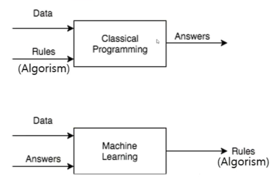

# 머신러닝

<!--more-->
# 머신 러닝

## 연역적 학습 VS 귀납적 학습

- 연역적
    - 모든 포유동물은 심장을 기자고 있다
    - 모든 말은 포유동물이다
    - → 모든 말은 심장을 가지고 있다
- 귀납법
    - 참새는 하늘을 난다
    - 제비는 하늘을 난다
    - 모든 새는 하늘을 난다

## 귀납적 학습

- 사례들을 일반화하여 패턴, 모델 추출
- 일반적인 기계학습의 대상
- 학습 데이터를 잘 설명할 수 있는 패턴을 찾는 것

## 전통적인 프로그래밍과 머신러닝

- 전통적인 프로그래밍 → 데이터와 규칙을 주면 답이 나옴
- 머신러닝 → 데이터와 답을 주면 규칙이 나옴

## 사람의 학습과 기계 학습의 비교

## 머신러닝 응용 분야

- 복잡한 데이터들이 있고, 이들 데이터에 기반해 결정을 내려야 하는 분야
- 문자인식
- 자율주행
- 광고, 상품 추천
- 안면인식 등..
- 보안시스템 (해킹방어)

## 지도학습 (Supoervised Learning)

- 입력 - 출력의 데이터들로부터 새로운 입력에 대한 출력을 결정할 수 있는 패턴 추출
- 분류 (Classification)
- 회귀 (Regression)

## 비지도학습 (Unsupervised Learning, 자율학습)

- **출력**에 대한 정보가 없는 데이터로부터 필요한 패턴 추출
- 군집 (Clustering)
- 차원축소 (Dimension Reduction)

## 강화학습 (Reinforcement Learning)

- 출력에 대한 정확한 정보는 제공하지 않음
- 평가정보 (Reward)는 주어지는 문제에 대해 각 상태에서의 행동을 결정

## 판별모델 (Discriminative Model)

- Supervised Learning
- 반 고흐가 그렸는지 예측하는 판별 모델
- 샘플 X가 주어졌을 때 레이블 Y의 확률을 Estimate

- P(Y|X)를 직접적으로 도출
    - 데이터 X가 주어졌을 때 클래스 레이블 Y가 나타날 조건부확률을 직접적으로 도출
    - 입력값 X의 차원이 높아질수록 계산량이 증가 → 학습이 어려워짐
    - 대부분 지도학습에 해당
        - 클래스 레이블 정보 Y가 필요하기 때문
- Dicision Boundary를 학습하는 것이 목표
    - 분별모델은 데이터 X가 주어졌을 때 Y1에 속할지, Y2에 속할지 구분하는데 관심

## 생성모델 (Generative Model)

- Unsupervised Learning
- 새로운 데이터 셋을  생성하는 방법을 기술
- 이 모델에서 샘플링하면 새로운 데이터를 생성 가능
- 생성 모델은 확률적이여야 한다
- 예시) 말 이미지를 생성하는 모델
    - 말의 외관을 결정하는 일반적인 규칙을 학습해야 한다
    - 이 규칙은 확률적이여야 함 → 고정된 계산만 수행한다면 매번 동일한 값을 출력하기 때문
    - 결론적으로 원본 training set에 있을 것 같지만 완전히 새롭고 다른 샘플을 생성해야함

- P(Y|X)를 간접적으로 도출
    - 데이터 X가 생성되는 과정을 두개의 확률모형으로 모델링
    - 베이즈 정리를 이용해 P(Y|X)를  간접적으로 도출
- P(Y)와 P(X|Y)의 확분포를 학습하는 것이 목표
    - 범주의 분포를 학습하는 것이 목표
    - 화가의 화풍을 학습시켜 어떤 그림을 그 화풍으로 변환하는 등..
