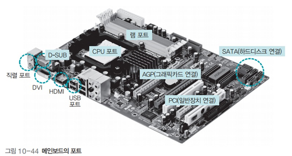

# 운영체제 - 메인보드

메인보드
<!--more-->
# 메인보드

## 메인보드의 포트

- CPU 포트 : CPU를 꽂는 곳
- 램 포트 : 램을 수직으로 꽂는 곳
- 그래픽 포트 : 외부 그래픽카드를 연결하는 포트
- SATA : 하드디스크 같은 저장장치를 연결하는 직렬 ATA 포트
- PCI : 그 외의 주변장치는 메인보드에 주변장치를 연결하는 포트

## 직렬 포트와 병렬 포트

- 버스의 통신 방식은 크게 직렬 방식과 병렬 방식으로 구분
- 직렬 방식에서는 데이터가 한 줄로 이동하고 병렬 방식에서는 데이터가 여러 줄로 동시에 이동

## USB 포트

- 키보드, 마우스, 프린터, 카메라, 저장장치 등 다양한 주변장치를 연결하기 위해 만든 표준 연결 포트

## 포트 연결 단자

- USB : USB 메모리나 카메라 등 다양한 주변장치를 연결할 수 있는 범용 포트
- SATA : 컴퓨터 내부에 있는 각종 저장장치를 연결할 때 사용
- D-SUB : 가장 오래된 모니터 연결 단자로 대개 파란색
- DVI : 컴퓨터 디스플레이와 디지털 프로젝터 같은 디지털 디스플레이 장치의 화질에 최적화된 표준 영상 인터페이스
- HDMI : 비압축 방식의 디지털 비디오/오디오 인터페이스 규격

## CD의 규격

- CD
- DVD
- 블루레이

## 그래픽카드의 발전

- CPU는 복잡한 그래픽 계산에 적합하게 설계되지 않음
- 현대의 컴퓨터 시스템에는 그래픽카드에 그래픽 계산만 전담하는 GPU가 추가됨
- 일반적인 작업은 CPU가 담당하고 그래픽 작업은 GPU가 담당하는 형태로 바뀜
