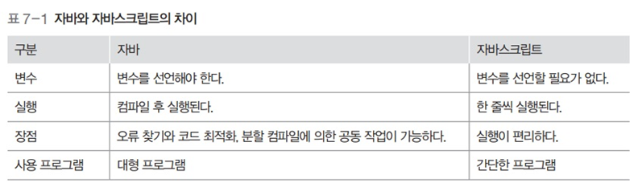

# 운영체제 - 물리 메모리 관리

물리 메모리 관리
<!--more-->
# 물리메모리 관리

# 1. 메모리 주소

- 1Byte 단위로 나뉨
- 보통 0번지부터 시작
- 메모리에 있는 내용을 가져오거나 작업 결과를 메모리에 저장하기 위해 메모리 주소 레지스터를 사용

# 2. 메모리 관리의 복잡성

- 폰 노이만 구조 컴퓨터에서 유일한 작업공간
    - 모든 프로그램은 메모리에 올라와야 실행 가능
- 일괄처리 시스템
    - 한번에 하나의 프로그램만 실행
    - 메모리 관리가 단순
- 시분할 시스템
    - 운영체제를 포함한 모든 응용 프로그램이 모두 메모리에 올라감
    - 관리가 복잡

## 메모리 관리의 이중성

- 프로세스 입장에서는 메모리를 독차지하려 함
- 메모리 관리자 입장에서는 되도록 관리를 효율적으로 하고싶어함

# 3. 언어 번역 프로그램의 종류

- 컴파일러 : 소스코드를 컴퓨터가 실행할 수 있는 기계어로 번역한 후 한꺼번에 실행
- 인터프리터 : 소스코드를 한 행씩 번역하며 실행

## 컴파일러의 목적

- 오류 발견
- 코드 최적화

## 컴파일러와 인터프리터의 차이

## 컴파일 과정

1. 소스코드 작성 및 컴파일
    - 에러찾기와 최적화
2. 목적 코드 (기계어), 라이브러리 연결
3. 동적 라이브러리를 포함하여 최종 실행
    - 기존 라이브러리는 내부 함수가 변경되면 재컴파일 해야함
    - 동적 라이브러리는 실행시에 포함되므로 재컴파일 필요 없음 (., SO)

# 3. 메모리 관리자

- 메모리 관리를 담당하는 하드웨어
- 어떠한 프로세스가, 어떤 위치의 메모리에 올려져야 할지, 어디 재배치할지 할지 결정

## 메모리 관리자의 작업 및 정책

- **가져오기 작업/정책**
    - 프로세스와 데이터를 메모리로 가져오는 작업
    - 프로세스가 필요로 하는 데이터를 언제 메모리로 가져올지 정책으로 결정
- **배치 작업/정책**
    - 가져온 프로세스와 데이터를 메모리의 어떤 부분에 올릴지 정책을 통해 결정
- **재배치 작업/정책**
    - 꽉 차 있는 메모리에 새로운 프로세스를 가져오기 위해 오래된 프로세스를 내보냄
    - 이 때 어떤 프로세스를 내보낼 지 정책을 통해 결정

## 물리 주소 공간, 논리 주소 공간

- **물리 주소 공간**
    - 하드웨어 입장에서 바라본 주소 공간.
    - 컴퓨터마다 크기가 다름
- **논리 주소 공간**
    - 사용자 입장에서 바라본 주소 공간

## 단순 메모리 구조

- 일괄 처리 시스템에서 사용
- 메모리를 운영체제 영역, 사용자 영역 두개로 나누어 관리
- 사용자 프로세스는 운영체제 영역을 피해 메모리에 적재
- 사용자 프로세스를 메모리에 올릴 때 메모리의 최상위 **(.)**부터 적재
    - 그러나 메모리를 거꾸로 사용하기 위해 주소를 변경하는것은 복잡해 잘 사용안함

### 경계 레지스터

- 운영체제 영역과 사용자 영역 경계 지점의 주소를 가진 레지스터 **(.)**
- CPU 내에 있는 경계 레지스터가 사용자 영역이 운영체제 영역으로 침범하는 것을 막아줌
- 메모리 관리자는 사용자가 작업을 요청할 때 마다 경계 레지스터의 값을 벗어나는지 검사
    - 경계 레지스터를 벗어나는 작업을 요청하는 프로세스가 있다면 그 프로세스를 종료

## 절대 주소

- 실제 물리 주소

## 상대 주소

- 사용자 영역이 시작되는 번지를 0번지로 변경해 사용
- 사용자 프로세스 입장에서 바라본 주소
- 절대 주소와 관계없이 항상 0번지부터 시작

## 절대 주소와 상대 주소의 차이

## 상대 주소를 절대 주소로 변환하는 과정

- 메모리 접근 시 상대 주소를 사용하면 결과적으로 절대 주소로 변환됨
- 상대 주소값 + 재배치 레지스터값 = 절대 주소
- 재배치 레지스터
    - 주소 변환의 기본이 되는 주소값을 가진 레지스터
    - 메모리에서 사용자 영역의 시작 주소값이 저장됨

# 4. 메모리 오버레이

> 프로그램의 크기가 실제 메모리보다 클 때, 전체 프로그램을 메모리에 가져오는 대신 적당한 크기로 잘라서 가져오는 기법

## 작동 방식

- 프로그램이 실행되면 필요한 모듈만 메모리에 올라옴
- 한정된 메모리에서 메모리보다 더 큰 프로그램 실행 가능
- 프로그램 전체가 아닌 일부만 메모리에 올라와도 실행 가능

# 5. 스왑 영역

- 메모리가 모자라서 쫓겨난 프로세스를 저장장치의 특별한 공간에 모아두는 영역
- 저장장치는 장소만 빌려주고 메모리 관리자가 관리하는 영역
- 사용자는 실제 메모리 + 스왑 영역의 크기를 합쳐 전체 메모리로 인식

## 스왑인

- 스왑 영역에서 메모리로 데이터를 가져오는 작업

## 스왑아웃

- 메모리에서 스왑 영역으로 데이터를 내보내는 작업

# 6. 메모리 분할 방식

> 메모리에 여러 개의 프로세스를 배치하는 법

## 가변 분할 방식

- 프로세스의 크기에 따라 메모리를 나누는 것
- 연속 메모리 할당
- 장점
    - 프로세스를 한 덩어리, 연속적으로 처리해 처리가 쉬움
- 단점
    - 프로세스 하나가 종료되면 중간에 비어있는 메모리 처리 등 메모리 관리가 복잡

## 고정 분할 방식

- 프로세스의 크기와 상관없이 메모리를 같은 크기로 나누는 것
- 비연속 메모리 할당
- 장점
    - 메모리를 일정한 크기로 나눠 관리하기에 메모리 관리 수월
- 단점
    - 메모리 낭비가 일어날 수 있음

## 가변 분할 방식의 자리 배정

- 대기중인 프로세스가 들어갈 수 있을만한 자리가 반드시 나야함

## 가변 분할 방식과 외부 단편화

- 가변 분할 방식에서 발생할 수 밖에 없는 중간의 작은 빈 공간을 외부 단편화라고 함

### 외부 단편화 해결법

- 메모리 배치 방식 최적화
    - **최초 배치**
        - 프로세스를 메모리에 배치할 때 메모리에서 적재 가능한 공간을 순서대로 검색하여 첫번째로 발견한 공간에 프로세스를 배치
        - 빈 공간을 모두 확인할 필요 없음
    - **최적 배치**
        - 메모리의 빈 공간을 모두 확인한 후 적당한 크기 가운데 가장 작은 공간에 배치
        - 빈 공간을 모두 확인해야 함
            - 그러나 딱 맞는 공간을 찾을 경우 단편화 발생하지 않을 수 있다.
            - 딱 맞는 공간이 없을 때는 작은 조각을 만들수밖에 없음
    - **최악 배치**
        - 빈 공간을 모두 확인한 후 가장 큰 공간에 프로세스를 배치
        - 빈 공간을 모두 확인해야 함
            - 프로세스를 배치하고 남는 공간이 크기 때문에 쓸모가 있음
            - 빈 공간의 크기가 클 때는 효과적이지만 점점 줄어들수록 작은 조각을 만들 수 밖에 없음
- 조각 모음
    - 과정
        1. 프로세스의 동작을 멈춤
        2. 프로세스를 적당한 위치로 이동 (프로세스의 상대 주소값 변경)
        3. 작업을 마친 후 프로세스 다시 시작
    - 현재 실행중인 프로세스를 종료하고 메모리를 옮겨야 하므로 실제로는 사용 잘 안함

## 고정 분할 방식의 자리 배정

- C같은 경우 C1, C2로 나뉘는데
    - C2가 들어갈 메모리 공간이 없으므로 스왑 영역으로 들어가게 된다.

## 고정 분할 방식과 내부 단편화

- 각 메모리 족가에 프로세스를 배치하고 공간이 남는 현상
- 내부 단편화를 줄이기 위해 메모리 칸 크기에 신중해야 하지만 얼마로 나누느냐에 대한 정답은 없음

## 가변 분할 방식과 고정 분할 방식 비교

## 분할 방식 : 버디 시스템

- 가변 분할 방식과 고정 분할 방식의 장점들을 취합하려 시도
1. **메모리를 1/2 크기로 잘라가며** 프로세스 크기에 적절한 **메모리 공간을 할당**함
2. 나뉜 메모리의 각 구역에는 프로세스가 1개만 들어감
3. 프로세스가 종료되면 주변의 빈 조각과 합쳐서 하나의 큰 덩어리를 만듬

## 자리 배정 방법

## 버디 시스템 특징

- 가변 분할 방식처럼 메모리가 프로세스 크기대로 나뉨
- 고정 분할 방식처럼 하나의 구역에 다른 프로세스가 들어갈 수 없고, 내부 단편화 발생
- 비슷한 크기의 조각이 서로 모이는 효과가 있음
    - 작은 조각을 통합해 큰 조각을 만들기 용이함

# 7. 변수와 메모리 할당

- 컴파일러는 변수를 사용할 때마다 사용 범위를 넘는지 점검
- 컴파일러는 모든 변수를 메모리 주소로 바꾸어 기계어로 된 실행 파일을 만듬
- 컴파일러에 의해 만들어진 변수의 주소는 상대주소임
