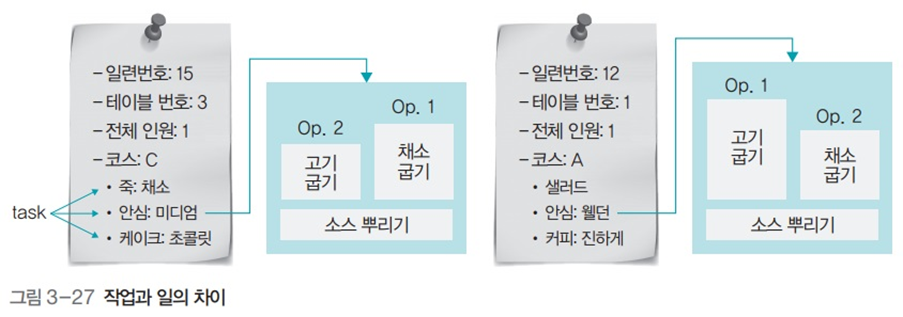

# 운영체제 - 스레드

스레드
<!--more-->
# 스레드

# 1. 스레드의 정의

- CPU 스케줄러가 CPU에 전달하는 일 하나
- 명령어의 한 줄기 혹은 프로그램 제어 흐름
- 프로세스에 있는 스레드들은 병행으로 실행되며 공통의 목표를 이루려고 협력
- CPU가 처리하는 작업의 단위는 프로세스로부터 전달받은 스레드
    - 운영체제 입장에서 작업 단위는 프로세스 (하나의 요리)
    - CPU 입장에서의 작업 단위는 스레드 (요리를 위한 작업들)
- **프로세스의 코드에 정의된 절차에 따라 CPU에 작업 요청을 하는 실행 단위**

# 2. 프로세스와 스레드의 차이

- 프로세스끼리는 약하게 연결되어 있지만, 스레드끼리는 강하게 연결되어 있음
- 보다시피 요리끼리는 연결고리가 약하지만 요리를 만들기 위한 작업들의 경우 공통의 목표를 이루기 위해 병행으로 실행되며 협력하는 모습

# 3. 멀티태스크와 멀티스레드

## **멀티태스크**

- 여러 개의 프로세스가 병렬적으로 실행
- 운영체제가 CPU에 작업을 줄 때 시간을 잘게 나누어 배분하는 기법

## **멀티스레드**

- 하나의 프로세스에 여러 개의 스레드로 구성된 것
- 프로세스 내 작업을 여러 개의 스레드로 분할함으로서 작업의 부담을 줄이는 프로세스 운영 기법
- **소프트웨어적 기법**: 운영체제가 프로세스를 작은 단위의 스레드로 분할하여 운영하는 것

## 멀티프로세싱

- 여러개의 CPU를 사용해 여러 개의 스레드를 동시에 처리하는 작업 환경

## CPU 멀티스레드

- 한 번에 하나씩 처리해야 하는 스레드를 파이프라인 기법을 이용해 동시에 여러 스레드를 처리하도록 만든 병렬 처리 기법
- **하드웨어적 기법**: 하나의 CPU에서 여러 스레드를 병렬적으로 동시에 처리하도록 설계

# 2. 멀티스레드의 구조와 예

## 멀티태스킹의 낭비 요소

- fork() 시스셈 호출로 프로세스를 복사하면
    - 코드 영역과 데이터 영역의 일부가 중복되어 존재
        - 필요 없는 정적 영역이 여러개가 됨
    - 부모-자식 관계이지만 서로 독립적인 프로세스임
    - 따라서 이러한 낭비 요소들을 제거할 수 없음
- **멀티스레드는 코드, 파일 등의 자원을 공유함으로서 자원의 낭비를 막고 효율성을 향상시킴**

## 자바 스레드 코드의 예

## fork() 시스템 호출로 작성한 코드 예

- 정적 영역이 2배가 되어 자원 낭비가 심하다

## 멀티스레드의 장점

- 응답성 향상
    - 단일 스레드일때보다 스레드 당 작업을 할당하여 응답성이 향상될 수 있음
- 자원 공유
- 효율성 향상
- 다중 CPU 지원

## 멀티스레드의 단점

- 모든 스레드가 자원을 공유
    - 한 스레드에 문제가 생기면 전체 프로세스에 영향을 미침

# 3. 멀티스레드 모델

## 커널 스레드

- 커널이 직접 생성하고 관리
- 하나의 사용자 스레드가 하나의 커널 스레드와 연결 (. to 1 모델)
- 독립적으로 스케줄링
    - 특정 스레드가 대기 상태에 들어가도 다른 스레드는 작업 계속 가능
- 커널 레벨에서 모든 작업을 지원
    - 멀티 CPU 사용 가능
- 커널의 기능을 사용하므로 보안에 강하고 안정적
- 문맥 교환 시 오버헤드 발생
    - 느리게 작동할 수 있음

## 사용자 스레드

- 라이브러리에 의해 구현된 스레드
- 사용자 프로세스 내에 여러 개의 스레드가 커널의 스레드 하나와 연결 (. to N 모델)
- 라이브러리가 직접 스케줄링을 하고 작업에 필요한 정보를 처리
    - 문맥 교환이 필요없다 (. 스케줄링은 오버헤드가 심함)
- 커널 입장에서는 여러개의 스레드가 있는지 알 수 없어 하나로 보임
    - 커널 스레드가 입출력 작업을 위해 대기 상태에 들어가면 모든 사용자 스레드가 같이 대기하게 됨
- 한 프로세스의 타임 슬라이스를 여러 스레드가 공유
    - 여러 개의 CPU를 동시에 사용할 수 없음
- 예) 자바 스레드

## 멀티레벨 스레드

- 사용자 레벨 스레드와 커널 레벨 스레드를 혼합 (. to N 모델)
- **커널 스레드가 대기 상태에 들어가면 다른 커널 스레드가 대신 작업**
    - 사용자 레벨 스레드보다 유연하게 작업 처리 가능
- 커널 레벨 스레드를 같이 사용
    - 여전히 문맥 교환 오버헤드 발생
- 빠르게 움직여야 하는 스레드는 사용자 레벨 스레드로
- 안정적으로 움직여야 하는 스레드는 커널 레벨 스레드로 작동
