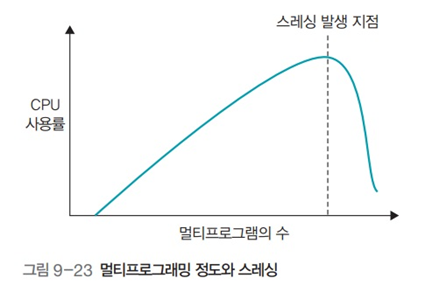

# 운영체제 - 스레싱

스레싱
<!--more-->
# 스레싱

## 스레싱

- 잦은 페이지 부재로 하드디스크 입출력이 너무 많아져 작업이 멈춘 것 같은 상태

## 스레싱 발생 시점

- CPU가 작업하는 시간보다 스왑 영역으로 페이지를 보내고 새로운 페이지를 메모리에 가져오는 작업이 빈번해져서 CPU가 작업할 수 없는 상태에 이르게 되는 시점
- 물리 메모리의 크기를 늘리면 스레싱 발생 지점이 늦춰져서 프로세스를 원만하게 실행할 수 있음

## 스레싱과 프레임 할당

- 프로세스에 너무 적은 프레임을 할당하면 페이지 부재가 빈번히 일어남
- 프로세스에 너무 많은 프레임을 할당하면 페이지 부재는 줄지만 메모리가 낭비됨
- 프로세스에 프레임을 할당하는 방식은 크게 **정적 할당**과 **동적 할당**으로 구분

## 정적 할당

### 균등 할당

- 프로세스의 크기과 상관 없이 사용 가능한 프레임을 모든 프로세스에 동일하게 할당
- 크기가 큰 프로세스의 경우 필요한 만큼 프레임을 할당받지 못함
    - 페이지 부재 빈번
    - 크기가 작은 프로세스의 경우 메모리 낭비

### 비례 할당

- 프로세스의 크기에 비례하여 프레임 할당
- 고정 할당보다는 좀 더 현실적
    - 그러나 실행중에 필요로 하는 프레임을 유동적으로 반영하지 못함
    - 사용하지 않을 메모리를 미리 확보하는 셈이라 공간 낭비

## 동적 할당 - 작업집합 모델

- 최근 일정 시간 동안 참조된 페이지들을 집합으로 만들고, 이 집합에 있는 페이지들을 물리 메모리에 유지
    - 작업집합 크기 : 작업집합 모델에서 물리 메모리에 유지할 페이지 크기
    - 작업집합 윈도우 : 작업집합에 포함되는 페이지 범위
- 델타 동안 참조된 10개의 페이지 중 작업집합에는 WS(.)={1, 7, 5, 2, 3}이 삽입되며, 이 페이지들은 다음번 윈도우에 도달할 때까지 물리 메모리에 보존

- 작업집합 크기
    - 작업집합에 들어갈 최대 페이지 수
    - 작업 집합 갱신 주기 (.번 페이지 접근시 마다)

## 작업 집합 윈도우의 크기와 프로세스 실행 성능

- 작업집합 윈도우를 너무 크게 잡으면 필요 없는 페이지가 메모리에 남아서 다른 프로세스에 영향을 미침
- 윈도우를 너무 작게 잡으면 필요한 페이지가 스왑 영역으로 옮겨져서 프로세스의 성능이 떨어짐
- 적정크기의 작업집합을 유지함으로써 메모리를 효율적으로 관리 할 수 있음

## 동적할당 - 페이지 부재 빈도

- 페이지 부재 횟수를 기록하여 페이지 부재 비율을 계산하는 방식
- 페이지 부재 비율이 상한선을 초과하면 프레임을 추가하여 늘림
- 페이지 부재 비율이 하한선 밑으로 내려가면 할당한 프레임을 회수
- 페이지 부재 빈도 방식은 프로세스를 실행하면서 추가적으로 페이지를 할당하거나 회수하여 적정 페이지 할당량을 조절

## 전역 교체와 지역 교체

- **전역 교체**
    - 전체 프레임을 상대로 교체 알고리즘 적용
- **지역 교체**
    - 현재 실행중인 프로세스의 프레임만을 대상으로 교체 알고리즘 적용

## 지역 교체의 장단점

- **장점** : 자신에게 할당된 프레임의 전체 개수에 변화가 없기 때문에 페이지 교체가 다른 프로세스에 영향을 미치지 않음
- **단점** : 자주 사용하는 페이지가 스왑 영역으로 옮겨져 시스템의 효율이 떨어짐

## 페이지 테이블의 크기

- 페이지 테이블이 차지하는 공간은 1,048,576개 X 20Bit = 약 2.62MB (각 프로세스마다)

## 프로세스의 프레임 공유 예

- 예를 들어 크롬을 두개 실행했을 경우 실행 부분은 메모리를 공유하고 데이터 부분만 따로 사용

## 쓰기 시점 복사

- 예를들어 크롬을 포크했을 때 기존의 메모리를 사용하고 있다가 데이터의 변화가 있을 때 그제서야 데이터 영역을 복사해 새로 할당해 주는 것
    - 데이터의 변화가 있을 때 까지 복사를 미루는 방식
    - 메모리를 효율적으로 사용하기 위함
