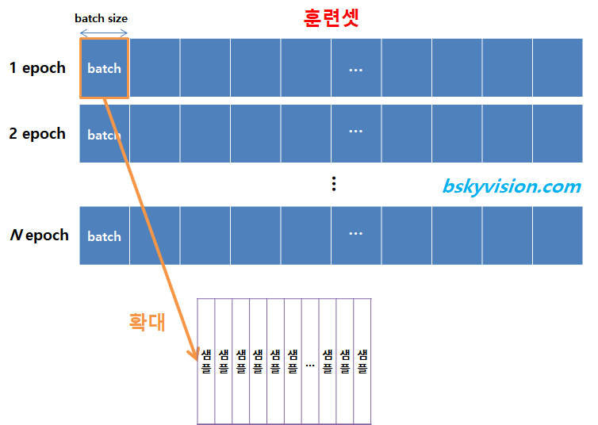

# 머신러닝 용어정리

<!--more-->
# 용어정리

## Explain the following terms.

1. singularity
    - 특이점. 인공지능이 인간의 지능을 능가하는 기점
2. chatbot
    - 챗봇. 인간이 아닌 기계가 인간을 응대하는 서비스. 앱 내 고객센터 등에 사용.
3. fuzzy logic
    - 전통적인 방식은 1로 참, 0으로 거짓
    - fuzzy 로직은 0~1 사이에서 어떤 값이라도 나올 수 있도록 함
        - 즉 0.7로 애매하게 참, 0.3으로 애매하게 거짓을 나타낼 수 있도록 함
4. fuzzy set
    - 위의 퍼지 논리를 이용해 기존의 집합 개념을 확장
    - 집합에 속하는 정도를 참, 거짓이 아닌 애매하게 속한다는 개념도 표현 가능한 `소속도`로 나타냄
5. regression
    - 회귀. 여러개의 독립변수와 하나의 종속변수의 상관관계를 모델링하는 기법.
6. epoch

    

    - 훈련 데이터셋에 포함된 모든 데이터들이 한번씩 모델을 통과한 횟수
    - epoch가 10회라면 학습데이터셋 A를 10회 모델에 학습시켰다는 것
    - epoch를 높일수록 다양한 무작위 가중치로 학습을 해보므로 적합한 파라미터를 찾을 확률이 올라감
    - 그러나 지나치게 높이면 overfitting됨
7. Batch size
    - 연산 한번에 들어가는 데이터의 크기
8. data normalization
    - 데이터 전처리 기법의 하나로 feature들을 0~1 사이의 값으로 모두 평준화하여 학습의 효율을 높임.
9. overfitting
    - 과적합. 과도하게 학습되어 새로운 데이터에 대한 예측이 어려움.
10. loss function
    - 손실함수. 실제 데이터와 예측값의 차이를 도출. 차이가 작을수록 좋다.
11. information gain
    - 정보이득. 어떤 Feature를 선택해야 가장 정보적으로 이득되는지 판별하는 척도. 디씨젼 트리에서 사용.
12. bayes rule
    - 베이즈 정리. 두 확률 변수의 사전확률과 사후 확률 사이의 관계를 나타냄.
13. gradient descent
    - 경사하강법. 기울기를 이용해 함수의 최소값을 찾아간다.

---

1. quantities of information
    - 불확실성의 양을 뜻한다. 확률이 낮을수록 정보량은 높다. Information theory에서 이를 이용해 정보량을 계산한다.
2. information entropy
    - 어떤 정보가 주어졌을 때 해당 정보가 의미있는 정보인지 파악할 때 사용된다. 0에 가까울수록 정보량이 없는 것이고 1에 가까울수록 정보량이 많음을 의미한다.
3. cross entropy
    - 교차 엔트로피. 신경망의 손실함수로 사용된다. Cross Entropy가 작으면 예측값과 실제값이 거의 일치함을 뜻한다.
4. mutual information
    - 상호 정보량. 두 정보를 따로따로 보았을 때 보다 같이 보았을 때 얼마나 더 불확실성이 감소하였는가를 정량화. 두 정보의 연관성을 볼 때 사용.

---

1. artificial intelligence
    - AI란 사람의 행동을 모방하도록 설계된 기계 혹은 소프트웨어, 방법론을 뜻한다.
2. machine learning
    - 머신러닝이란 AI를 구현하기 위해 사용되는 방법 중 하나이며 사람이 Feature들을 선별하여 학습시킨다.
3. deep learning
    - 딥러닝은 머신러닝의 일종으로 히든 레이어에서 자체적으로 Feature를 학습하여 머신러닝보다 상대적으로 간편하다.

---

1. bias
    - 편향. 결과의 정확도를 의미한다.
2. variance
    - 분산. 결과의 다양성을 의미한다.

---

1. K-means
    - Algorithm that forms K clusters for a given K
    - How to automatically determine K?
        - K값을 1씩 더해서
    - How can you determine which clusters are better than others for the same data
        - 응집도를 보고 판단
2. Overfitting
    - How to avoid overfitting in terms of the amount of learning data, the learning epoch, complexity of the model
        - learning data, learning epoch가 많을수록, 모델의 복잡도가 높을수록 overfitting이 될 확률이 높으므로 적절하게 설정하는 것이 중요하다. 예를들어 learning data의 경우 전처리  및 차원축소 등을 실행하거나, epoch의 경우 너무 높에 설정하지 않아야하고, 모델의 복잡도가 너무 높은 경우 레귤레이션이나 드롭아웃을 통해 해결한다.

---

1. Generalization
    - 일반화. 트레이닝 셋이 아닌 데이터를 넣어도 정확도가 최대한 유지된 채로 아웃풋이 나오도록 하는 것.
2. Optimization
    - 최적화. 아웃풋의 오류가 가장 적은 하이퍼 파라미터들을 찾는 것
