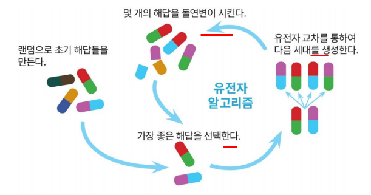

# 유전 알고리즘

<!--more-->
# 유전 알고리즘

## Genetic Algorithm

## 최적화 문제

- 가장 근접한 해를 찾는 방법
- Hill-Climbing 알고리즘
    - 산꼭대기 그거
    - 미분을 통해 가장 가파른 경사를 알아내는 알고리즘
- **유전 알고리즘 (GA)**
    - GA에서 출력을 얻을 수 있는 함수가 정의되면 어디서나 적용 가능
    - 환경에 적합한 측도인 적합도를 늘리는 쪽으로 진화를 반복

## 염색체

- 주어진 문제에 대한 가능한 해들의 집합을 표현한 자료구조
- Encoding: 문제 공간을 염색체들의 형태로 변경
- Decoding: 염색체들을 문제 공간으로 변경

## 평가함수

- 현재의 염색체가 얼마나 문제를 잘 해결하고 있는지 나타내는 함수
    - 적합도를 반환

## 유전자 연산 (operation)

- 염색체 선택 (selection)
    - 적합도 값이 우수한 염색체들이 부모로 선택
- 유전자 교배 (crossover)
    - 부모 염색체에서 유전자들을 서로 고환
- 돌연변이 (mutation)
    - 염색체에서 임의 위치의 유전자 값을 바꿈

## 선택연산자 (Fitness Function)

- **룰렛 휠**

## 교배연산자 (Crossover)

- 임의의 교배 위치 선택
- **단순 교배 (simple crossover)**

    

    - 하나의 부분만 교배
    - 빠르게 부모와 변함
    - 양쪽이 같은 값을 가지고 있는 부분은 바뀌지 않음
- **이점 교배 (two-point crossover)**

    

    - 두개 부분을 교체
- 단일교배 (uniform crossover)
- 역위 (inversion)

## 돌연변이

- 다양한 개체군 유지
- 아주 낮은 돌연변이률

## 예제

## 유전자 알고리즘의 장단점

- 예측한 그대로 동작하는 알고리즘이 존재하는 문제에는 의미가 없음
- 수행 시간 예측이 불가
- 최적의 솔루션이 필요없는, 기존의 방법으로 해결할 수 없는 문제에 종종 사용됨

## 유전자 프로그래밍

- 8 Queen, TSP
