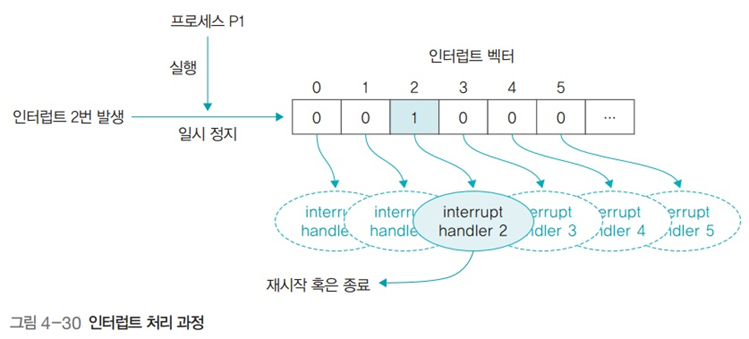

# 운영체제 - 인터럽트와 프로세스 통신

인터럽트와 프로세스 통신
<!--more-->
# 인터럽트와 프로세스 통신

# 1. 인터럽트 심화

## 폴링

- 입출력을 요청하면 운영체제가 직접 주기적으로 입출력장치를 확인하여 처리

## 인터럽트

- 입출력 관리자에게 입출력을 요청하고 입출력이 완료되면 이벤트를 발생시켜 알림
- **동기적 인터럽트**
    - 프로세스가 실행중인 명령어로 발생
    - 다른 사용자의 메모리 영역 접근, 오버플로우, 언더플로우, 수를 0으로 나누는 산술 연산 등
- **비동기적 인터럽트**
    - 하드딛스크 읽기 오류, 메모리 불량 등 하드웨어적 오류
    - 사용자가 직접 작동하는 키보드 인터럽트, 마우스 인터럽트

## 인터럽트 처리 과정

1. 인터럽트가 발생하면 현재 실행중인 프로세스는 일시정지, 재시작하기 위해 상태 정보를 PCB에 임시 저장함
2. 인터럽트 컨트롤러가 실행되어 인터럽트 처리 순서 결정
3. 먼저 처리할 인터럽트가 결정되면 인터럽트 벡터에 등록된 인터럽트 핸들러 (해당 이벤트를 처리할 함수의 시작 주소) 실행
4. 핸들러가 인터럽트 처리를 마치면 일시정지된 프로세스가 다시 실행되거나 종료

## 커널 모드

- 운영체제와 관련된 커널 프로세스가 실행되는 상태

## 사용자 모드

- 사용자 프로세스가 실행되는 상태

## 이중 모드

- 운영체제가 커널 모드와 사용자 모드를 전환하며 일 처리를 하는 것
- 궁극적인 목적은 자원 보호

## 시스템 호출과 API

- 사용자 프로세스가 자원에 접근하려면 시스템 호출을 이용해야 함
- 사용자 프로세스는 API가 준비해놓은 다양한 함수를 이용해 시스템 자원에 접근

# 2. 프로세스 통신

## 종류

- **프로세스 내부 데이터 통신**
    - 한 프로세스 내에 2개 이상의 스레드가 존재하는 경우의 통신
    - 전역 변수, 파일을 이용해 데이터를 주고받음
- **프로세스 간 데이터 통신**
    - 한 PC에 있는 여러 프로세스끼리 통신
    - 공용 파일 또는 운영체제가 제공하는 파이프 이용
- **네트워크를 이용한 데이터 통신**
    - 여러 컴퓨터가 네트워크로 연결되어 있을 때 통신
    - 소켓을 이용

## 분류

### 통신 방향에 따른 분류

- 양방향 통신
    - 데이터를 동시에 양쪽 방향으로 전송 가능
    - 일반적인 통신
    - 소켓 통신
- 반양방향 통신
    - 양쪽 방향으로 통신 가능하나 동시 전송 불가
    - 무전기
- 단방향 통신
    - 한쪽 방향으로만 데이터 전송
    - 모스 신호
    - 전역 변수, 파이프

### 통신 구현 방식에 따른 분류

- 대기가 있는 통신
    - 동기화를 지원하는 통신 방식
    - 데이터를 받는 쪽은 데이터가 도착할 때 까지 대기
- 대기가 없는 통신
    - 동기화를 지원하지 않는 통신 방식
    - 데이터를 받는 쪽은 Busy Waiting을 통해 데이터가 도착했는지 여부를 직접 확인

## 프로세스 간 통신 방식

- 데이터를 주거나 받는 쓰기 연산과 읽기 연산으로 이루어짐

## 공유메모리 방식

- 공동으로 관리하는 메모리를 사용해 데이터를 주고받음
- 데이터를 보내는 쪽은 공유메모리에 쓰기, 받는 쪽은 공유메모리 읽기
- 유닉스 공유메모리 관련 함수: shmget(), shmat()

## 파일을 이용한 통신

- **파일 열기**
    - open(“com.txt”, O_RDWR) : com.txt 파일을 읽기와 쓰기를 할 수 있는 형태로 준비
    - 파일이 열리면 open 함수는 그 파일에 접근할 수 있는 권한인 파일 기술자 fd를 사용자에게 반환
- **읽기 또는 쓰기 연산**
    - write(., “Test”, 5) : fd, 즉 com.txt 파일에 Test라는 문자열을 쓰라는 뜻
    - read(., buf, 5) : fd, 즉 com.txt 파일에서 5B를 읽어 변수 buf에 저장
- **파일 닫기**
    - close(.) : fd가 가리키는 파일, 즉 com.txt 파일을 닫음

## 파이프를 이용한 통신

- 파이프로 양방향 통신을 하려면 파이프 2개 사용
- 운영체제가 제공하는 동기화 통신 방식
    - 파일 입출력과 같이 open() 함수로 기술자를 얻고 close() 함수로 마무리
- 파이프에 쓰기 연산, 읽기 연산을 통해 송신 수신

### 이름 없는 파이프

- 일반적인 파이프

### 이름 있는 파이프

- FIFO라는 특수 파일을 이용해 서로 관련없는 프로세스 간 통신에 사용

## 소켓을 이용한 통신

- 여러 컴퓨터에 있는 프로세스끼리 통신
- 통신하고자 하는 프로세스는 자신의 소켓과 상대의 소켓을 연결 (바인딩)
- 소켓에 쓰기 연산을 하면 데이터가 전송되고
- 읽기 연산을 하면 데이터를 받게 됨
