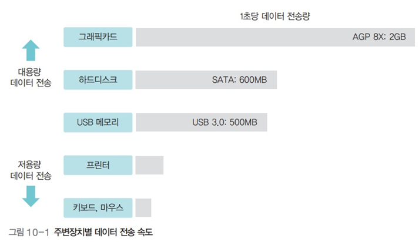

# 운영체제 - 입출력 시스템

입출력 시스템
<!--more-->
# 입출력 시스템

## 주변장치

- 저속 주변장치 : 키보드, 마우스 등
- 고속 주변장치 : 그래픽카드, 하드디스크 등

## 채널

- 데이터가 지나다니는 통로

## 채널 공유와 채널 분리

- 채널을 모든 주변장치가 공유하면 데이터 전송 속도가 느려짐
- 그래서 전송 속도가 비슷한 장치끼리 묶어 장치별로 채널 할당
    - 전체 데이터 속도를 향상시킬수 있음

## 입출력 버스 구조 - 초기

- 모든 장치가 하나의 버스를 사용
- CPU가 작업을 진행하다가 입출력 명령을 만나면 직접 입출력장치에서 데이터를 가져오는 폴링방식 이용

## 입출력 버스 구조 - 입출력 제어기 사용

- 버스는 메인버스와 입출력 버스의 2개의 채널로 나뉨
    - 메인버스 : 고속으로 작동하는 CPU와 메모리가 사용
    - 입출력 버스 : 주변장치가 사용
- 입출력 제어기를 사용하면 느린 입출력장치로 인해 CPU와 메모리의 작업이 느려지는 것을 막을 수 있어 전체 작업 효율 향상

## 입출력 버스의 분리

- 입출력 제어기를 사용하면 작업 효율을 높일 수 있지만, 저속 주변장치 때문에 고속 주변장치의 데이터 전송이 느려지는 문제가 있음
- 이를 해결하기 위해 입출력 버스를 고속 입출력 버스와 저속 입출력 버스로 분리하여 운영
- 고속 입출력 버스에는 고속 주변장치를 연결하고 저속 입출력 버스에는 저속 주변장치를 연결
- 두 버스 사이의 데이터 전송은 채널 선택기가 관리
- 입출력 버스로 감당하기 어려워진 그래픽카드는 입출력 버스에서 분리하고 메인버스에 바로 연결하여 사용
- 결론적으로 현대의 컴퓨터는 CPU와 메모리를 연결하는 메인버스, CPU와 그래픽카드를 연결하는 그래픽 버스, 고속 입출력 버스와 저속 입출력 버스를 사용

    

    ## 직접 메모리 접근 (. Memory Access)

    

    - CPU의 도움 없이도 메모리에 접근할 수 있도록 입출력 제어기에 부여된 권한
    - 입출력 제어기에는 직접 메모리에 접근하기 위한 DMA 제어기가 마련되어 있음
    - 입출력 제어기는 여러 채널에 연결된 주변 장치로부터 전송된 데이터를 적절히 배분하여 하나의 데이터 흐름을 만듦
    - 채널 선택기는 여러 채널에서 전송된 데이터 중 어떤 것을 메모리로 보낼지 결정

    ## 입출력과 인터럽트

    - 인터럽트는 주변장치의 입출력 요구나 하드웨어의 이상 현상을 CPU에 알려주는 역할을 하는 신호
    - 각 장치에는 IRQ라는 고유의 인터럽트 번호가 부여되어 있음
    - 인터럽트가 발생하면 CPU는 IRQ를 보고 어떤 장치에서 인터럽트가 발생했는지 파악

    ## 인터럽트의 종류

    - 외부 인터럽트 : 입출력장치로부터 오는 인터럽트뿐 아니라 전원 이상이나 기계적인 오류 때문에 발생하는 인터럽트를 포함
    - 내부 인터럽트 : 프로세스의 잘못이나 예상치 못한 문제 때문에 발생하는 인터럽트
    - 시그널 : 사용자가 직접 발생시키는 인터럽트 (일반적으로는 인터럽트로 분류하지는 않음)

    ## 인터럽트 백터

    

    - 여러 인터럽트 중 어떤 인터럽트가 발생했는지 파악하기 위해 사용하는 자료 구조
    - 인터럽트 벡터의 값이 1이면 인터럽트가 발생했다는 의미

    ## 인터럽트 핸들러

    - **인터럽트의 처리 방법을 함수 형태로 만들어놓은 것**
    - 운영체제는 인터럽트가 발생하면 인터럽트 핸들러를 호출하여 작업함
    - 사용자 인터럽트인 시그널의 경우 자신이 만든 인터럽트 핸들러를 등록할 수도 있음

    ## 버퍼

    

    - 속도가 다른 두 장치 속도 차이를 완화하는 역할을 하는 저장 공간
    - 이중 버퍼를 사용하면 한 버퍼는 데이터를 담는 용도로 쓰고 또 한 버퍼는 데이터를 가져가는 용도로 쓸 수 있어 유용

    ## 하드웨어 안전 제거

    

    - 버퍼가 다 차지 않으면 버퍼가 다 찰 때까지 입출력장치에 자료가 전송되지 않는데, 이 상태에서 저장장치를 제거하면 버퍼 안의 데이터가 저장되지 않는 문제가 발생
    - 하드웨어 안전 제거를 사용하면 버퍼가 다 차지 않아도 강제로 버퍼의 내용이 저장장치로 옮겨짐 (플러시)
