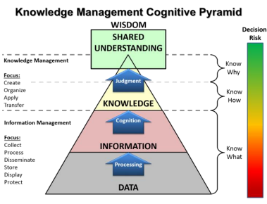

# 전문가 시스템

<!--more-->
# 전문가시스템

# 🤖 1. 지식 및 전문가시스템

- 1960~1970 1차 AI 붐 → 1차 겨울: 계산기능한계, 논리체계한계
- 1980~1990 2차 AI 붐 → 2차 겨울: AI HW 시장 붕괴, Data 부족, 규칙학습 불가능
- 2010~20XX 3차 AI 붐 : 머신러닝, 딥러닝

## 데이터

- **데이터**
    - 특정 분야에서 관측된 아직ㅈ 가공되지 않은 것
    - 오류나 잡음 포함 가능
- **정보**
    - 데이터를 가공하여 어떤 목적이나 의미를 갖도록 한 것
- **지식**
- **지혜**
    - 경험과 학습을 통해서 얻은 지식보다 높은 수준의 통찰

## **지식**

- 정보를 취합하고 분석하여 얻은 대상에 대해 사람이 이해한 것
- 일반화, 규칙
- **표현형식**
    - 암묵지
        - 당연한, 형식을 갖추어 표현하기 어려운 학습과 경험을 통해 쌓은 지식
    - 형식지
        - 비교적 쉽게 형식을 갖추어 표현할 수 있는 지식
- **표현 대상**
    - 절차적 지식
        - 문제 해결의 규칙이나 절차 등
        - Symbolic
    - 선언적 지식
        - 어떤 대상의 특성에 대한 지식
        - 색상 등..
        - Non-Symbolic

## Production Rule

- 사실: Boolean
- 규칙: If ~ Then 형태의 문장
- 규칙 획득 및 표현
    - 예) 신호등이 녹색일 때는 건널목을 안전하게 건널 수 있고, 빨간색일때는 길을 건너지 말아야 한다
    - 대상, 속성, 행동/판단 정보 추출
        - 대상: 신호등
        - 속성: 녹색, 빨간색
        - 행동/판단: 건던다, 멈춘다
    - 표현
        - IF 신호등 = 녹색 THEN 건넌다, ELIF 신호등 = 빨간색 THEN 멈춘다
- 규칙을 통한 지식 표현
    - **인과관계**
        - 원인을 조건부에, 결과는 결론부에 표현
    - **추천**
        - 상황을 조건부에, 추천내용을 결론부에
    - **지시**
        - 상황을 조건부에, 지시 내용을 결론부에
    - **전략**
        - 일련의 규칙들로 표현
    - **휴리스틱**
        - 일반적으로 바람직한 것을 표현

## 규칙기반 시스템

- 지식을 규칙의 형태로 표현
- 규칙들을 사용해 문제에 대한 해를 찾는 지식기반시스템

## 전문가 시스템

- 특정 문제정역에 대해 전문가 수준의 해를 찾아주는 시스템
- 첫번째 겨울 이후 제한된 문제에 집중

## 전통적인 프로그램과 전문가시스템 비교

- 전통적인 프로그램은 항상 같은 순서 (알고리즘) 으로 처리
- 전문가시스템은 기술된 단계의 순서를 따르지 않음
    - 정확하지 않은 추론 허용
    - 확신도에 따라 불완전/불확실한 데이터를 처리

## 추론 엔진

## 추론

- 구축된 지식과 주어진 데이터를 이요하여 가설을 검증하거나, 새로운 사실을 유도하거나, 관련된 정보를 유추
- 생성 시스템 (Production System)

## **전향 추론 (foward reasoning)**

- 규칙의 조건부와 만족
- 규칙의 결론부를 실행

## **후향 추론**

- 결론부에 가지고 있는 규칙을 찾아서
- 조건부의 조건들이 모두 만족하는지 확인

## 전문가 시스템 구조

- 지식/규칙베이스 : 사실, 규칙
- **작업메모리**
    - 사용자로부터 받은 문제에 대한 정보 관리
    - 추론과정의 중간결과를 저장, 유도된 최종해 저장
    - 작업 메모리에 저장되는 모든 것을 사실이라고 함
- **추론 엔진**
    - 실행할 수 있는 규칙을 찾아서, 해당 규칙을 실행하는 역할
    - 패턴 매칭 - 경합 해소 - 규칙 실행의 과정 반복

## 경합 해소 전략

- 규칙 우선순위
    - 작업 메모리의 사실과 규칙베이스에 있는 규칙의 조건부를 대조
    - 일치하는 규칙을 찾는 과정
- 최신 우선
- 최초 우선
- 상세 우선
    - 가장 상세한 조건부를 갖는 규칙

## 전문가시스템 개발 도구

- LISP, Prolog
- Jess, CLIPS, EXSYS, SEOPS

## 전문가 시스템 장점

- IF - THEN 규칙
    - 전문가의 지식을 자연스럽게 표현
    - 독립적이고 이해하기 쉬움
- 지식베이스와 추론엔진 분리
    - 다른 영역에돋 쉽게 적용 가능
- 확신도를 사용하면 불완전하고 불확실한 지식 표현 가능

## 전문가 시스템 단점

- 지식을 학습할 수 없음
    - 전문가가 새로운 지식을 추가, 변경해야 함
- 비효율적인 탐색
- 규칙이 많아지면 상호관계가 불명확해짐. 유지보수가 어려움.

# 2. Sementic Network

## 의미망

- 지식을 이항 관계의 집합으로 표현
- 방향성 그래프를 이용해 지식 표현
    - **노드**
        - 대상, 개념, 행위, 상태, 사건
    - **간선**
        - 관계가 있는 노드들을 연결
        - 관계에 따른 방향
        - 관계의 이미를 나타내는 라벨 부여

## 관계

### 🔵 **is-a**

- **상위 클래스와 하위 클래스** 관계 ex) 조류, 동물
- **또는 클래스와 객체**의 관계 (트위티, 종달새)
- 계층 관계 표현.
    - **상위 계층의 속성을 상속**
- **추이적** (transitive) 관계 만족 → inheritance

    

### 🔵 **has-a**

- **전체-부분 관계**
- part-of와 역관계
    - **has-a(X,Y) 이면 part-of(Y,X) 성립**
- **추이적** 관계 만족

    

## 다항 관계 표현

- 다항 관계를 이항 관계로 전개
- 사물화: 다항 관계를 객체로 간주하여 표현
- 예) 길동이는 지난 가을부터 현재까지 고양이를 키우고 있다

## 의미망에서 추론

- **상속을 사용**
- 질문에 대한 의미망과 지식을 나타내는 의미망을 비교

- 질문 예) 펭귄은 알을 낳는가?
    - can(펭귄, 알낳기)에 해당
    - is-a 관계의 간선을 따라 조류 노드로 이동
    - can(조류, 알낳기)가 있으므로 질문의 답은 참

## 시맨틱 네트워크 장점

- 지식을 시각적으로 표현하영 직관적 이해 용이
- 노드 추가, 변경으로 쉽게 지식의 추가 변경 가능
- 계층 관계를 정의하여 속성의 상속 관계 지정 가능
- 복잡한 지식을 구조화하여 표현 가능

## 시맨틱 네트워크 단점

- 지식의 양이 많아지면 관리 복잡
- 개념이나 관계를 정의하는 표준 지침이 없음
    - 통일성 부족
    - 공유나 재사용에 대한 고려 없음
- 논리적 결합 관계나 인과 관계를 기술하려고 하면 and, or, implies와 같
은 링크 도입 필요
    - 일관성을 떨어뜨리고 추론과정을 복잡
- 기본적으로 정적인 지식의 표현
    - 추론 과정에서 동적으로 지식의 내용을 바꾸려면 그래프를 동적으
    로 바꿀 수 있도록 해야 함

## 3. 프레임

- 특정 객체, 개념에 대한 전형적인 지식을 슬롯의 집합으로 표현
- 객체지향의 느낌

## 스크립트

- 일반적으로 발생할 수 있는 전형적인 상황에 대한 절차적 지식을 표현
- 일련의 사건을 시간적 순서를 고려하여 기술

## 온톨로지

- 어떤 영역의 지식을 개념, 특성, 속성, 제약조건, 개체에 대한 정보가 기술
- 영역에 대한 공통된 어휘 사용
- 서로간 토의를 통해 합의를 이룬 것을 표현
- 예시
    - 아마존 쇼핑 카탈로그
    - 워드넷
        - 영어 단어의 어휘목록과 어휘목록 사이의 다양한 의미관계 기록
- 시맨틱 웹
    - 웹의 데이터를 소프트웨어 에이전트가 이해하여 지능적으로 활용 가능하도록 하는 것
    - XML 사용
    - 의미 해석을 위해서는 RDF 사용

## 심볼 그라운딩 문제

- 컴퓨터가 기호로 표기된 실제 세계의 의미를 이해할 수 없음
    - 딥러닝을 이용해 학습시키기

## 프레임 문제

- 컴퓨터가 하나의 프레임에 갇혀 하나의 목표만 보고 움직임
- 관계있는 지식을 사용하지 않음
