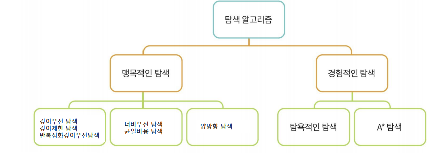

# 탐색 알고리즘

<!--more-->
# 탐색

# 👾 1. Search Space & Search

## 탐색

- 문제의 해가 될 수 있는 것들의 집합을 공간으로 간주하고, 문제의 최적의 해를 찾기위해 공간을 체계적으로 찾아보는 것
- 탐색문제의 예
    - 선교사-식인종 강건너기 문제
    - 8퍼즐 문제
    - 8퀸 문제
    - 틱택토
    - 루빅스큐브
    - 순회판매자 문제

## 상태

- 특정 시점에 문제의 세계가 처해 있는 모습

## 세계

- 문제에 포함된 대상들과 이들의 상황을 포괄적으로 표현한 것

## 상태 공간

- 문제 해결 과정에서 초기 상태로부터 도달할 수 있는 모든 상태들의 집합
- 문제의 해가 될 가능성이 있는 모든 상태들의 집합

## 초기상태

- 문제가 주어진 시점의 시작 상태

## 목표상태

- 문제에서 원하는 최종 상태

## 상태 공간 그래프

- 상태공간에서 각 행동에 따른 상태의 변화를 나타낸 그래프
    - 노드: 상태
    - 링크: 행동
- 일반적인 문제에서는 상태공간이 매우 큼
    - 미리 상태 공간 그래프를 만들기 어렵다
    - 탐색과정애서 그래프 생성

# 🤖 2. Blind Search

## 맹목적 탐색

- 정해진 순서에 따라 상태공간 그래프를 점점 생성해 가면서 해를 탐색하는 방법

## 깊이 우선 탐색 (DFS)

- 초기 노트에서 시작하여 깊이 방향을 ㅗ탐색
- 목표 노드에 도달하면 종료
- 더 이상 진행할 수 없으면 백트래킹
- 방문한 노드는 재방문하지 않음

## 너비 우선 탐색 (BFS)

- 초기 노드에서 시작하여 모든 자식노드를 확장하여 생성
- 목표 노드가 없으면 형제 노드에서 다시 자식 노드 확장

## 8퍼즐 문제

### DFS

- 루트 노드에섯 현재 노드까지의 경로 하나만 유지
- 가능 상태 : 9!/2 = 184,440

### BFS

- 전체 트리를 메모리에서 관리

## 균일 비용 탐색

- 경로 비용 g(n)이 제일 낮은 노드 n을 확장
- Sibiu → Bucharest 로 갈 때
    - Sibiu에서 볼 수 있는 도시는 Rim, Fag
    - 따라서 80 비용인 Rim부터 감 → Pit 확장
    - 이제 Pit과 Fag가 보인다. 97 비용인 Pit 가고 Buch 확장
    - 이제 99인 Fag와 101이 Buch가 보인다. Fag가기
    - 이제 비용 101인 Pit → Buch로 간다 80 + 97 + 101 = 278 (최적)
    - 이제 비용 211인 Fag → Buch로 간다. 99 + 211 = 310

## 반복적 깊이심화  탐색

- 깊이 한계가 있는 깊이 우선 탐색을 반복적으로 사용
- 최상의 싶이 한계를 찾아내는 방법
- 목표를 발견할 때 까지 깊이 한계를 증가시켜 나감
- 깊이우선탐색 + 너비우선탐색 장점 모두 가짐

## 맹목적 탐색 방법의 비교

- **깊이 우선 탐색**
    - 메모라 공간 사용 효율적
    - 최단 경로 해 탐색 보장 불가
- **너비 우선 탐색**
    - 최단 경로 해 탐색 보장
    - 메모리 공간 사용 비효율
- **반복적 깊이심화 탐색**
    - 최단 경로 해 보장
    - 메모리 공간 사용 효율적
    - 반복적인 깊이 우선 탐색에 따른 비효율
        - 실제 비용은 크게 늘지 않음
        - 각 노드가 10개의 자식노드를 가질 때 너비 우선 탐색 대비 약 11% 정도 추가 노드 생성
    - 탐색공간이 크기 해답의 깊이가 알려져 있지 않은 경우 선호

## 양방향 탐색

- 초기 노드와 목적 노드에서 동시에 너비 우선 탐색 진행
- 중간에 만나도록 하여 초기 노드에서 목표 노드로의 최단 경로를 찾음

# 1. Informed Search

## 정보이용 탐색

- 휴리스틱 탐색
    - 시간이나 정보가 불충분하여 신속하게 어림짐작 하기
    - 최적의 해를 구하는 것이 아니라 적절한 해를 빠르게 찾는 방법
- 언덕 오르기 방법, 최상 우선 탐색, 빔 탐색, A* 알고리즘 등
- 최단 경로 문제에서 목적지까지 남은 직선 거리
    - 거리는 짧지만 비용이 많이 소요될 여지가 있음

## 휴리스틱 비용 추정의 예

## 언덕 오르기 방법

- 현재 노드에서 휴리스틱에 의한 평가값이 가장 좋은 이웃 노드 하나를 확장해 나가는 탐색 방법
    - Greedy Search
    - 기울기가 제일 가파른 곳부터 계속해서 탐욕적으로 나아가는 방법
- 그러나 최적의 값을 도출하지 못할 수 있음
    - 에를들어 중간에서 왼쪽으로 가야 최고점에 도달하는데
    - 오른쪽으로 가버리면 최고점에 도달하지 못하고, 중간봉우리에서 끝나게 됨

## 모의 담금법

- Greedy Search, Stochastic Search
- 담금질을 하듯 기울기를 조절하여 왔다갔다하면서 최적점을 찾음

## 최상 우선 탐색

- 확장중인 노드들 중에서 목표 노드까지 남은 거리가 가장 짧은 노드를 확장하여 검색
- 남은 거리를 정확히 알 수 없으므로 휴리스틱 사용
    - 제자리가 아닌 타일의 개수

## A* 알고리즘

- 추정한 전체 비용 f(n)을 최소로 하는 노드를 확장해 가는 방법
- f(n) = g(n) + h(n)
    - 노드 n을 경유하는 전체 비용
    - 현재 노드 n까지 이미 투입된 비용 g(n)과 목표 노드까지의 남은 비용 h(n)의 합
- h(n) : 남은 비용의 정확한 예측 불가
    - 휴리스틱 함수로 예측

## 빔 탐색

- 휴리스틱에 의한 평가값이 우수한 일정 개수의 확장 가능한 노드만을 메모리에 관리하면서 최상 우선 탐색을 적용
