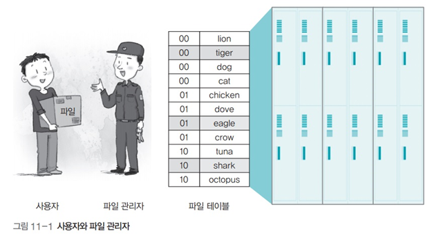

# 운영체제 - 파일 시스템

파일 시스템
<!--more-->
# 파일 시스템

## 파일 시스템

- 사용자가 직접 파일을 보관하는 대신 파일 관리자를 두어 저장 장치의 관리를 맡기는 시스템
- 파일 관리자가 파일 테이블을 사용하여 파일을 관리
- 사용자가 특정 파일에 접근하려면 파일 관리자로부터 파일에 접근할 수 있는 권한을 획득해야 함

r

- (운영체제 입장에서) 블록은 저장장치에서 사용하는 가장 작은 단위로, 한 블록에 주소 하나가 할당
- 블록은 여러 개의 섹터로 구성되며 블록의 크기는 시스템마다 다름
- **블록 크기를 작게 설정하면 내부 단편화 현상이 줄어들어** 저장장치를 효율적으로 쓸 수 있지만, **파일이 여러 블록으로 나뉘어 파일 입출력 속도가 느려짐**
- 큰 파일을 많이 사용할 때는 블록 크기를 크게 잡는 것이 좋음

## 파일 속성의 종류

## 파일 헤더와 고유 헤더

- **파일 헤더** : 파일 테이블에서 관리하며 **파일의 이름, 종류, 크기, 시간, 접근 권한** 등과 같은 일반적인 내용과 파일이 저장장치의 몇 번째 블록에 있는지에 대한 정보를 가지고 있음
- **고유 헤더** : 데이터 파일에는 응용 프로그램이 직접 관리하는 고유 헤더가 따로 달려 있는데 파일의 버전 번호, 크기, 특수 정보 등 응용 프로그램이 필요로 하는 정보가 있음

## 파일 작업의 종류

## 순차 파일 구조

- 파일 내용이 하나의 긴 줄로 늘어선 형태
- **장점**
    - 모든 데이터가 순서대로 기록되기 때문에 저장 공간에 낭비되는 부분이 없음
    - 구조가 단순하여 테이프는 물론 플로피디스크나 메모리를 이용한 저장장치에도 적용할 수 있음
    - 순서대로 데이터를 읽거나 저장할 때 매우 빠르게 처리됨
- **단점**
    - 파일에 새로운 데이터를 삽입하거나 삭제할 때 시간이 많이 걸림
    - 특정 데이터로 이동할 때 직접 접근이 어렵기 때문에 앞에서부터 순서대로 움직여야 하기 때문에 데이터 검색에 적당하지 않음

    ## 인덱스 파일 구조

    

    - 인덱스 테이블을 이용하여 순차 접근과 직접 접근이 가능
    - **현대의 파일 시스템은 인덱스 파일 구조**로, 파일을 저장할 때는 순차 파일 구조로 저장하고 파일에 접근할 때는 인덱스 테이블을 보고 원하는 파일에 직접 접근

    ## 직접 파일 구조

    

    - 저장하려는 데이터의 특정 값에 어떤 관계를 정의하여 물리적인 주소로 바로 변환하는 파일 구조
    - 특정 함수(**해시 함수**)를 이용하여 직접 접근이 가능한 파일 구조
    이때 사용하는 함수를 해시 함수hash function라고 함
    - 실제로 많이 쓰이는 구조는 아님

    ## 직접 파일 구조의 장단점

    - 해시 함수를 이용하여 주소를 변환하기 때문에 데이터 접근이 매우 빠름
    - 전체 데이터가 고르게 저장될 수 있는 해시 함수를 찾기가 어려움
    - 해시 함수를 잘 찾았다고 하더라도 저장 공간이 낭비되는 문제도 있음

    ## 디렉터리  파일

    

    - 디렉터리도 파일임
    - 일반 파일에는 데이터가 담기고 디렉터리에는 포함된 파일 정보가 담김
    - **디렉터리 헤더**에는 **디렉터리의 이름, 만든 시간, 접근 권한 등의 정보**가 기록됨
    - **디렉터리 헤더**에는 **실제 내용이 담긴 블럭의 위치도 저장**됨
        - **해당 블럭으로 가면 실제 디렉터리 파일이 담고 있는 내용 (해당 파일들의 헤더들)이 저장**되어 있음
        - 이런식으로 디렉터리 헤더 → 디렉터리 내용 (파일 헤더 위치) → 파일 헤더 → 파일 내용 형식으로 내려간다고 보면 됨

    ## 마운트

    - 유닉스에서 여러 개의 파티션을 통합하는 명령어

    

    

    - 논리적으로 통합하는 것이지, 실제 파일시스템, 파티션들이 통합되는 것은 아님

## 2개의 파티션을 하나의 파일 시스템으로 만든 예

## 파일 내 블록을 연결하는 방식

- **연속 할당 방식**
    - 파일을 구성하는 데이터를 디스크상에 연속적으로 배열하는 간단한 방식
    - **단점**
        - 파일을 저장하거나 삭제하다 보면 **빈 공간이 생김**
        - 디스크에 남은 공간 중 파일의 크기와 맞는 **연속된 공간이 없을 때는 연속 할당이 불가능**
        - 실제로 사용되지 않음
- **불연속 할당 방식**
    - 비어 있는 블록에 데이터를 분산하여 저장하고 이에 관한 정보를 파일 시스템이 관리하는 방식
    - 연결 리스트를 이용한 **연결 할당**과 인덱스를 이용한 **인덱스 할당**이 대표적

## 불연속 할당 방식

### 연결 할당 방식

- 파일에 속한 데이터를 연결 리스트로 관리하는 방식
- **파일 테이블에는 시작 블록에 대한 정보만 저장**
    - 나머지 데이터는 시작 블록부터 연결 리스트를 이용해 연결하여 저장
- 체인으로 연결한 것처럼 보여서 체인 할당이라고도 함
- 연결리스트 방식과 윈도우의 FAT(. Allocation Table) 방식이 있음
- **단점**
    - 내용을 추가하거나 검색할 때 연결리스트를 하나하나 탐색해가야 하기 때문에 실제로 사용하지 않음

### File Allocation Table (.) 방식

- 연결리스트에서 다음 블록을 가르키는 포인터 정보만 빼다가 테이블을 따로 만들었다고 생각하면 편함
- 테이블은 메모리에 올려놓고 계속 동기화를 시켜줌
    - 자료구조 자체도 작고
    - 테이블이 메모리 위에 있으므로 디스크 작업량 부하 없이 빠르게 탐색 가능
- 단점
    - 어떠한 이유로 (시스템 다운, USB 비정상 추출) 메모리에 있는 파일 할당 테이블이 디스크의 파일 할당 테이블과 동기화되지 않는다면 파일 시스템에 오류 발생

## 인덱스 할당

- 테이블의 블록 포인터가 데이터 블록을 연결하는 것이 아니라, 데이터의 인덱스를 담고 있는 **인덱스 블록**(**inode**)을 연결
- 인덱스 블록은 실제 데이터의 위치에 관한 정보를 순서대로 보관
- 테이블이 꽉 차서 더 이상 데이터를 연결할 수 없을 때는 인덱스 블록을 연결하는 간접 인덱스 블록(. index block)을 만들어 테이블을 확장할 수 있음
    - 즉 추가적인 인덱스 블록을 사용한다는 것
- 유닉스의 I-node가 이 방식을 사용
- 현재는 저널링 방식을 쓰는중. 예전에 쓰던 방식

## 인덱스 할당 방식의 예

- 예를들어 블록 포인터가 10개의 데이터 블록을 가르킬 수 있다면
    - 만약 10개 이상의 데이터 블록을 가르켜야 한다면 간접 포인터를 통함
        - 간접 포인터는 데이터 블록이 아니라 또다른 인덱스 블록을 가르킴

## 빈 공간 리스트

- 파일 시스템은 디스크의 빈 공간을 효율적으로 관리하기 위해 **빈 블록의 정보만 모아놓은 빈 공간 리스트**를 유지
- **파일 시스템에서는 파일 테이블의 헤더를 삭제하고 사용했던 블록을 빈 공간 리스트에 등록하는 것을 파일이 삭제된 것으로 간주**
- **어떤 데이터를 지우고 새로운 데이터를 디스크에 넣을 때 방금 지워진 블록에 할당되는 것이 아니라 리스트에 있던 블록 중 맨 앞에 있는 블록에 할당**

## 유닉스 파일 시스템의 접근 패턴

- 맨 앞자리는 파일의 종류를 나타냄
- 나머지 아홉 자리는 rwx라는 세 덩어리로 구성
- rwx 덩어리 중
    - 첫 번째 덩어리 : 파일의 소유자owner권한 부여
    - 두 번째 덩어리 : 소유자가 속한 그룹group의 권한 부여
    - 세 번째 덩어리 : 소유자도 아니고 같은 그룹도 아닌 제삼자others의 권한 부여

## chmod

