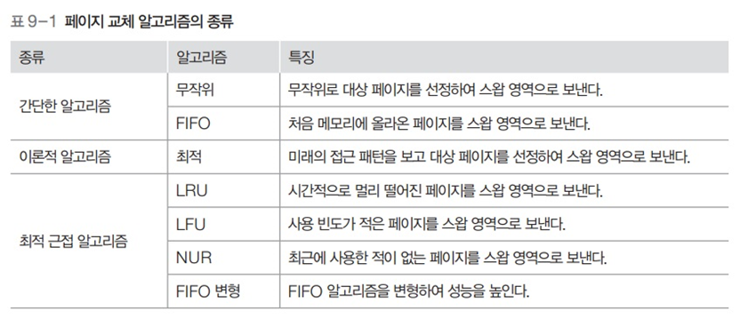

# 운영체제 - 페이지 교체 알고리즘

페이지 교체 알고리즘
<!--more-->
# 페이지 교체 알고리즘

## 페이지 교체 알고리즘

- 스왑 영역으로 보낼 페이지를 결정하는 알고리즘
- 메모리에서 앞으로 사용할 가능성이 적은 페이지를 대상 페이지로 선정
    - 페이지 부재를 줄이고 시스템의 성능 향상

## 페이지 교체 알고리즘의 성능 평가

- 다양한 방법이 있음
- 여기서는 페이지 부재 횟수, 페이지 성공 횟수를 비교
- 위는 첫번째는 A에 접근, 두번째는 B에 접근, 세번째는 C에 접근.... 을 의미

## 무작위 페이지 교체 알고리즘

- 스왑 영역으로 쫓아낼 페이지를 무작위로 선정
- 지역성을 전혀 고려하지 않음
    - 성능 좋지않다

## FIFO 페이지 교체 알고리즘

- 시간상으로 메모리에 가장 먼저 올라온 페이지를 대상 페이지로 선정
- 메모리가 꽉 차면 맨 위 페이지가 스왑 영역으로 가고, 나머지 페이지들이 위쪽으로 이동하고 새 페이지가 아래쪽으로 들어옴
    - 다만 실제로 페이지 테이블을 이렇게 재배치하는 것이 아님, 그냥 논리적으로 볼 때 그렇다는 것
- 무조건 오래된 페이지를 대상 페이지로 선정하므로 성능이 좋지않음
- 페이지 성공 횟수: 3

## 최적 페이지 교체 알고리즘

- 앞으로 사용하지 않을 페이지를 스왑 영역으로 옮김
    - 앞으로 사용할 페이지를 미리 살펴봄
    - 사용되는 시점이 제일 멀리 있는 페이지를 대상 페이지로 선정
- 페이지 성공 횟수 : 5
- 이상적인 방법이지만 실제로 구현할 수 없음

## 최적 근접 알고리즘의 접근 방식

- 최적에 근접한 성능 추구
    - 실제 구현이 가능하면서도 최전 근접 알고리즘에 근접한 성능을 추구함
- **LRU 페이지 교체 알고리즘**
    - Least Recently Used
    - 페이지가 접근한 시간을 기준으로 대상 페이지 선정
- **LFU 페이지 교체 알고리즘**
    - Least Frequently Used
    - 페이지가 사용된 횟수를 기준으로 대상 페이지 선정

## LRU 페이지 교체 알고리즘

- 최근 최소 사용 페이지 교체 알고리즘
- 메모리에 올라온 후 가장 오랫동안 사용되지 않은 페이지를 스왑 영역으로 보냄
- 시간을 기준으로 구현하거나 카운터나 참조 비트를 이용하기도 함

### 페이지 접근 시간에 기반한 구현

- 페이지에 접근한 지 가장 오래된 페이지를 교체
- 페이지 성공 횟수 : 4

### 카운터에 기반한 구현

- 구체적 설명 안해주심
- 그냥 카운터에 기반해서..

### 참조 비트 시프트 방식

- 각 페이지에 일정 크기의 참조 비트를 만들어 사용하는 것
- 참조 비트의 초깃값은 0이며 페이지에 접근할 때마다 1로 바뀜
- 참조 비트는 주기적으로 오른쪽으로 한 칸씩 이동
- 참조 비트를 갱신 하다가 대상 페이지를 선정할 필요가 있으면 참조 비트 중 **가장 작은 값**을 대상 페이지로 선정
    - 되게 창의적이다

## LFU 페이지 교체 알고리즘

- 페이지가 몇 번 사용 되었는지를 기준으로 대상 페이지를 선정
- 현재 프레임에 있는 페이지마다 그 동안 사용된 횟수를 세어 횟수가 가장 적은 페이지를 스왑 영역으로 옮김
- 실제로는 많이 사용되지 않음
    - 과거에는 많이 사용되었는데, 예를 들어 변수를 초기화 한 후에 사용될 일이 없는데도 누적된 사용횟수 때문에 계속 남아잇는 경우가 있음

## NUR 페이지 교체 알고리즘

- LRU, LFU 페이지 교체 알고리즘은 추가적인 오버헤드가 큼
- 이를 개선한 NUR는 두 개의 비트만으로 구현 가능
- ‘최근 미사용 페이지 교체 알고리즘’이라고도 불림
    - None Used Recently
- 페이지마다 참조 비트와 변경 비트를 가짐
    - 참조 비트 : 페이지에 접근(./execute)하면 1이 됨
    - 변경 비트 : 페이지가 변경(./append)되면 1이 됨
- 모든 페이지의 초기 상태는 (.,0), 모든 값이 (.,1)이면 초기화 함!

- 오버헤드가 작지만 성능은 LRU, LFU 알고리즘과 비슷

## NUR 페이지 교체 알고리즘

- 대상 페이지를 찾을 때 참조 비트가 0인 페이지를 먼저 찾고, 없으면 변경 비트가 0인 페이지를 찾음
- 같은 비트의 페이지가 여러 개라면 무작위로 대상 페이지를 선정
- 페이지 성공 횟수 : 5

## FIFO 변형 알고리즘 - 2차 기회 페이지 교체 알고리즘

- FIFO 페이지 교체 알고리즘과 마찬가지로 큐를 사용
- 특정 페이지에 접근하여 페이지 부재 없이 성공할 경우 해당 페이지를 큐의 맨 뒤로 이동하여 대상 페이지에서 제외
- 성공한 페이지를 큐의 맨 뒤로 옮김으로써 기회를 한 번 더 줌
- 페이지 성공 횟수 : 4

## FIFO 변형 알고리즘 - 시계 알고리즘

- 2차 기회 페이지 교체 알고리즘은 큐를 사용하지만 시계 알고리즘은 원형 큐를 사용
- 스왑 영역으로 옮길 대상 페이지를 가리키는 포인터를 사용
- 포인터가 큐의 맨 바닥으로 내려가면 다음번에는 다시 큐의 처음을 가리키게 됨

- 2차 기회 페이지 교체 알고리즘에 비해 각 페이지에 참조 비트가 하나씩 추가
- 참조 비트의 초깃값은 0, 메모리에 있는 페이지를 성공적으로 참조하면 0에서 1로 변경
- 대상 포인터는 메모리가 꽉 찰 경우 스왑 영역으로 쫓겨날 페이지를 가리킴
- 가리키는 페이지가 스왑 영역으로 쫓겨 나면 대상 포인터를 밑으로 이동하는데 이때 참조 비트가 1인 페이지는 0으로 만든 후 건너 뜀 (.차기회를 줌)
- 페이지 성공 횟수 : 4
