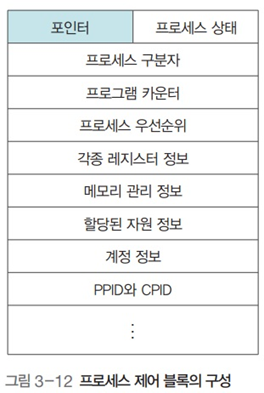

# 운영체제 - 프로세스 제어

프로세스 제어
<!--more-->
# 프로세스 제어

# 1. 프로세스 제어 블록 (상세)

## 개념

- 프로세스를 실행하는데 필요한 중요한 정보를 저장하는 자료 구조
- 프로세스는 고유의 PCB를 가짐
- 프로세스 생성 시 만들어져 프로세스가 실행을 완료하면 폐기

## 프로세스 제어 블록의 구성

- **포인터**
    - 준비 상태나 대기 상태의 큐를 구현할 때 사용
- **프로세스 상태**
    - 어떤 상태에 있는지 나타냄 (준비, 대기, 실행...)
- **프로세스 구분자**
    - 여러 프로세스를 구분하기 위함
- **프로그램 카운터**
    - 다음에 실행될 명령어의 위치를 가리킴 (.값)
- **프로세스 우선순위**
    - 프로세스의 실행 순서를 결정하는 우선순위
- **각종 레지스터 정보**
    - 프로세스가 실행되는 중에 사용하던 레지스터의 값
- **메모리 관리 정보**
    - 프로세스가 메모리의 어디에 있는지를 나타내는 메모리 위치 정보
    - 메모리 보호를 위한 경계 레지스터, 한계 레지스터 값 등
- **할당된 자원 정보**
    - 프로세스를 위한 입출력 자원이나 오픈 파일 등에 대한 정보
- **계정 정보**
    - 계정 번호, CPU 할당 시간, CPU 사용 시간 등
- **부모 프로세스 구분자와 자식 프로세스 구분자**
    - 부모 프로세스를 가리키는 PPID와 자식 프로세스를 가리키는 CPID 정보

## 포인터

- 대기 상태에서는 같은 입출력을 요구한 프로세스끼리 연결할 때 포인터 사용
- 대기 큐는 링크드 리스트를 이용해 구현함

# 2. 문맥 교환

## 개요

- CPU를 차지하던 프로세스가 나가고 새로운 프로세스를 받아들이는 과정
- 실행 상태에서 나가는 PCB에는 지금까지의 작업 내용을 저장
- 반대로, 실행 상태로 들어오는 PCB는 해당 내용을 읽어 그것을 기반으로 CPU를 다시 세팅

# 3. 프로세스의 구조

- 코드 영역
    - 프로그램의 본체가 있는 곳
    - 프로그램의 코드가 기술
    - 읽기 전용
- 데이터 영역
    - 프로그램이 사용하려고 정의한 변수와 데이터가 있는 곳
    - 코드가 실행되면서 사용하는 변수나 파일 등의 데이터를 모아놓음
    - 읽기 쓰기 모두 가능
- 스택 영역, 힙 영역
    - 운영체제가 프로세스를 실행하기 위해 부수적으로 필요한 데이터를 모아놓은 곳
    - 프로세스 내에서 함수를 호출하면 함수를 수행하고 원래 프로그램으로 되돌아올 위치를 이 영역에 저장
    - 파라미터, 로컬 변수도 이 곳에 저장됨
    - 운영체제가 사용자의 프로세를 작동하기 위해 유지하는 영역
        - 사용자에게는 보이지 않음
    - 프로세스가 실행되는 동안 만들어지는 영역
    - 동적 할당 영역
        - 크기가 늘어나기도, 줄어들기도 함

## 스택 영역

- 스레드가 작동되는 동안 추가되거나 삭제되는 동적 할당 영역
- 스레드가 진행됨에 따라 커지기도, 작아지기도 함

- add(., b)를 호출했다
    - 다음에 실행할 코드의 주소 **①**과 **add() 함수의 인자인 c, d**를 스택 영역에 저장했다
- add() 함수를 실행하며 mul(., d)를 호출했다
    - 역시 다음에 실행할 코드의 주소인 **②**와 **mul() 함수의 인자인 e,f**를 스택에 저장했다.
- 해당 함수가 종료되면 스택을 보고 **(.)** 어디로 돌아가야 할지 확인함

## 힙 영역

- 프로그램이 실행되는 동안 할당되는 변수 영역
- 포인터, malloc(), calloc()를 쓸때 해당 영역을 써서 메모리를 할당해줌

# 4. 프로세스의 생성

## fork() 시스템 호출

- 실행 중인 프로세스로부터 새로운 프로세스를 복사
- 실행 중인 프로세스와 똑같은 프로세스가 하나 더 만들어짐
- 실행하던 프로세스는 부모 프로세스, 새로 생긴 프로세스는 자식 프로세스가 됨

## fork() 시스템 호출의 동작 과정

- **fork() 를 하면**
    - **부모 프로세스 영역의 대부분이 자식 프로세스에 복사**
        - PCB
        - 코드 영역
        - 데이터 영역
        - 스택 영역
- **단 PCB의 일부가 변경됨**
    - 프로세스 구분자
    - 메모리 관련 정보
    - 부모 프로세스 구분자와 자식 프로세스 구분자

## fork() 시스템 호출의 장점

- 프로세스 생성 속도가 빠름
- 추가 작업 없이 자원 상속
- 시스템 관리를 효율적으로

## fork() 시스템 호출의 예

- 부모 프로세스의 코드가 실행되어 fork() 문을 만나면 똑같은 내용의 자식 프로세스를 생성
- 이 때 fork() 문은
    - 부모 프로세스에 0보다 큰 값을 반환
    - 자식 프로세스에 0을 반환
- 만약 0보다 작은 값을 반환하면 자식 프로세스가 생성되지 않은 것으로 여겨 Error 출력

# 5. exec() 시스템 호출

## fork()

- 새로운 프로세스를 복사하는 시스템 호출

## exec()

- 프로세스는 그대로 두고 프로세스의 내용만 바꾸는 시스템 호출
- 이미 만들어진 프로세스의 구조를 재활용하는 것

# 6. exec()의 동작 과정

- 코드 영역에 있는 기존의 내용을 지우고 새로운 코드로 바꿈
- 데이터 영역이 새로운 변수로 채워짐
- 스택 영역이 리셋됨
- PCB의 내용 중 프로세스 구분자, 부모 프로세스 구분자, 자식 프로세스 구분자, 메모리 관련 사항은 변하지 않음
- 그러나 프로세스 카운터 레지스터 값을 비록한 각종 레지스터와 사용된 파일 정보들은 리셋됨

# 7. exec() 시스템 호출의 예

- exec()를 해도 PCB의 각종 프로세스 구분자 (., PPID, CPID)가 변경되지 않음
    - 때문에 프로세스가 종료된 후 부모 프로세스로 돌아올 수 있다.
- wait()
    - 자식 프로세스가 종료할 때 까지 대기

# 8. 프로세스의 계층 구조

- **유닉스의 모든 프로세스는 init 프로세스의 자식임**
- 트리 구조를 이룬다
- **쉘에서 어떤 프로그램을 실행할 때도 fork() 후 exec()를 하는 방식이다**

## 프로세스 계층 구조의 장점

1. 여러 작업을 동시에 처리할 수 있다
2. 프로세스의 재사용이 용이하다
3. 자원 회수가 쉽다
    - 프로세스 간의 책임 관계가 분명해져서 시스템을 관리하기 수월

## 좀비 프로세스

- 프로세스가 종료된 후에도 커널에 프로세스 정보가 비정상적으로 남아있는 프로세스
- 자식 프로세스가 종료되었지만 부모 프로세스가 wait()를 하지 않음
    - 따라서 부모 프로세스가 커널이 정리작업을 하도록 하지 않음

## 미아 프로세스

- 자식 프로세스 종료 전 부모 프로세스가 종료한 경우 발생
- 이럴 경우 init 프로세스가 내부적으로 wait()를 해줌
    - 미아 프로세스가 좀비 프로세스가 되는 것을 방지하기 위함

# 9. exit()와 wait()

## exit() 시스템 호출

- 작업의 종료를 알려줌
- 자식 프로세스가 exit()를 호출함으로써, 부모 프로세스는 자식 프로세스가 사용하던 자원을 빨리 거둬갈 수 있음
- exit() 함수가 전달하는 인자로 자식 프로세스가 어떤 상태로 종료되었는지 알려줄 수 있음
    - **exit(.)** = 정상종료
    - **exit(-1)** = 비정상정료

## wait() 시스템 호출

- 자식 프로세스가 끝나기를 기다렸다가 자식 프로세스가 종료되면 다음 문장을 실행
- 자식이 미아 프로세스가 되는 것을 막아줌
    - 부모 프로세스가 자식 프로세스보다 빨리 끝나지 않도록 해줌

## 쉘에서 프로그램을 실행시킬 때

- foreground에서 실행시킬 경우
    - wait() 함수를 사용함
    - 그래서 다음 명령어를 입력할 수 없는 것
- background에서 실행시킬 경우
    - wait() 함수를 사용하지 않음
    - 그래서 다음 명령어를 입력할 수 있음
